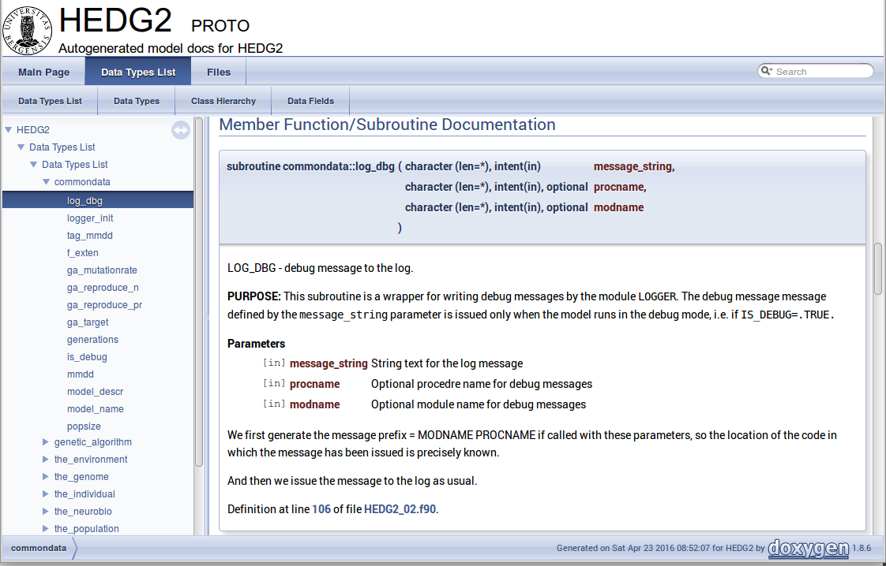

AHA! Modelling Tools Manual
===========================
Sergey Budaev <sergey.budaev@uib.no>
$Id$

////////////////////////////////////////////////////////////////////////////////
Note: asciidoc document, Generate pdf book with
a2x -fpdf BASE_UTILS.adoc
manual on asciidoc is available at: http://asciidoc.org/userguide.html
////////////////////////////////////////////////////////////////////////////////

////////////////////////////////////////////////////////////////////////////////
Notes: (within the comment block ///// , so won't render in the final document)

Workflow: do this doc in private branch. Reintegrate back to trunk when PDF is
          issued.

These are the top priorities for the modelling tools:

1. make coding (writing, maintaining, modifying, reusing and understanding
   code) simple -- OO + modular design + standard modules for data output.
2. make understanding the model code easier -- modular design + extensive and
   detailed documentation within both the code and as a separate html/pdf/epub
   bundle.
////////////////////////////////////////////////////////////////////////////////

:description: Modelling tools/coding style for the new AHA! environment.

:language: fortran

Abstract
--------

This document describes the modelling tools and approaches used for the
new individual-based and agent-based model environment (framework). First,
it documents the modelling *modules* that are developed to make coding such
models simpler. Second, it outlines the general coding style and an aproach
based on *object-oriented* programming.

Modern *Fortran* can be considered as an almost ideal language for agent-based
modelling. It is high-level (e.g. it allows to work with whole arrays and
slices) and partly object-oriented. It also contains many similar constructions
with Python, so the later can be used for rapid prototyping. Nonetheless, it
is compiled and strictly typed which makes coding big and complex projects
safer. Compilers are easily available, including free GNU gfortran. Recent
compilers generate highly efficient and extremely fast machine code. Modern
Fortran includes some built-in parallel calculation instructions, and libraries
and tools for high performance parallel computations are readily available. As
such, Fortran is one of the favourite languages for computation-intensive
works.

_Document date: {docdate}._ The document is generated with the
http://asciidoc.org/[AsciiDoc] markup processor.

////////////////////////////////////////////////////////////////////////////////
Note: SVN tags need property setup:
svn propset svn:keywords "Id Date Revision HeadURL LastChangedDate" BASE_UTILS.adoc
svn commit BASE_UTILS.adoc -m 'set keywords for svn tags""
////////////////////////////////////////////////////////////////////////////////

SVN address of this document source is: +
$HeadURL$

////////////////////////////////////////////////////////////////////////////////
NOTE: PDF svn path is ****** updated MANUALLY ******
////////////////////////////////////////////////////////////////////////////////

Latest PDF version: +
https://svn.uib.no/aha-fortran/trunk/HEDTOOLS/doc/BASE_UTILS.pdf

////////////////////////////////////////////////////////////////////////////////
SVN: $LastChangedDate$
////////////////////////////////////////////////////////////////////////////////

:numbered:

Software tools and requirements
-------------------------------

Most tools needed for the model are already available on Linux (e.g. gfortran,
make, Subversion, console, midnight commander etc) and are trivial to install
using the standard package manager (e.g. +apt-get install gfortran+ on Ubuntu).
On Windows they can be installed manually from their official web sites. On
Mac use http://brew.sh[homebrew] to install many of the utils. Below are
some details on the Windows software.

*Fortran Compiler* (Mandatory)
[[FORTRAN_GET]]

*Intel Fortran* compiler, a commercial software available
at UiB. Intel Fortran is also installed on the UiB HPC cluster
http://docs.hpc.uib.no/wiki/Available_resources#Linux_cluster_fimm.hpc.uib.no[fimm].
Free *GNU Fortran* distribution along with make
and other tools is available from the Equation solution
http://www.equation.com/servlet/equation.cmd?fa=fortran. There is also *Oracle
Solaris Studio* combining Fortran compiler and an NetBeans-based IDE, freely
available from http://www.oracle.com/technetwork/server-storage/solarisstudio,
Linux and Solaris OSs only (no Windows or Mac).
indexterm:[compiler,GNU,gfortran]
indexterm:[compiler,Intel Fortran]
indexterm:[compiler,Oracle Fortran]

*GNU Make* (Mandatory)
[[MAKE_GET]]

This is an automated program build system that keeps track of changes
in different components of the source code and generates header files
automatically depending on the platform and compiler used. It is possible to
work without it, but in such a case everything should be tweaked manually. GNU
make is trivial to install on Linux. For Windows, it goes bundled with the
Equation solution
http://www.equation.com/servlet/equation.cmd?fa=fortran[GNU Fortran].
The official site with the code, manuals aec is here:
https://www.gnu.org/software/make/

*Subversion* (Mandatory)
[[SVN_GET]]

Windows GUI for Subversion is *TortoiseSVN* (supported by UiB IT):
https://tortoisesvn.net/. It is very helpful to have also console Subversion
client software: TortoiseSVN includes console tools but they are not
installed by default. A good command-line-only Windows tool is SilkSVN
https://sliksvn.com/download/.

*Console terminal* (Highly recommended)
[[CONSOLE_GET]]

The Windows console (+cmd+) is extremely weak. *Conemu*
https://conemu.github.io/ is a much better alternative, especially
with the *Far manager*, a two-panel console file manager similar to
the ancient Norton commander for DOS (or Midnight commander on Linux):
http://www.farmanager.com/download.php?l=en.

image:img_doc_far.png[height=280,align="left"]

It is also very helpful to have (on the Microsoft Windows) the
https://en.wikipedia.org/wiki/GNU_Core_Utilities[GNU core utilities]
(+grep+, +cut+, +sed+, +awk+ etc.). Some of them are used in the GNU make build
system, and some are included with the Equation solutions gfortran (*TODO: have
to check what is really necessary*). There are several distributions available,
e.g.
http://gnuwin32.sourceforge.net/[GnuWin32],
http://www.cygwin.com/[Cygwin],
http://www.mingw.org/[MinGW],
http://unxutils.sourceforge.net/[UnxUtils],
http://github.com/bmatzelle/gow/wiki[Gow],
http://win-bash.sourceforge.net/[winbash].

*Doxygen: Automatically generate program documentation* (Highly Recommended)
[[DOXY_GET]]

This is a tool for writing software reference documentation. The documentation
is written within code using special markup and can include formatting,
formulas, tables, graphics etc. Doxygen can cross reference documentation
and code, so that the user/reader of a document can easily refer to the
actual code. It is trivial to install on Linux, but probably not so on
Windows. Using the full power of the tool is not trivial though. Available
from http://doxygen.org/. On Windows is is also highly desirable to have a
LaTeX distribution, such as MikTeX (http://miktex.org) and Ghostscript
(http://www.ghostscript.com), both are free software. LaTeX and Ghostscript
are required to generate PDF.
indexterm:[LaTeX]
indexterm:[Ghostscript]

*Geany* (Recommended)
[[GEANY_GET]]

Lightweight IDE, Editor for code and any text files (including
http://asciidoc.org/[AsciiDoc]). Works on Linux, Windows
and Mac. http://www.geany.org/ Also need plugins: http://plugins.geany.org/
(The Geany SVN plugin for Windows _requires_ command line tools like
https://sliksvn.com/download/[SilkSvn] to work.)

*Code::Blocks for Fortran* (Recommended)

IDE for Fortran. Works with many compilers, including Intel and GNU gfortran.
http://cbfortran.sourceforge.net/. Installation by unpacking into some
directory.

////////////////////////////////////////////////////////////////////////////////
TODO: CSV editors -- do we need them? or just use Office?:
http://recsveditor.sourceforge.net/
https://sourceforge.net/projects/javacsveditor/
////////////////////////////////////////////////////////////////////////////////

*Follow: A logfile reading program* (Recommended)
[[FOLLOW_GET]]

Following a logfile while executing a program is done trivially on Linux:
+tail -f some_log_file.txt+. There is a Java GUI program for reading log
files that works on all major platforms installs by just placing in some
directory: Follow. Available from http://sourceforge.net/projects/follow/.

////////////////////////////////////////////////////////////////////////////////
FIRST, WE NEED A BRIEF INTRODUCTION TO THE PROGRAMMING / SOFTWARE TOOLS AND
GENERAL INTRO ON PROGRAMMING STYLE, INCLUDING OBJECT-ORIENTED FORTRAN FEATURES.
////////////////////////////////////////////////////////////////////////////////

Coding style: General guidelines and tips
-----------------------------------------

////////////////////////////////////////////////////////////////////////////////
General principles
~~~~~~~~~~~~~~~~~~
////////////////////////////////////////////////////////////////////////////////

IMPORTANT: A very helpful collection of advises and tips for efficient
programming in Fortran can be found here:
http://www.fortran90.org/src/best-practices.html[Fortran Best Practices]
indexterm:[Fortran Best Practices]

*Work at high level, use these tools, use objects, isolate as much as possible
into subroutines*

In this way of coding, it becomes more clear what each part of the program
is really doing and it is also easier to modify components of the program
so that they don't affect other irrelevant components.

[source]
--------------------------------------------------------------------------------
GENERATIONS_LOOP: do while &
                  (realgen <= GENERATIONS .and. &
                   parents(1)%fitness > 0)

  call sort_by_fitness()

  call selection()

  call mate_reproduce()

  call offspring_fitness()

  call generations_swap()

  realgen = realgen +1

end do GENERATIONS_LOOP
--------------------------------------------------------------------------------

*Use meaningful labels*

Using labels to mark +do.. end do+, +if .. end if+, +forall+ and other similar
constructs may greatly improve the readability of the code and make it more
easy to understand, especially if there are many nested loops +if..then.. end
if+ constructs. No need to label all such things (this will just increase
clutter), but those that are really important or very big must be. A couple of
examples are below:

[source]
--------------------------------------------------------------------------------
GENERATIONS_LOOP: do while &
                  (realgen <= GENERATIONS .and. &
                   parents(1)%fitness > 0)
.....
  realgen = realgen +1

end do GENERATIONS_LOOP
--------------------------------------------------------------------------------

[source]
--------------------------------------------------------------------------------
SELECT_DEVIANT_CLASS: if (dev == 2) then
.....
else if (dev == 3) then SELECT_DEVIANT_CLASS
.....
else if (dev == 4) then SELECT_DEVIANT_CLASS
......
end if SELECT_DEVIANT_CLASS
--------------------------------------------------------------------------------

*Use whole-array operations and array slices instead of loops, as well as
built-in parallel instructions (+where+, +forall+ etc.): it is faster*

Fortran 95, 2003 and 2008 has several looping/array assignment constructions
that have been optimised for speed in multi-processor parallel environments.
Never use loops to initialise arrays, and avoid using them to calculate
array components. Whenever possible, _reverse the order of indices_ in nested
loops, e.g. first looping should be over the columns, and then over the rows.
Nested loops  may have huge speed overhead! Use +FORALL+, +WHERE+ and similar
new "parallelized" Fortran constructions. Below is a little test conducted on
an average amd64 system using GNU Fortran (+-O3 -funroll-loops -fforce-addr,+
timing is by Linux +time+).
indexterm:[speed, execution speed]
indexterm:[nested loops]
indexterm:[array, nested loops,indices order]

.Test 1: Multiple nested loops, execution time = 0m12.488s
[source]
--------------------------------------------------------------------------------
use BASE_UTILS
use BASE_RANDOM
implicit none
integer, parameter :: n=1000, a=100,b=100,c=100
integer :: nn, i,j,k
real :: random_r
real, dimension(a,b,c) :: M   ! The above header part is the same in all tests

call random_seed_init

MATRLOOP: do nn=1,n
  random_r = rand_r4()
  do i=1,a                                          ! Multiple nested loops
    do j=1,b
      do k=1,c
        M(i,j,k) = random_r
      end do
    end do
  end do
end do MATRLOOP
--------------------------------------------------------------------------------

.Test 2: Direct array assignment, execution time = 0m1.046s
[source]
--------------------------------------------------------------------------------
! header the same as above...
call random_seed_init

MATRLOOP: do nn=1,n
  random_r = rand_r4()
  M=random_r                                        ! Direct array assignment
end do MATRLOOP
--------------------------------------------------------------------------------
indexterm:[array, direct assignment]

.Test 3: +forall+ instruction, execution time = 0m1.042s
[source]
--------------------------------------------------------------------------------
! header the same as above...
call random_seed_init

MATRLOOP: do nn=1,n
  random_r = rand_r4()
  forall (i=1:a, j=1:b, k=1:c) M(i,j,k) = random_r  ! Parallel instruction
end do MATRLOOP
--------------------------------------------------------------------------------
indexterm:[FORALL]

.Test 4: Reverse order of nested loops (cols then rows), execution time = 0m1.046s
[source]
--------------------------------------------------------------------------------
! header the same as above...
call random_seed_init

MATRLOOP: do nn=1,n
  random_r = RAND_R4()
  do i=1,a
    do j=1,b
      do k=1,c
        M(k,j,i) = random_r                         ! Order of looping is reversed
      end do
    end do
  end do
end do MATRLOOP
--------------------------------------------------------------------------------

Multiple nested loops with the most "natural and intuitive"
indices order (rows then cols) had a _really huge_ execution
speed overhead footnote:[This is because allocation of arrays in
the computer memory goes in an "index-reverse" order in Fortran, see
http://www.fortran90.org/src/best-practices.html#multidimensional-arrays],
more than _ten times_ slower than the other methods (compare 12.5s and
1.0s!). The code is also more concise and easier to read. The same tests
with Oracle Solaris Fortran (+f95+) turning on aggressive optimization
and automatic loop parallelization (+-fast -autopar -depend=yes+) run much
faster, but the speed differences still remained quite impressive (first
test execution time = 0m0.010s, all other = 0m0.006s). So compiler-side
aggressive CPU optimisation does work, although the tricks remain very useful.

Note that newer versions of Fortran compilers can become smart enough to adjust
the order of looping in the machine code. Nonetheless it is better to write
"optimised" code using the above tricks that works fast just everywhere.

Document code as you write it with Doxygen
------------------------------------------

////////////////////////////////////////////////////////////////////////////////
Local documentation for Doxygen on Linux should be here:
file:///usr/share/doc/doxygen/html/index.html
////////////////////////////////////////////////////////////////////////////////

<<DOXY_GET, Doxygen>> is a very useful tool which allows to extract and produce
documentation from the source code in a highly structured manner. Prior to
parsing the code to get the documentation, one has to provide a configuration
file for Doxygen. The +doxywizard+ generates a wizard-like GUI to make this
configuration file easily.  There are many formatting symbols, Markdown
codes are supported. Thus, it is easy to document the code extensively as
it is being written.

Comments that are parsed through Doxygen are inserted into the source code
using special markup language. The basic usage is quite simple. You should
start comment line with *+"!>"+* rather than just *+"!"+*, continuing Doxygen
comments is done with two exclamation marks: *+"!!"+*. Only comments formatted
with this style are processed with Doxygen, you are free to insert "usual"
comments, they are just ignored by the documentation generator.

The documentation description for a particular unit of the program,
e.g. module, subroutine, function or variable definition, should normally
go _before_ this unit. Here is an example:
indexterm:[Doxygen]
indexterm:[documentation, autogeneration, Doxygen]

[source]
--------------------------------------------------------------------------------
!-------------------------------------------------------------------------------
!> @brief   Module **COMMONDATA** is used for definine various global
!!          parameters like model name, tags, population size etc.
!! @details Everything that has global scope and should be passed to many
!!          subroutines/functions, should be defined in `COMMONDATA`.
!!          It is also safe to include public keyword to declarations.
!!          `COMMONDATA` may also include subroutines/functions that have
!!          general scope and used by many other modules of the model.
module COMMONDATA
......
  !> MODNAME always refers to the name of the current module for use by
  !! the LOGGER function LOG_DBG. Note that in the debug mode (if IS_DEBUG=TRUE)
  !! LOGGER should normally produce additional messages that are helpful for
  !! debuging and locating possible sources of errors.
  !! Each procedure should also have a similar private constant PROCNAME.
  character (len=*), parameter, private :: MODNAME = "COMMONDATA"

  !> This is the target string, only for the prototype test
  character(len=*), parameter, public :: GA_TARGET = "This is a test of genetic algorithm."

  !> Model name for tags, file names etc. Must be very short.
  character (len=*), parameter, public :: MODEL_NAME = "HEDG2_01"
--------------------------------------------------------------------------------

There are various options and keywords. A few of them should be particularly
useful in documenting the model(s) codes:

+@param+ describes a function or subroutine parameter, may optionally include
+[in]+ (or out or in,out) specifier. An example is below

[source]
--------------------------------------------------------------------------------
subroutine LOG_DBG(message_string, procname, modname)
    implicit none
    ! Calling parameters:
    !> @param[in] message_string String text for the log message
    character (len=*), intent(in) :: message_string
    !> @param[in] procname Optional procedre name for debug messages
    character (len=*), optional, intent(in) :: procname
--------------------------------------------------------------------------------

+@returns+ describes a function return value. @retval is almost the same but
starts with the function return value.

[source]
--------------------------------------------------------------------------------
function TAG_MMDD() result (MMDD)
    implicit none
    !> @retval MMDD Returns an 8-character string for YYYYMMDD
    character(8) MMDD
--------------------------------------------------------------------------------

+@brief+ starts a paragraph that serves as a brief description. +@details+
starts the detailed description.

[source]
--------------------------------------------------------------------------------
!-----------------------------------------------------------------------------
!> @brief LOG_DBG - debug message to the log
!! @details **PURPOSE:** This subroutine is a wrapper for writing debug
!!          messages by the module `LOGGER`. The debug message message
!!          defined by the `message_string` parameter is issued only
!!          when the model runs in the debug mode, i.e. if `IS_DEBUG=.TRUE.`
subroutine LOG_DBG(message_string, procname, modname)

  implicit none
--------------------------------------------------------------------------------

+@note+ insert a note with special emphasis in the doc text.  +@par+ start a
new paragraph optionally with a title in parentheses. In the example above note
also the use of *Markdown* formatting, such as double asterisks (*) for strong
emphasis (bold) and reverse quote (+`+) for inline code (variable names etc.).
indexterm:[Doxygen, Markdown]

Doxygen parses the source code and produces highly structured documentation
in different formats (e.g. html, rtf, latex, pdf etc.).

There are different options to generate HTML documents. For example, a bundle
of HTML files with images , cross-references, code syntax highlighting and
search functionality can be prepared. Alternatively, a single simpler HTML
file can be done. LaTex output can be converted to PDF with references and
index.

Examples of HTML and PDF outputs are below.

image:img_doc_doxygen_pdf.png[width=490,align="left"]

Here is an example of LaTeX formula in the autogenerated documentation
file. Note that formulas are delimited with +@f$+ on both sides.
indexterm:[Doxygen, LaTeX]
indexterm:[LaTeX, formulas]

[source]
--------------------------------------------------------------------------------
!> Fitness is just the "distance" between the agent's string and the target
!! string: sum of all absolute differences between the numerical value of
!! the symbol across the whole string: @f$ \sum |a_i - T_i| @f$
this%fitness = sum([(abs(iachar(this%str(i:i)) - iachar(GA_TARGET(i:i))), &
                     i = 1, len(GA_TARGET))])
--------------------------------------------------------------------------------

This is rendered as follows:

image:img_doc_doxygen_formula.png[width=490,align="left"]

IMPORTANT: +LaTeX+, +dvips+ and +Ghostscript+ should be installed for the
formula rendering to work correctly.
indexterm:[LaTeX]
indexterm:[Ghostscript]

Documenting a complex model is very important! It is also not really difficult,
but requires some additional discipline. It is much easier to include Doxygen
comments as you write the model code than to look through the whole (huge)
amount of the code a month later just to recall what the code is actually
doing. Thus, the model becomes much more understandable to the level of its
finest details. And Doxygen allows inclusion of various markup commands and
styles, LaTeX formulas and graphics. Doxygen documentation, faq's and howtos
are available here: http://doxygen.org indexterm:[Doxygen]

In the AHA <<MAKE_OVERVIEW, GNU make>> system used to build the executables,
documentation is generated using this simple command:

[source,bash]
--------------------------------------------------------------------------------
make docs
--------------------------------------------------------------------------------

Version control: Subversion (SVN)
--------------------------------

AHA Repository: https://svn.uib.no/aha-fortran[https://svn.uib.no/aha-fortran]
indexterm:[AHA repository]

AHA Tools stable version (trunk): https://svn.uib.no/aha-fortran/trunk/HEDTOOLS/
[https://svn.uib.no/aha-fortran/trunk/HEDTOOLS/]

Overview
~~~~~~~~

<<SVN_GET, Subversion>> (SVN) is a version control system used in the AHA
project. Use version control not only for just managing versions, but also
for organising your coding. For example, it would be good to commit changes
to the server in pieces involving specific functions or parts of the model
that are ready. Use the log messages to describe briefly what has been done.
The examples below assume you use a terminal <<CONSOLE_GET, console>>, but
most SVN commands can also be easily performed from a GUI tool.
indexterm:[Subversion]
indexterm:[svn]
indexterm:[Subversion, log message]

For example, imagine you have implemented a new sigmoid function. Then, when
it is ready, commit your change to the server with a log message like
"New sigmoid function". And only after this go to the next piece of code. Then
the versions you have will not be haphazard but organised into meaningful
pieces. If you did several pieces in different files, e.g. sigmoid function in
Hed18.f90 and a new Makefile  for building the code, do two commits:

[source,bash]
--------------------------------------------------------------------------------
svn commit Hed18.f90 -m "New sigmoid function"
...
svn commit Makefile -m "Tweaked makefile, added PGI compiler build"
--------------------------------------------------------------------------------

A typical SVN repository organisation usually includes a *trunk* directory for
the main development line and many *branches* for different purposes created by
different developers. For example, the current AHA repo has this structure:

[source,bash]
--------------------------------------------------------------------------------
|-- branches
|   |-- budaev
|   |-- judy
|   `-- ryan
|
|-- old_archived
|
`-- trunk
--------------------------------------------------------------------------------
indexterm:[Subversion,trunk]
indexterm:[Subversion,branch]

First time setup of the working copy
~~~~~~~~~~~~~~~~~~~~~~~~~~~~~~~~~~~~

First time setup of the working copy of the model (working directory):

* For a new project (run/experiment etc.), get into the working directory where
  the model code will reside (+cd+) (possibly make a new directory +mkdir+),
  and *checkout:* get the model code (one branch, no need to get everything!)
  from the  server with +svn checkout https://path_to_branch+. When a specific
  repository is used _for the first time,_ you should also include the user name
  for this repository (+--username your_user_name+) and then the program asks
  for the password. SVN server name, username and password is then saved, so
  subsequently it is not necessary to state the username/password you connect
  to the same SVN server from the same workstation. For example, first time
  checkout (for user +u01+):

[source,bash]
--------------------------------------------------------------------------------
svn --username u01 checkout https://svn.uib.no/aha-fortran/branches/budaev/HED18
--------------------------------------------------------------------------------

next, just this should work:

[source,bash]
--------------------------------------------------------------------------------
svn checkout https://svn.uib.no/aha-fortran/branches/budaev/HED18
--------------------------------------------------------------------------------

This will get the +HED18+ into the directory +HED18+ within the current working
directory. If we use +HEDTOOLS+, it should also be placed here:

[source,bash]
--------------------------------------------------------------------------------
svn checkout https://svn.uib.no/aha-fortran/branches/budaev/HED18
...
svn checkout https://svn.uib.no/aha-fortran/branches/budaev/HEDTOOLS
--------------------------------------------------------------------------------

So, we now get +HED18+ and +HEDTOOLS+ in our working directory.
indexterm:[Subversion,checkout]

image:img_doc_fimm_svn.png[height=280,align="left"]

IMPORTANT: AHA Tools in _trunk_ (stable version) can be found here:
+https://svn.uib.no/aha-fortran/trunk/HEDTOOLS/+;
Development versions are here:
+https://svn.uib.no/aha-fortran/branches/budaev/HEDTOOLS/+.
So standard checkout (the _stable_ version) is like this: +
+svn checkout https://svn.uib.no/aha-fortran/trunk/HEDTOOLS/+
indexterm:[AHA repository]

Standard workflow
~~~~~~~~~~~~~~~~~

Now you can work within this directory. This is the standard workflow.

* *update* code from the server: +svn up+
* edit the code using any favoured tools, build, run model etc...
* *diff* (+svn diff+) to check what are the differences between the local
  file(s) or directory and those in the repository
* *commit* when ready (e.g. when a new piece of code has been implememnted):
  +svn commit+
indexterm:[Subversion,update]
indexterm:[Subversion,diff]
indexterm:[Subversion,commit]

+commit+ will ask you to provide a short descriptive log message. It will run
the standard text editor for this by default (can be configured). But you can
provide such a message just on the command line with the +-m+ option:
indexterm:[Subversion,commit]

[source,bash]
--------------------------------------------------------------------------------
svn commit Hed18.f90 -m "New sigmoid function"
--------------------------------------------------------------------------------

Both +update+ and +commit+ can be done for the working directory as well as for
specific file. E.g. to commit only the model code +Hed18.f90+ do:

[source,bash]
--------------------------------------------------------------------------------
svn commit Hed18.f90
--------------------------------------------------------------------------------

Both +update+ and +commit+ can be performed within any subdirectory of the
working copy. In such cases they are limited to this subdirectory only.

Using branches
~~~~~~~~~~~~~~

A *branch* in Subversion is just a directory on the SVN server. It can be
thought of in the same way as common file system directory/folder. Creating
a new folder is easy:
indexterm:[Subversion,branch]

[source,bash]
--------------------------------------------------------------------------------
# Making a new directory for old code -- use the mkdir command
svn mkdir https://svn.uib.no/aha-fortran/old_archived
--------------------------------------------------------------------------------
indexterm:[Subversion,mkdir]

It is also easy to move or copy parts of the repository across the repository:

[source,bash]
--------------------------------------------------------------------------------
# Move a model branch to the archive folder -- use mv command
svn mv https://svn.uib.no/aha-fortran/trunk/model_20151013 \
      https://svn.uib.no/aha-fortran/old_archived/model_20151013
--------------------------------------------------------------------------------

Do not forget to update the local working copy after deleting/moving/copying
directories on the SVN server, then local copy will be in sync with the server.

indexterm:[Subversion,mv]

Make a branch copying old code
^^^^^^^^^^^^^^^^^^^^^^^^^^^^^^

The +copy+ command is very useful to create a copy of some repository part to
a separate *branch.* Then some new features or functions can be implemented in
the branch and then reintegrated back to the parent project. Or an independent
new model can be initialised in such a way.

Making a branch is easy, use +svn copy source_svn_path destination_svn_path+
to do this. For example, the following command makes a copy of the whole
sub-tree for the model code +HED18+ from user +budaev+ private branch to the
user +natasha+ private branch. Now +natasha+ can work on her own copy of the
code and, when done, merge the changes back to +budaev+'s code. Finally,
+budaev+'s (and +natasha+'s) code can be reintegrated back to the *trunk*
main line.

[source,bash]
--------------------------------------------------------------------------------
svn copy https://svn.uib.no/aha-fortran/branches/budaev/HED18 \
    https://svn.uib.no/aha-fortran/branches/natasha/HED18 \
    -m "Creating private branch."
--------------------------------------------------------------------------------
indexterm:[Subversion,branch]
indexterm:[Subversion,copy]

If several people are simultaneously working on the project, it make sense to
merge changes from the parent branch back to the current branch (e.g. from
trunk to +budaev+ and +natasha+). Thus does not allow the code to diverge
too far and reduces the chances to get version conflicts. Merging ongoing
changes from the parent project is easy. For example, the following will merge
changes from trunk back to the current branch (note that ^ substitutes the
SVN repository web address):

[source,bash]
--------------------------------------------------------------------------------
svn merge ^/trunk/HEDTOOLS/
--------------------------------------------------------------------------------
indexterm:[Subversion,merge]

Reintegrate your branch back to the trunk
^^^^^^^^^^^^^^^^^^^^^^^^^^^^^^^^^^^^^^^^^

Suppose you have a private branch/branches +.../branches/budaev/HEDTOOLS+ where
you work on the code. Now you are going to reintegrate your branch back to the
trunk (the main development line: +.../trunk/HEDTOOLS+).
indexterm:[Subversion,branch,reintegrate branch]

For this you need several simple steps:

*Step 1.* Merge possible changes in trunk back to the branch:

If someone is working on the trunk, you need to keep your branch in sync with
it, e.g. all other files you are not working on are synchronised.

[source,bash]
--------------------------------------------------------------------------------
# First, make sure you are in the branch .../branches/budaev/HEDTOOLS
pwd

# Second, Do final check/update
svn status
svn update

# Merge possible changes from trunk to the (current) branch working copy
#   --dry-run does everything but does not change any data, it is good to run it
#   first to make sure everything is okay (e.g. yo are really in the correct
#   directory, there are no errors etc.):
svn merge ^/trunk/HEDTOOLS/ --dry-run
# For example, if the working copy is not up to date (need commit or revert),
# there may be issues like this:
#   svn: E195016: Cannot merge into a working copy that has local modifications
# to check what is wrong (modified), the command: svn diff is helpful. Also,
# commit local changes before merging.
# When everything is in order, do the real merge:
svn merge ^/trunk/HEDTOOLS/

# if merge was used, commit changes back to the repository, even though the
# files are unchanged, tags and properties may have changes
svn commit -m "Will merge back to trunk now"
--------------------------------------------------------------------------------

Obviously, this first step is not always necessary. In many cases you can be
sure that no one did changes in the trunk (or the other directoy to which
merge is planned).

*Step 2.* Actually do the reintegrate changes from your branch back to the
trunk. For this we need the code from the trunk.

[source,bash]
--------------------------------------------------------------------------------
# First, make sure you are in the trunk local working copy .../trunk/HEDTOOLS
#  if necessary, checkout this directory somewhere just for this merge... but
#  you need the code for the trunk.
pwd

# Second, do final checks/updates
svn status
svn update

# Do the reintegration of changes from branch back to (current) trunk working copy
#   it is first good to try with --dry-run to make sure everything is okay
svn merge --reintegrate ^/branches/budaev/HEDTOOLS --dry-run
#   and finally do the real thing
svn merge --reintegrate ^/branches/budaev/HEDTOOLS

# Finally, commit these changes back to the SVN repository
svn commit -m "Merged my changes to trunk"
--------------------------------------------------------------------------------

Other features
~~~~~~~~~~~~~~

Subversion has a very useful feature: you can set various properties (+svn
propset+). For example, one can set tags on files or directories. A very
interesting feature is that  +svn:keyword+ properties can be incorporated into
the source files under SVN control. For example, you can include specific
tags into the Fortran (or any other managed) source code so that they are
updated automatically.
indexterm:[Subversion,propset]
indexterm:[Subversion,properties]
indexterm:[Subversion,keywords]
indexterm:[Subversion,tags]

One user case for this is this. Define special +$Id+ tag. This tag includes
the file name, last changed revision number, revision date and time and the
user who did the revision. This is how it will appear in the source code:

[source]
--------------------------------------------------------------------------------
! The comment below incorporates SVN revision ID, it should apparently be
!   inserted into a comment, so does not affect the compiler:
! $Id$
!                                                          other code follows...
......
implicit none
......
! Public constants
integer, public, parameter :: MAX_UNIT=255      ! Maximum unit number (in old
--------------------------------------------------------------------------------

To set up this tag we just have to issue such command:

[source, bash]
--------------------------------------------------------------------------------
svn propset svn:keywords "Id" file_name_to_set_keyword.f90
--------------------------------------------------------------------------------

and include two strings +$Id anything in between initially $+ in this source
text to set where the keywords should be placed. Obviously, we have to *commit*
change to the server after this. From now on, the information will be updated
automatically between the +$id ...+ and +$+ symbols. So the source code itself
will have comments indicating the revision number etc. There are many useful
tags that can be placed in such a way. For example +$Date $Revision $HeadURL
$LastChangedDate+. If several tags should be placed, one can set up several
keywords for a particular file:

[source, bash]
--------------------------------------------------------------------------------
svn propset svn:keywords "Id Date Revision HeadURL LastChangedDate" file_name.f90
--------------------------------------------------------------------------------

Check out full documentation in the SVN manual about +propset+ and
+svn:keyword+.

IMPORTANT: Subversion keywords are case sensitive, so +$ID+ or +$id+ won't work.

GUI Tools
~~~~~~~~~

Using the GUI tools like <<SVN_GET, TortoiseSVN>> is similar to using the
terminal commands. With GUI you should just select the appropriate item from
the menu list.

Checking changes, diff-ing, setting properties and keywords etc. is also very
easy and visual with the built-in tool. Another useful feature is the revision
graphs showing sequence of versions and pattern of branching. TortoiseSVN
is incorporated into the Windows explorer and uses small overlay icons to
show the status of the files and directories.

Similar GUI tools, although not as mature as TortoiseSVN, exist for Linux. For
example, there is +thunar-vcs-plugin+ (Git and Subversion integration into the
https://en.wikipedia.org/wiki/Thunar[Thunar] file manager).

image:img_doc_fxce_svn.png[height=200,align="left"]

indexterm:[Subversion,GUI tools, TortoiseSVN]
indexterm:[Subversion,TortoiseSVN]
indexterm:[TortoiseSVN]

Subversion also integrates with numerous other tools, e.g. there is an SVN
plugin for the <<GEANY_GET, Geany>> editor, plugins for the
https://tortoisesvn.net/visualstudio.html[Microsoft Visual Studio IDE] etc.
Do not forget that version control systems are not only for just program code
but any text-based files. So writing papers in LaTeX benefits from a built-in
Subversion support in the http://www.texstudio.org/[TexStudio]. There is
even integration for http://magnetsvn.com[Microsoft Office] although non-free.

Object-oriented programming and modelling
-----------------------------------------

General principles
~~~~~~~~~~~~~~~~~~

Modern Fortran (2003 and 2008 standards) allows coding in a true
object-oriented style, although does not require it. Object oriented style
allows to define user's abstractions that mimic real world objects, isolate
extra complexity of the objects and create extensions of objects.
indexterm:[object-oriented programming]

Object oriented programming is based on the following principles:

*Abstraction:* defining and abstracting common features of objects and
functions.

*Modularity and hiding irrelevant information:* An object is written and
treated separately from other objects. Details about internal functioning of
the object are effectively hidden, what is important is the _interface_ of the
object, i.e. how it interacts with the external world. This reduces complexity.

*Encapsulation:* combining components of the object to create a new object.

*Inheritance:* components of objects (both data and functions) can be
inherited across objects, e.g. properties the "genome" object inherited by
a more general object "the individual."

*Polymorphism:* the provision of a single interface to objects of different
types.

At the most basic level the programmer defines both the *data structure*
(user's type) as well as the types of *operations* (subroutines and functions)
that are linked with and are be applied to the data structure.

IMPORTANT: Object-oriented features of Fortran are described in recent Fortran
books, e.g.: *Brainerd, W.S. (2009)*. _Guide to Fortran 2003 Programming,_
Springer (Chapter 12).  *Chapman, S.J. (2007)* _Fortran 95/2003 for
Scientists and Engineers,_ 3rd ed., McGraw-Hill (Chapter 16).  *Chivers,
I. & Sleightholme, J. (2012)* _Introduction to Programming with Fortran:
With Coverage of Fortran 90, 95, 2003, 2008 and 77,_ Springer (Chapter 26).
Short introduction can also be found on the internet, e.g.
*Leai, M.* _Object-oriented programming in Fortran 2003_ (PGI: www.pgroup.com).
http://www.pgroup.com/lit/articles/insider/v3n1a3.htm[Part 1: Code Reusability];
http://www.pgroup.com/lit/articles/insider/v3n2a2.htm[Part 2: Data Polymorphism].

Implementation of objects
~~~~~~~~~~~~~~~~~~~~~~~~~

It is the most convenient and natural to define a single object or closely
related objects within the same Fortran module. Note also that components
of an object or derived type are referred using the percent symbol +%+,
e.g. +fish%sex+ refers to a component +sex+ of the object +fish+. Both derived
type data components and functions are referred in this way. Derived type
data objects can be combined into arrays as "normal" data. For example, the
+sex+ component of the _i_-th element of the array of derived type +fish+
is referred as +fish(i)%sex+. Note that derived types can also include arrays,
so +predator%prey(j)+ can be _j_-th element of the +prey+ array component of
the object +predator+. If we use an array of derived type that includes
a three-dimensional array component, it could be something like
+fish(i)%position(x,y,z)+.
indexterm:[module]
indexterm:[derived type, object]
indexterm:[derived type,array of derived type]
indexterm:[object-oriented programming]

Data structure (user-defined type) is defined in Fortran using the keywords:
+type ... end type+. An object can also include subroutines and/or functions.
For example, the following object +INDIVIDUAL_GENOME+ includes a data structure
consisting of a single character string +str+ and two subroutines that define
its behaviour. The first subroutine has the internal name +init_genome_random+
but is referenced outside of the object as +init_genome+ (i.e. +init_genome+
is a part of the object's interface').

[source]
--------------------------------------------------------------------------------
module THE_GENOME                            ! The module defines GENOME object
....

type, public :: INDIVIDUAL_GENOME            ! It is defined here
  character(len=len(GA_TARGET)) :: str       !   we have user (derived) type
  contains                                   !   ... and type-bound procedures.
    procedure, public :: init_genome => init_genome_random
    procedure, public :: mutate => mutate_genome
end type INDIVIDUAL_GENOME

private :: init_genome_random, mutate_genome ! Internal names are "private," so
                                             !  the outside procedures can refer
                                             !  the object subroutines by their
                                             !  outer "interface" names set on
contains                                     !  the left of "=>"

  subroutine init_genome_random(this)        ! The subroutine is almost as usual
    class(INDIVIDUAL_GENOME) :: this         ! Note the use of the CLASS keyword
    ........
  end subroutine init_genome_random
....
end module THE_GENOME
--------------------------------------------------------------------------------

Note that the subroutine part of the object +init_genome_random+  must have
an item of the type definition (+this+) as its first argument. However,
we must define it as +class()+ rather than +type()+. With +class,+ the
subroutine will work not only with this specific +type,+ but also with any of
its extension (i.e. it is a polymorphic type).
indexterm:[class, object, polymorphic]
indexterm:[type-bound procedure]

We may then define an additional, more general, object extending the
+INDIVIDUAL_GENOME+. In this case, we use the word +extends+ in the
new type definition (see code below). This says that the components
of the +INDIVIDUAL_GENOME+ are also included into the new object
+INDIVIDUAL_NEURO_ARCH+ (i.e. +INDIVIDUAL_NEURO_ARCH+ inherits the
+INDIVIDUAL_GENOME+ components).

[source]
--------------------------------------------------------------------------------
module THE_NEUROBIO
.....
type, public, extends(INDIVIDUAL_GENOME) :: INDIVIDUAL_NEURO_ARCH
  integer :: bundles
  contains
    procedure, public :: init_neuro => init_neurobio_random
end type INDIVIDUAL_NEURO_ARCH

private :: init_neurobio_random

contains

  subroutine init_neurobio_random(this)
    class(INDIVIDUAL_NEURO_ARCH) :: this
    ........
  end subroutine init_neurobio_random

end module THE_NEUROBIO
--------------------------------------------------------------------------------

In this way, it is easy to create new objects inheriting properties of
other objects, for example, create several layers ranging from the *genome*
through the *neurobiological architecture* and up to the *individual fish*
and further to a *population* of fish.

However, the above is just the _definition_ of an object. To use the object,
we must _instantiate_ it, i.e. create its specific instance and set the
values. This is analogous to having a specific data type, e.g. +integer+. We
cannot use "just an integer," we need (1) to create a specific variable
(variable is also an object though trivial!) of the type _integer_
(e.g. +integer :: Var_A+) and (2) to assign a specific value to it (+Var_A=1+).
indexterm:[object-oriented programming, object instance]
indexterm:[instance]

For example, the following creates two instance arrays of the type
+INDIVIDUAL_FISH+. Both arrays are one-dimensional and have +POPSIZE+
elements. So we now have two fish populations, +generation_one+
and +generation_two+. Each individual value of such an array,
e.g. +generation_one(1)+ is an instance of the object of the type
+INDIVIDUAL_FISH+ that can be quite a complex data structure including many
different data types, even arrays and lower-order derived types (you can define
derived types inside other derived types). So, instead of being arrays
of simple values these object arrays are in fact arrays of complex data
structures potentially consisting of many different data types and arrays:

[source]
--------------------------------------------------------------------------------
type(INDIVIDUAL_FISH), dimension(POPSIZE) :: generation_one
type(INDIVIDUAL_FISH), dimension(POPSIZE) :: generation_two
--------------------------------------------------------------------------------

We can now assign concrete values to each of the previously defined components
of +generation_one+ array, e.g.

[source]
--------------------------------------------------------------------------------
generation_one(i)%sex = "male"          ! assign values to individual components
generation_one(i)%alive = .true.        ! of the object instance
generation_one(i)%food(j) = "spaghetti"
--------------------------------------------------------------------------------

We can also use the subroutines and type-bound functions that we have defined
within the object definitions to do specific manipulations on the object
and its components:

[source]
--------------------------------------------------------------------------------
subroutine population_init()
....

  do i = 1, POPSIZE
    call generation_one(i)%init()     ! Initialise the i-th fish object in the
  end do                              ! "generation_one" population array
                                      ! using the object-bound subroutine init
end subroutine population_init
--------------------------------------------------------------------------------

TODO -- more text later

////////////////////////////////////////////////////////////////////////////////
BELOW START ACTUAL DESCRIPTION OF THE AHA PROGRAMMING FRAMEWORK
////////////////////////////////////////////////////////////////////////////////

Introduction to the AHA Fortran modules
---------------------------------------

Module is just a piece of <<FORTRAN_GET, Fortran>> program that contains
variable or constant declarations and functions and subroutines. Modules
are defined in such a simple way:
indexterm:[module]

[source]
--------------------------------------------------------------------------------
module SOME_MODULE

character (len=*), private, parameter :: text_string = "its value"
integer :: some_variable
real, dimension(:)

contains                      ! subroutines and functions go after "contains"

  subroutine SOME_SUBROUTINE(parameters)
  ...
  end subroutine SOME_SUBROUTINE

end module SOME_MODULE
--------------------------------------------------------------------------------

To use any variable/constant/subroutine/function from the module, the program
must include the use +MODULE_NAME+ statement:

[source]
--------------------------------------------------------------------------------
use SOME_MODULE
....
--------------------------------------------------------------------------------

The AHA modelling tools include several separate modules:

* +BASE_UTILS+
* +CSV_IO+
* +BASE_RANDOM+
* +BASE_STRINGS+
* +LOGGER+
* Error trapping  modules
* IEEE Arithmetics modules

BASE_UTILS contains a few utility functions. CSV_IO is for output of numerical
data into the CSV (comma separated values) format files. CSV is good because
it is human-readable but can still be easily imported into spreadsheets and
stats packages (R reads CSV). It also has little file size overhead which
is good if huge amounts of data are generated by the model.

Invoking the modules requires the +use+ keyword in Fortran. +use+ should
normally be the first statements before +implicit none+:

[source]
--------------------------------------------------------------------------------
program TEST

  use BASE_UTILS  ! Invoke the modules
  use CSV_IO      ! into this program

  implicit none

  character (len=255) :: REC
  integer :: i
  real, dimension(6) :: RARR = [0.1,0.2,0.3,0.4,0.5,0.6]
  character (len=4), dimension(6) :: STARR=["a1","a2","a3","a4","a5","a6"]

..........

end program TEST
--------------------------------------------------------------------------------

Building the program with these modules using the command line is normally a
two-step process:

build the modules, e.g.

[source,bash]
--------------------------------------------------------------------------------
gfortran -g -c ../BASE_CSV_IO.f90 ../BASE_UTILS.f90
--------------------------------------------------------------------------------

This step should only be done if the source code of the modules change, i.e.
quite rarely.

build the program (e.g. TEST.f90) with these modules

[source,bash]
--------------------------------------------------------------------------------
gfortran -g -o TEST.exe TEST.f90 ../BASE_UTILS.f90 ../BASE_CSV_IO.f90
--------------------------------------------------------------------------------

or for a generic F95 compiler:

[source,bash]
--------------------------------------------------------------------------------
f95 -g -c ../BASE_CSV_IO.f90 ../BASE_UTILS.f90
f95 -g -o TEST.exe TEST.f90 ../BASE_UTILS.f90 ../BASE_CSV_IO.f90
--------------------------------------------------------------------------------

indexterm:[compiler,GNU,gfortran]

A static library of the modules could also be built, so the other more
changeable code can be just linked with the library.

// For some reason icons don't appear in output of admonition blocks on herring.
// Workaround: do Important with caption Note.

[IMPORTANT]
.Note
================================================================================
The examples above assume that the module code is located in the
upper-level directory, so ../ , also the build script or Makefile should
normally care about all this automatically.
================================================================================

Module: BASE_UTILS
------------------

indexterm:[BASE_UTILS]

This module contains a few utility functions and subroutines. So far there are
two useful things here: *STDOUT*, *STDERR*, *TOSTR*, *CLEANUP*, and
*RANDOM_SEED_INIT*.

Function: TOSTR
~~~~~~~~~~~~~~~

*TOSTR* converts everything to a string. Accepts any numeric or non-numeric
type, including integer and real (kind 4 and 8), logical and strings. Also
accepts arrays of these numeric types. Outputs just the string representation
of the number. Aliases: *STR* (same as *TOSTR*), *NUMTOSTR* (accepts only
numeric input parameter, not logical or string)

indexterm:[TOSTR]
indexterm:[STR]
indexterm:[NUMTOSTR]

Examples:
^^^^^^^^^

Integer:

[source]
--------------------------------------------------------------------------------
STRING = TOSTR(12)
produces  "12"
--------------------------------------------------------------------------------

Single precision real (type 4)footnote:[Note that float point calculations,
especially single precision (real type 4) may introduce a rounding error]

[source]
--------------------------------------------------------------------------------
print *, ">>", TOSTR(3.1415926), "<<"
produces >>3.14159250<<
--------------------------------------------------------------------------------

Double precision real (type 8)

[source]
--------------------------------------------------------------------------------
print *, ">>", TOSTR(3.1415926_8), "<<"
produces >>3.1415926000000001<<
--------------------------------------------------------------------------------

TOSTR also converts logical type to the "TRUE" or "FALSE" strings and can also
accept character string as input. In the latest case it just output the input.

*Optional parameters*

TOSTR can also accept standard Fortran format string as the second optional
*string* parameter, for example:

[source]
--------------------------------------------------------------------------------
print *, ">>", TOSTR(3.1415926,"(f4.2)"), "<<"
produces >>3.14<<
--------------------------------------------------------------------------------

[source]
--------------------------------------------------------------------------------
print *, ">>", TOSTR(12,"(i4)"), "<<"
produces >>  12<<
--------------------------------------------------------------------------------

With integers, TOSTR can also generate leading zeros, which is useful for
auto-generating file names or variable names. In such cases, the number of
leading zeros is determined by the second optional *integer* parameter. This
integer sets the template for the leading zeros, the maximum string. The
exact value is unimportant, only the number of digits is used.

For example,

[source]
--------------------------------------------------------------------------------
print *, ">>", TOSTR(10, 100), "<<"
produces >>010<<
--------------------------------------------------------------------------------

[source]
--------------------------------------------------------------------------------
print *, ">>", TOSTR(10, 999), "<<"
also produces >>010<<
--------------------------------------------------------------------------------

[source]
--------------------------------------------------------------------------------
print *, "File_" // TOSTR(10, 10000) // ".txt"
produces File_00010.txt
--------------------------------------------------------------------------------

*Examples of arrays*

It is possible to convert numeric arrays to their string representation:

[source]
--------------------------------------------------------------------------------
real, dimension(6) :: RARR = [0.1,0.2,0.3,0.4,0.5,0.6]
.....
print *, ">>", TOSTR(RARR), "<<"
produces > 0.100000001 0.200000003 0.300000012 0.400000006 0.500000000 0.600000024<<
--------------------------------------------------------------------------------

Fortran format statement is also accepted for arrays:

[source]
--------------------------------------------------------------------------------
real, dimension(6) :: RARR = [0.1,0.2,0.3,0.4,0.5,0.6]
.....
print *, ">>", TOSTR(RARR,"(f4.2)"), "<<"
produces >> 0.10 0.20 0.30 0.40 0.50 0.60<<
--------------------------------------------------------------------------------

It is possible to use array slices and array constructors with implicit do:

indexterm:[implied do]
indexterm:[implied cycle]
indexterm:[array slice]
indexterm:[array constructor]

[source]
--------------------------------------------------------------------------------
print *, ">>", TOSTR(RARR(1:4)), "<<"
print *, ">>", TOSTR( (/(RARR(i), i=1,4)/) ), "<<"
both produce >> 0.100000001 0.200000003 0.300000012 0.400000006<<
--------------------------------------------------------------------------------

or using the newer format with square brackets:

[source]
--------------------------------------------------------------------------------
print *, ">>", TOSTR( [(RARR(i), i=1,4), 200.1, 400.5] ), "<<"
produces >> 0.100000001 0.200000003 0.300000012 0.400000006 200.100006 400.500000<<
--------------------------------------------------------------------------------

the same with format:

[source]
--------------------------------------------------------------------------------
print *, ">>", TOSTR( [(RARR(i), i=1,4), 200.1, 400.5], "(f9.3)" ), "<<"
produces >> 0.100 0.200 0.300 0.400 200.100 400.500<<
--------------------------------------------------------------------------------

The subroutine TOSTR is useful because it allows to change such confusing
old-style Fortran string constructions as this

[source]
--------------------------------------------------------------------------------
!print new gene pool. First make file name      !BSA 18/11/13
if (gen < 10) then
  write(gen1,2902) "gen-0000000",gen
else if (gen < 100) then
  write(gen1,2903) "gen-0000000",gen
else if (gen < 1000) then
  write(gen1,2904) "gen-000000",gen
else if (gen < 10000) then
  write(gen1,2905) "gen-00000",gen
else if (gen < 100000) then
  write(gen1,2906) "gen-0000",gen
else if (gen < 1000000) then
  write(gen1,2907) "gen-000",gen
else if (gen < 10000000) then
  write(gen1,2913) "gen-00",gen
else if (gen < 100000000) then
  write(gen1,2914) "gen-0",gen
else
  write(gen1,2915) "gen-",gen
end if

if (age < 10) then
  write(gen2,2920) "age-0000",age
else if (age < 100) then
  write(gen2,2921) "age-000",age
else if (age < 1000) then
  write(gen2,2922) "age-00",age
else if (age < 10000) then
  write(gen2,2923) "age-0",age
else
  write(gen2,2924) "age-",age
end if

write(gen3,2908)gen1,"-",gen2

if (expmt < 10) then
  write(string104,2901)"HED24-",MMDD,runtag,"-E0",expmt,"-o104-genepool-",gen3,".txt"
else
  write(string104,2910)"HED24-",MMDD,runtag,"-E",expmt,"-o104-genepool-",gen3,".txt"
end if
--------------------------------------------------------------------------------

to a much shorter and clear like this:

[source]
--------------------------------------------------------------------------------
!print new gene pool. First make file name      !BSA 18/11/13
string104 = "HED24-" // trim(MMDD) // trim(runtag) // "-E0" // &
            TOSTR(expmt,10) // "-o104-genepool-" // &
            "gen-" // TOSTR(gen, 10000000) //  "-" // &
            "age-" // TOSTR(age, 10000) // f_exten
--------------------------------------------------------------------------------

Subroutines: STDOUT and STDERR
~~~~~~~~~~~~~~~~~~~~~~~~~~~~~~

These subroutines output arbitrary text to the terminal, either to the standard
output and standard error. While it seems trivial (standard Fortran print *, or
write() can be used), it is still good to have a dedicated standard subroutine
for all outputs as we can then easily modify the code to use Matlab/R API to
work with and run models from within these environments, or use a GUI window
(the least necessary feature now, but may be useful if the environment is used
for teaching in future). In such cases we will then implement a specific
dedicated output function and just globally swap STDOUT with something like
R_MESSAGE_PRINT or X_TXTGUI_PRINT.

indexterm:[STDOUT]
indexterm:[STDERR]

*STDOUT/STDERR* accept an arbitrary number of string parameters, which just
represent messages placed to the output. Each parameter is printed on a new
line. Trivial indeed:)

IMPORTANT: It is useful to have two separate subroutines for stdout and stderr
as they could be easily separated (e.g. redirected to different files).
Redirection could be done under Windows/Linux terminal in such a simple way: +
+model_command.exe 1>output_file_stdout 2>output_file_stderr+ +
Here STDOUT is redirected to output_file_stdout, STDERR, to output_file_stderr.

*Examples*

[source]
--------------------------------------------------------------------------------
call STDOUT("---------------------------------------------------",&
            ch01 // " = " // ch02 // TOSTR(inumber) // " ***", &
            ch10 // "; TEST NR= " // TOSTR(120.345), &
            "Pi equals to = " //  TOSTR(realPi, "(f4.2)"), &
            "---------------------------------------------------")
--------------------------------------------------------------------------------

The above code just prints a message. Note that TOSTR function is used to append
numerical values to the text output (unlike standard write where values are
separated by commas).

Function: CLEANUP
~~~~~~~~~~~~~~~~~

*CLEANUP* Removes all spaces, tabs, and any control characters from the input
string. It is useful to make sure there are no trailing spaces in fixed Fortran
strings and no spaces in file names.

indexterm:[CLEANUP]

Example:

[source]
--------------------------------------------------------------------------------
print *, ">>", CLEANUP("This is along string blablabla"), "<<"
produces >>Thisisalongstringblablabla<<
--------------------------------------------------------------------------------

Subroutine: RANDOM_SEED_INIT_SIMPLE
~~~~~~~~~~~~~~~~~~~~~~~~~~~~~~~~~~~
indexterm:[RANDOM_SEED_INIT_SIMPLE]

*RANDOM_SEED_INIT_SIMPLE* is called without parameters and just initialises
the random seed for the Fortran random number generator. But note that the
module +BASE_RANDOM+ contains a much better subroutine +RANDOM_SEED_INIT+ that
is also suitable for parallel processing systems (+RANDOM_SEED_INIT_SIMPLE+
*cannot* be used in parallel calculations).

*Example*

[source]
--------------------------------------------------------------------------------
call RANDOM_SEED_INIT
--------------------------------------------------------------------------------

Module: CSV_IO
--------------

Overview
~~~~~~~~
indexterm:[CSV_IO]

This module contains subroutines and functions for outputting numerical
data to the http://en.wikipedia.org/wiki/Comma-separated_values[CSV (Comma
Separated Values)] format (http://tools.ietf.org/html/rfc4180/[RFC4180],
http://www.creativyst.com/Doc/Articles/CSV/CSV01.htm[CSV format]). There are
now only routines for data output to CSV, not (yet?) for input as we don't
input much data. CSV *record* is a whole line (*row*) of numbers/strings (as in
Excel), a single file can have quite many records (rows).

For example, records (rows) can represent consecutive *generations* during
the evolution or *individuals* for within-generation data.

In a typical workflow, within-column variables (i.e those that belong to the
same row of data file) are appended to the same record. When the record is
full (i.e.  the number of values appended is equal to the number of columns
in the CSV file), the record is written physically to the disk file and we
can go to writing the next record (row) of the data.
indexterm:[CSV record]
indexterm:[record, CSV]

Such a workflow can be like this:
indexterm:[workflow]

image:img_doc_records_work.svg[width=360,align="left"]

////////////////////////////////////////////////////////////////////////////////
** *CSV_OPEN_WRITE* - physically open CSV file for writing;
** *CSV_HEADER_WRITE* - physically write optional descriptive header (header
   is just the first line of the CSV file);
** do -- start loop (1) over records (*rows* of data file) +
   do -- start loop (2) over *column values* within the same record +
    *CSV_RECORD_APPEND* - produce record of data values of different types,
    append single values, arrays or lists, usually in loop(s) +
    end do -- end loop (2) +
    *CSV_RECORD_WRITE* - physically write the current record of data +
    to the output file.
** end do -- end loop (1) -- go to producing the next record;
** *CSV_CLOSE* - physically closes the output CSV file.
////////////////////////////////////////////////////////////////////////////////

Thus, subs ending with *_WRITE* and *_CLOSE* do physical write.

This module is most suited at this moment for CSV file _output_ rather than
input.

//Input CSV is to be done later if necessary.

This module widely uses *optional arguments*. They may or may not be present
in the function/subroutine call. If not all parameters are passed, so called
_named parameters_ are used. That is, the name of the parameter(s) within the
function is explicitly stated when the function/subroutine is called.
indexterm:[optional arguments]
indexterm:[named arguments]

For example, +GET_FREE_FUNIT+ has its both parameters optional (+max_funit+ and
+file_status+), it can be called in the standard way as below:

[source]
intNextunit = GET_FREE_FUNIT(200, logicalFlag)

It can lack any parameter:

[source]
intNextunit = GET_FREE_FUNIT()

If the first optional parameter is absent, +GET_FREE_FUNIT+ is called as here:

[source]
intNextunit = GET_FREE_FUNIT(file_status=logicalFlag)

If both parameters present but swapped in order, it should be

[source]
intNextunit = GET_FREE_FUNIT(file_status=logicalFlag, max_funit=200)

of course, it can also be used this way:

[source]
intNextunit = GET_FREE_FUNIT(max_funit=200, file_status=logicalFlag)

IMPORTANT: The standard way of using subroutine parameters (without explicitly
  setting their names) when calling subroutine works only when their are not
  missing and their order remains the same as in the subroutine declaration.
  When a function / subroutine has many parameters and optional are
  interspersed with mandatory, _it is probably just safer to use named
  parameters anyway_.

Files can be referred either by unit or by name, but unit has  precedence (if
both a provided, unit is used). There is also a derived type *csv_file*
that can be used as a single file handle. If csv_file object is defined,
the file name, unit and the latest operation success status can be accessed
as +%name+, +%unit+, +%status+ (e.g. +some_file%name+, +some_file%unit+).
indexterm:[csv_file]
indexterm:[file handle, file handle object]

The physical file operation error flag, +csv_file_status+ is of logical type.
It is always an optional parameter.
indexterm:[optional arguments]

Here is an example of the data saving workflow:
indexterm:[workflow]

[source]
--------------------------------------------------------------------------------
use CSV_IO  ! invoke this module first
........
........
! 1. Generate file name for CSV output
csv_file_append_data_name="data_genomeNR_" // TOSTR(i) // "_" // TOSTR(j) // &
                          "_" // TOSTR(k) // ".csv"
........
! 2. open CSV file for writing
call CSV_OPEN_WRITE (csv_file_append_data_name, csv_file_append_data_unit, &
                     csv_written_ok)
if (.not. csv_written_ok) goto 1000 ! handle possible CSV error
! 3. Write optional descriptive header for the file
call CSV_HEADER_WRITE(csv_file_name = csv_file_append_data_name, &
                      header = header_is_from_this_string, &
                      csv_file_status = csv_written_ok)
........
........
! 4. Generate a whole record of variable (column) names
record_csv="" ! but first, prepare empty record string
call CSV_RECORD_APPEND(record_csv,["VAR_001", ("VAR_" // TOSTR(i,100),i=2,Cdip)])
! 5. physically write this variable header record to the file
call CSV_RECORD_WRITE (record=record_csv, &
                       csv_file_name=csv_file_append_data_name,&
                       csv_file_status=csv_written_ok)
if (.not. csv_written_ok) goto 1000 ! handle possible CSV error
........
........
! 6. Now we can write records containing actual data values, we do this
!    in two do-cycles
CYCLE_OVER_RECORDS: do l=1, Cdip
  ! 7. Prepare an empty string for the current CSV record
  record_csv=""
  CYCLE_WITHIN_RECORD: do m=1, CNRcomp
    ....
    ! do some calculations...
    .....
    .....
    ! 8. append the next value (single number: genomeNR) to the current record
    call CSV_RECORD_APPEND ( record_csv, genomeNR(l,m) )
    .....
  end do CYCLE_WITHIN_RECORD
  ! 9. physically write the current record
  call CSV_RECORD_WRITE ( record=record_csv, &
                          csv_file_name=csv_file_append_data_name,&
                          csv_file_status=csv_written_ok )
  if (.not. csv_written_ok) goto 1000 ! handle possible CSV error
  .......
end do CYCLE_OVER_RECORDS
! 10. close the CSV file when done
call CSV_CLOSE( csv_file_name=csv_file_append_data_name, &
                csv_file_status=csv_written_ok )
if (.not. csv_written_ok) goto 1000 ! handle possible CSV error
--------------------------------------------------------------------------------

indexterm:[csv_file]

Although, there is a wrapper for saving the whole chunk of the data at once.
A whole array or matrix (2-dimensional table) can be exported to CSV
in a single command:

[source]
--------------------------------------------------------------------------------
! save the whole matrix/array d_matrix to some_file.csv
call CSV_MATRIX_WRITE(d_matrix, "some_file.csv", fstat_csv)
if (.not. fstat_csv) goto 1000
--------------------------------------------------------------------------------

Subroutine: CSV_OPEN_WRITE
~~~~~~~~~~~~~~~~~~~~~~~~~
indexterm:[CSV_OPEN_WRITE]
indexterm:[physical disk write]

Open CSV file for writing. May have two forms:

*(1)* either get three parameters:

[source]
--------------------------------------------------------------------------------
character (len=*) :: csv_file_name  ! file name
integer :: csv_file_unit            ! file unit
logical :: csv_file_status          ! optional status flag, TRUE if operation
                                    !   successful
--------------------------------------------------------------------------------

*(2)* get the (single) file handle object of the derived type +csv_file+

[source]
--------------------------------------------------------------------------------
type(csv_file), intent(inout) :: csv_file_handle  ! file handle object
--------------------------------------------------------------------------------

indexterm:[csv_file]
indexterm:[file handle, file handle object]

*Example*

[source]
--------------------------------------------------------------------------------
type(csv_file) :: file_occ      ! declare file handle object
........
call CSV_OPEN_WRITE(file_occ)   ! use file handle object
........
call CSV_OPEN_WRITE(file_name_data1, file_unit_data1, fstat_csv) ! old style
 if (.not. fstat_csv) goto 1000
--------------------------------------------------------------------------------

Subroutine: CSV_CLOSE
~~~~~~~~~~~~~~~~~~~~
indexterm:[CSV_CLOSE]
indexterm:[physical disk write]

Closes a CSV file for reading or writing. May have two forms:

*(1)* either get three optional parameters:

[source]
--------------------------------------------------------------------------------
character (len=*) :: csv_file_name  ! file name
integer :: csv_file_unit            ! file unit
logical :: csv_file_status          ! optional status flag, TRUE if operation
                                    !   successful
--------------------------------------------------------------------------------

IMPORTANT: At least *file name* or *unit* should be present in the subroutine
           call.

*(2)*  get one file handle object of the derived type +csv_file+

[source]
--------------------------------------------------------------------------------
type(csv_file), intent(inout) :: csv_file_handle  ! file handle object
--------------------------------------------------------------------------------

indexterm:[csv_file]
indexterm:[file handle, file handle object]

*Example*

[source]
--------------------------------------------------------------------------------
type(csv_file) :: file_occ          ! declare file handle object
........
call CSV_CLOSE(file_occ)            ! use file handle object
........
call CSV_CLOSE(csv_file_name=file_name_data1, &   ! old style
               csv_file_status=fstat_csv)
 if (.not. fstat_csv) goto 1000
--------------------------------------------------------------------------------

Subroutine: CSV_HEADER_WRITE
~~~~~~~~~~~~~~~~~~~~~~~~~~~~
indexterm:[CSV_HEADER_WRITE]
indexterm:[physical disk write]

Writes an optional descriptive header to a CSV file. The header should normally
be the first line of the file.

May have two forms:

*(1)* either get four parameters, only the header is mandatory, but the file
      must be identified by name or unit:

[source]
--------------------------------------------------------------------------------
character (len=*) :: csv_file_name  ! file name
integer :: csv_file_unit            ! file unit
character (len=*) :: header         ! header string
logical :: csv_file_status          ! status flag, TRUE if operation successful
--------------------------------------------------------------------------------

IMPORTANT: At least *file name* or *unit* should be present in the subroutine
           call.

*(2)* get two parameters including the header string and the file handle object
      of the type +csv_file+

[source]
--------------------------------------------------------------------------------
character (len=*) :: header         ! mandatory CSV file header
type(csv_file) :: csv_file_handle   ! file handle object
--------------------------------------------------------------------------------

indexterm:[csv_file]
indexterm:[file handle, file handle object]

*Example*

[source]
--------------------------------------------------------------------------------
call CSV_HEADER_WRITE(csv_file_name=FILE_NAME_CSV1, &
      header="Example header. Total " // TOSTR(CSV_RECORD_SIZE(record_csv)) // &
      " columns of data.", csv_file_status=fstat_csv)
if (.not. fstat_csv) goto 1000
--------------------------------------------------------------------------------

Here CSV file header is generated from several components, including the
+CSV_RECORD_SIZE+ function to count the record size.

Function: GET_FILE_UNIT
~~~~~~~~~~~~~~~~~~~~~~~
indexterm:[GET_FILE_UNIT]

Returns file unit associated with an existing open file name, if no file unit
is associated with this name (file is not opened), return unit=-1 and error
status

Input parameters:

[source]
--------------------------------------------------------------------------------
character (len=*) :: csv_file_name    ! mandatory file name
logical :: csv_file_status            ! optional status flag, TRUE if operation
                                      !   successful
--------------------------------------------------------------------------------

Output parameter (function value):

[source]
--------------------------------------------------------------------------------
integer :: csv_file_unit              ! unit associated with open file name
--------------------------------------------------------------------------------

*Example*

[source]
--------------------------------------------------------------------------------
file_unit = GET_FILE_UNIT(file_name)
--------------------------------------------------------------------------------

Function: GET_FREE_FUNIT
~~~~~~~~~~~~~~~~~~~~~~~~
indexterm:[GET_FREE_FUNIT]

Returns the next free/available Fortran file unit number. Can optionally search
until a specific maximum unit number.

Input parameters, optional:

[source]
--------------------------------------------------------------------------------
logical :: file_status                ! operation success status
integer :: max_funit                  ! maximum unit to search
--------------------------------------------------------------------------------

Output parameter (function value):

[source]
--------------------------------------------------------------------------------
integer :: file_unit                  ! the first free/available file unit
--------------------------------------------------------------------------------

IMPORTANT: When optional input parameters are absent, the function uses a
           hardwired maximum unit number, possibly depending on the computer
           platform and compiler used.

*Example*

[source]
--------------------------------------------------------------------------------
restart_file_unit_27 = GET_FREE_FUNIT()
--------------------------------------------------------------------------------

Function: CHECK_UNIT_VALID
~~~~~~~~~~~~~~~~~~~~~~~~~~
indexterm:[CHECK_UNIT_VALID]

Checks if file unit is valid, that is within the allowed range and doesn't
include standard input/output/stderr units. The unit should not necessarily
be linked to any file or be an open file.

Input parameter:

[source]
--------------------------------------------------------------------------------
integer :: file_unit                  ! Fortran file unit to check
--------------------------------------------------------------------------------

Output parameter (function value):
[source]
--------------------------------------------------------------------------------
logical :: file_status                ! gets TRUE if the unit is valid
--------------------------------------------------------------------------------

*Example*

[source]
--------------------------------------------------------------------------------
if (.not. CHECK_UNIT_VALID(csv_file_unit)) then
      csv_file_unit=GET_FREE_FUNIT(csv_file_status, MAX_UNIT)
.........
--------------------------------------------------------------------------------

In this example, we check if the user provided unit is valid, if not, get the
first available one.

Function: CHECK_FILE_OPEN
~~~~~~~~~~~~~~~~~~~~~~~~~

indexterm:[CHECK_FILE_OPEN]

Checks if a file is currently open, can optionally determine the Fortran unit
associated with an open file (returns -1 if it is not open). Input parameters
can be either raw form (file name or unit) or csv_file object. Optional
+csv_file_status+ can determine if the check proceeded without error (=TRUE)
there was an error when trying to access the file (=FALSE). Input parameters
must be either file name or unit.

Standard (verbose) form:

[source]
--------------------------------------------------------------------------------
! Calling parameters
character (len=*), optional, intent(in) :: csv_file_name  ! file name to check
integer, optional, intent(in) :: csv_file_unit            !  or unit to check
logical, optional, intent(out) :: csv_file_status         ! error status
integer, optional, intent(out) :: get_csv_file_unit       ! obtain file unit of
                                                          !  an open file
--------------------------------------------------------------------------------

File object form:

[source]
--------------------------------------------------------------------------------
type(csv_file) :: csv_file_handle
--------------------------------------------------------------------------------

Output of the function is logical type, returns TRUE if the file is currently
opened, FALSE otherwise.

*Examples:*

[source]
--------------------------------------------------------------------------------

if (.not. CHECK_FILE_OPEN("file_out.csv")) call OPEN_OUTPUT
...
if (CHECK_FILE_OPEN(csv_file_unit=12)) goto 100
...
file_is_open = CHECK_FILE_OPEN(csv_file_name="data_out.csv", &
                               get_csv_file_unit=fileunit, &
                               csv_file_status=error_flag)
--------------------------------------------------------------------------------

[source]
--------------------------------------------------------------------------------
type (csv_file) :: output_handle
...
if (CHECK_FILE_OPEN(output_handle)) then
...
--------------------------------------------------------------------------------

Subroutine: CSV_RECORD_APPEND
~~~~~~~~~~~~~~~~~~~~~~~~~~~~~
indexterm:[CSV_RECORD_APPEND]
indexterm:[record, CSV]

Appends one of the possible data objects to the current CSV record. Data objects
could be either a single value (integer, real with single or double
precision, character string) or a one-dimensional array of the above
types or still an arbitrary length list of the same data types from the above
list.

Overview
^^^^^^^^

The first parameter of the subroutine is always character string record:

[source]
--------------------------------------------------------------------------------
character (len=*) :: record           ! character string record to append data
--------------------------------------------------------------------------------

The other parameters may be of any of thee following types: +integer (kind=4)+,
+real(kind=4)+, +real(kind=8)+, +character+ string.

IMPORTANT: The record keeping variable can be either fixed length string or an
allocatable string. But it should fit the whole record. This might be a little
bit tricky if record  is allocatable as +record_string=""+ allocates it to an
empty string. A good tip is to use the +repeat+ function in Fortran to allocate
the record string to the necessary value, e.g. +record=repeat(" ", MAX_RECORD)+
will produce a string consisting of +MAX_RECORD+ blank characters. +record+
should not necessarily be an empty string initially, it could be just a whole
blank string.
indexterm:[allocatable string]
indexterm:[repeat]

Examples
^^^^^^^^

Append a single string to the current record:

[source]
--------------------------------------------------------------------------------
call CSV_RECORD_APPEND(record_csv, "ROW_NAMES")
--------------------------------------------------------------------------------

Append a single value (any of the supported types) to the current record:

[source]
--------------------------------------------------------------------------------
call CSV_RECORD_APPEND(record_csv, value)     ! some variable of supported type
call CSV_RECORD_APPEND(record_csv, 123.5_8)   ! double precision literal value
--------------------------------------------------------------------------------

Append a list of values (any one of the supported types) to the current record:

[source]
--------------------------------------------------------------------------------
call CSV_RECORD_APPEND(record_csv, fish, age, stat4, fecund)
--------------------------------------------------------------------------------

Append an array slice (any of the supported types) to the current record:

[source]
--------------------------------------------------------------------------------
call CSV_RECORD_APPEND(record_csv, RARR(1:4))
--------------------------------------------------------------------------------

indexterm:[array slice]

Append an array using old-style array constructor with implied do
(any of the supported types) to the current record:

[source]
--------------------------------------------------------------------------------
call CSV_RECORD_APPEND(record_csv,(/(RARR(i), i=1,6)/))
--------------------------------------------------------------------------------

indexterm:[implied do]
indexterm:[implied cycle]
indexterm:[array constructor]

Append an array using new-style array constructor (square brackets) with
implied do plus two other values (all values can have any of the supported
types but should have the same type) to the current record:

[source]
--------------------------------------------------------------------------------
call CSV_RECORD_APPEND(record_csv, [(RARR(i), i=1,4), measur1, age(fish)])
--------------------------------------------------------------------------------

Append integers from 1 to 10 to the current record (using implied do):

[source]
--------------------------------------------------------------------------------
call CSV_RECORD_APPEND(record_csv, [(i,i=1,10)])
--------------------------------------------------------------------------------

Append a string, an array of strings with implied do and finally another string
to the record. This example shows how variable (column) names could be
generated:
indexterm:[column names]

[source]
--------------------------------------------------------------------------------
call CSV_RECORD_APPEND(record_csv,["ROW_NAME",("VAR_" // TOSTR(i,1000),i=1,1000),"STATUS"])
--------------------------------------------------------------------------------

IMPORTANT: On some compilers (e.g. Oracle Solaris Studio f95 v.12 but not GNU
gfortran version >5), all strings within the array constructor must explicitly
have the same length, otherwise the compiler issues an error. In gfortran (v>5,
the first occurrence of the string (e.g. the first  iteration of the implied do
loop) defines the default length and all extra characters are just silently
dropped. The behaviour of other compilers and their versions may differ.
indexterm:[array constructor,portability,compiler limitation]
indexterm:[compiler,limitation]
indexterm:[compiler,GNU,gfortran]
indexterm:[compiler,Oracle Fortran]

Function: CSV_GUESS_RECORD_LENGTH
~~~~~~~~~~~~~~~~~~~~~~~~~~~~~~~~~
indexterm:[CSV_GUESS_RECORD_LENGTH]
indexterm:[record, CSV]

Guesses the maximum size for the string variable keeping the record being
appended for +CSV_RECORD_APPEND+.

It gets two parameters: integer record size (the number of separate
numerical values in the record) and the maximum target value (integer,
real, or double precision real (kind=8)) and  returns an integer value for a
guess for the record size. The target value is used to estimate the number
of characters and should have the same type as the values being appended
with +CSV_RECORD_APPEND+.

[source]
--------------------------------------------------------------------------------
! suppose we have a real matrix and like to save it to a CSV file
real, dimension(1000,20) :: MATRX_A
...
! we declare the CSV record as allocatable string
character(len=:), allocatable  :: record_for_csv
...

! As explained in the Important note to CSV_RECORD_APPEND above, we have to
!   allocate the string record such that it fits the complete record;
! This can be achieved as follows. Here 20 is the record size (number of cols,
!   can be determined as ubound(MATRX_A,2)), and the target value is the
!   maximum numeric value of the matrix MATRX_A:
record_for_csv = repeat(" ", CSV_GUESS_RECORD_LENGTH(20, maxval(MATRX_A)))
--------------------------------------------------------------------------------

IMPORTANT: Use this function with caution, especially if long strings are also
added to the CSV file. In such a case, make additional allowance for the added
string(s).

Function: CSV_RECORD_SIZE
~~~~~~~~~~~~~~~~~~~~~~~~~
indexterm:[CSV_RECORD_SIZE]
indexterm:[record, CSV]

Counts the number of values in a CSV record.

Input parameters:

[source]
--------------------------------------------------------------------------------
character (len=*) :: record           ! mandatory CSV record
--------------------------------------------------------------------------------

Function value: an integer

--------------------------------------------------------------------------------
integer :: csv_record_size
--------------------------------------------------------------------------------

*Example*

[source]
--------------------------------------------------------------------------------
print *, "This record is: ", CSV_RECORD_SIZE(record_csv), " columns."
--------------------------------------------------------------------------------

Function: CSV_FILE_LINES_COUNT
~~~~~~~~~~~~~~~~~~~~~~~~~~~~~
indexterm:[CSV_FILE_LINES_COUNT]

Counts the number of lines in an existing CSV file. If file cannot be opened or
file error occurred, then issues the value -1

Input parameters:

[source]
--------------------------------------------------------------------------------
character (len=*) :: csv_file_name  ! The name of the existing file
logical :: csv_file_status          ! optional file operation status, TRUE if
                                    !   file operations were successful.
--------------------------------------------------------------------------------

Function value: an integer

--------------------------------------------------------------------------------
integer :: csv_file_lines_count     ! number of lines in file, -1 if file error
--------------------------------------------------------------------------------

Can actually calculate the number of lines in any text file. Does not
distinguish header or variable names lines in the CSV file and does not
recognize CSV format.

*Example*

[source]
--------------------------------------------------------------------------------
print *, "File ", CSV_FILE_LINES_COUNT("test_file.csv", succ_flag), "lines."
--------------------------------------------------------------------------------

Subroutine: CSV_RECORD_WRITE
~~~~~~~~~~~~~~~~~~~~~~~~~~~~
indexterm:[CSV_RECORD_WRITE]
indexterm:[physical disk write]
indexterm:[record, CSV]

Physically writes a complete record of data to a CSV file. A record is a
single row of data in the file.
indexterm:[record, CSV]

This subroutine has two forms:

*(1)* it can either accept three parameters:

[source]
--------------------------------------------------------------------------------
character (len=*) :: csv_file_name        ! file name
integer :: csv_file_unit                  ! file unit
character (len=*)  :: record              ! current CSV record (mandatory)
logical :: csv_file_status                ! optional operation status, TRUE if
                                          !  success
--------------------------------------------------------------------------------

IMPORTANT: The file to write the current record can be referred either by
           name or unit. So one of them must be present in the subroutine call.

*(2)* get the CSV record and the (single) file handle object of the derived
      type +csv_file+

[source]
--------------------------------------------------------------------------------
character (len=*)  :: record              ! current CSV record (mandatory)
type(csv_file) :: csv_file_handle         ! file handle object
--------------------------------------------------------------------------------

indexterm:[csv_file]
indexterm:[file handle, file handle object]

*Example*

[source]
--------------------------------------------------------------------------------
call CSV_RECORD_WRITE(csv_record, file_cop)               ! write current record
call LOG_MSG("Physically wrote record " // TOSTR(a) // &  ! report this in some
             " to the file " // file_cop%name // &        ! logging subroutine.
             ", write status =" // TOSTR(file_cop%status))
--------------------------------------------------------------------------------

Note, that file handle object is used in the above example.

Subroutine: CSV_MATRIX_WRITE
~~~~~~~~~~~~~~~~~~~~~~~~~~~~
indexterm:[CSV_MATRIX_WRITE]
indexterm:[physical disk write]

Writes a matrix of real (kind 4 or  8), integer or string values to a CSV data
file. This is a shortcut allowing to write data in a single code instruction.
This subroutine works either with a two-dimensional matrix or one-dimensional
array (vector). The behaviour is a little different in these cases.

Two-dimensional matrix
^^^^^^^^^^^^^^^^^^^^^^

It gets the following parameters: (1) two-dimensional data matrix (of any
supported type), (2)  mandatory name of the output file; (3) optional vector
of column names. If the column name vector is shorter than the "column"
dimension of the data matrix, the remaining columns get "COL_XXX" names,
where XXX is the consecutive column number (so they are unique). and
(4) optional logical file operation success status.

indexterm:[array,two dimensional]
indexterm:[matrix]
indexterm:[matrix,two dimensional]
indexterm:[column names]
indexterm:[matrix,column names]

[source]
--------------------------------------------------------------------------------
[any supported], dimension(:,:) :: matrix ! data object, array or 2-d matrix
character (len=*) :: csv_file_name        ! file name for output
character, dimension(:) :: colnames       ! optional array of column names
logical :: csv_file_status                ! operation status, TRUE if success
--------------------------------------------------------------------------------

*Example*

[source]
--------------------------------------------------------------------------------
real, dimension(1:100,1:30 ) :: MATRIX
character (len=8), dimension(1:10) :: NAMES = ["MEAS_001","MEAS_002","MEAS_003",&
    "MEAS_004","MEAS_005","MEAS_006","MEAS_007","MEAS_008","MEAS_009","MEAS_010"]
....
! save data with column names, the first ten names are taken from the NAMES
!    string array, the remaining ones are autogenerated
call CSV_MATRIX_WRITE(matrix=MATRIX, colnames=NAMES,
                      csv_file_name="data_file.csv", csv_file_status=fstat_csv)
if (.not. fstat_csv) goto 1000

! save data without column names
call CSV_MATRIX_WRITE(matrix=MATRIX, csv_file_name="data_file.csv",
                      csv_file_status=fstat_csv)
if (.not. fstat_csv) goto 1000
--------------------------------------------------------------------------------

*Higher-rank arrays* (with more than two dimensions)footnote:[CSV_IO code
could be modified to save higher-rank arrays if this function is needed]
can be saved into CSV files using array slices, for example:
indexterm:[array slice]
indexterm:[array, multidimensional]
indexterm:[array, high-rank]

[source]
--------------------------------------------------------------------------------
real, dimension(100,300,99) :: M3   ! Declare a 3D matrix M3
....
do i=lbound(M3,3), ubound(M3,3)     ! Cycle over the third index, min - max

  ! Save separate slices of M3 into individual files file_01.csv .. file_99.csv
  call CSV_MATRIX_WRITE(matrix=M3(:,:,i), &
                        colnames=NAMES,   &
                        csv_file_name="file_" // TOSTR(i,10) // ".csv", &
                        csv_file_status=flag)

end do
--------------------------------------------------------------------------------

One-dimensional arrays
^^^^^^^^^^^^^^^^^^^^^^

With one-dimensional array (vector), the subroutine gets (1) the array,
(2) output file name, (3) logical parameter pointing if the array is saved
"vertically" (as a single column, if +TRUE+) or "horizontally" (as a single
row, if +FALSE+). If the +vertical+ parameter is absent, the default +TRUE+
(i.e. "vertical" data output) is used. There is also an alias to this
subroutine, *+CSV_ARRAY_WRITE+*.
indexterm:[CSV_ARRAY_WRITE]

indexterm:[array,one dimensional]
indexterm:[array,one dimensional,write vertical]
indexterm:[array,one dimensional,write horizontal]

[source]
--------------------------------------------------------------------------------
[any supported], dimension(:) :: array    ! data object, array
character (len=*) :: csv_file_name        ! file name for output
logical :: vertical                       ! optional parameter defining how one-
                                          !   dimensional array is saved
logical :: csv_file_status                ! operation status, TRUE if success
--------------------------------------------------------------------------------

*Example*

[source]
--------------------------------------------------------------------------------
! Here the data will be written into a single row of values
call CSV_MATRIX_WRITE (ARRAY, "data_file.csv", .FALSE., fstat_csv)
 if (.not. fstat_csv) goto 1000
--------------------------------------------------------------------------------

*Tip*

In the simplest cases, with only the data object and the file name,
+CSV_MATRIX_WRITE+ can be used with a two-dimensional matrix or one-dimensional
array in the same way (it's convenient during debugging):

[source]
---------------------------------------------------------------------------------
real, dimension(1:100,1:20) :: MatrixX    ! Matrix, two dimensional
real, dimension(1:100) :: Array_Y         ! Array, one-dimensional
.......
.......
call CSV_MATRIX_WRITE(MatrixX, "file_matrixx.csv")      ! write 2-d matrix
call CSV_MATRIX_WRITE(Array_Y, "file_array_y.csv")      ! write 1-d array
---------------------------------------------------------------------------------

Combining multiple arrays with RESHAPE
^^^^^^^^^^^^^^^^^^^^^^^^^^^^^^^^^^^^^^

+RESHAPE+ is a powerful Fortran function that allows combining several arrays
in various ways. This could be very useful for saving multiple vectors (or
arrays) of the same type into a single CSV file using a single line of code.
indexterm:[arrays,reshape]
indexterm:[array constructor, reshape]
indexterm:[arrays,combine,CSV_MATRIX_WRITE]
indexterm:[RESHAPE]

Suppose we have two integer object vectors +generation_one%individual%fitness+
and +generation_one%individual%person_number+ each having +POPSIZE+ elements
(these are just two one-dimensional vector components of a single object).
Each of these vectors can be saved using the standard +CSV_MATRIX_WRITE+ call:

[source]
--------------------------------------------------------------------------------
call CSV_MATRIX_WRITE (generation_one%individual%fitness, "ZZZ1_F.csv")
call CSV_MATRIX_WRITE (generation_one%individual%person_number, "ZZZ1_N.csv")
--------------------------------------------------------------------------------

image:img_doc_reshape1.png[height=200,align="left"]

The code below reshapes these two vectors into a single two-column matrix
(by columns, array constructors are in square brackets +[]+), so in the final
CSV file they represent two separate variables. Note that there is also an
array constructor for two descriptive column names of the same string length.

[source]
--------------------------------------------------------------------------------
! Here we save two huge integer vectors reshaping them into a single matrix
! by columns, see help on Fortran reshape function and array constructors.
! It also creates a vector of two column names for the output file.
call CSV_MATRIX_WRITE ( reshape(                                           &
                         [generation_one%individual%fitness,               &
                          generation_one%individual%person_number],        &
                         [POPSIZE, 2]),                                    &
                         "ZZZ1_all.csv",                                   &
                         ["FITNESS  ","ID_NUMBER"]                         &
                      )
--------------------------------------------------------------------------------

So the resulting data CSV file is like this:

image:img_doc_reshape2.png[height=200,align="left"]

If the arrays to be combined have different types, it is possible to use
whole-array type conversions to get some common type for all of the arrays.
For example, if we combine an integer array +A+ and a real array +B+ (both
having +POPSIZE+ elements as above), it is wise to convert integer to real to
avoid losing data precision:

[source]
--------------------------------------------------------------------------------
! Here integer array A is converted to real so both A and B have the same type.
call CSV_MATRIX_WRITE ( reshape(                                           &
                         [real(A), B],                                     &
                         [POPSIZE, 2]),                                    &
                         "ZZZ1_all.csv",                                   &
                         ["FITNESS  ","ID_NUMBER"]                         &
                      )
--------------------------------------------------------------------------------

We do not combine multiple loops manually, and automatic reshaping of the
arrays is (usually) very fast.

////////////////////////////////////////////////////////////////////////////////
IMPORTANT NOTE: we cannot use TOSTR in such cases because it can convert a
numeric array to a single string, NOT array of strings. Do we need
implementing such a conversion function?
////////////////////////////////////////////////////////////////////////////////

Derived type: csv_file
~~~~~~~~~~~~~~~~~~~~~~
indexterm:[csv_file]

This type is used as a unitary file handle object. It has the following
structure:
indexterm:[derived type]
indexterm:[file handle, file handle object]

[source]
--------------------------------------------------------------------------------
type, public :: csv_file
  character (len=MAX_FILENAME) :: name  ! The name of the file
  integer :: unit = -1                  ! Fortran unit associated with the file
  logical :: status = .TRUE.            ! success flag for the latest operation
end type csv_file
--------------------------------------------------------------------------------

If +csv_file+ object is defined, the file name, unit and the latest operation
success flag can be accessed as +%name+, +%unit+, +%status+
(e.g. +some_file%name+, +some_file%unit+).

Basic Example
^^^^^^^^^^^^^

[source]
--------------------------------------------------------------------------------
type(csv_file) :: file_occ              ! define the file handle object
....
file_occ%name="some_name.txt"           ! set file name value
....
call CSV_OPEN_WRITE(file_occ)           ! Open file for writing
....
call CSV_CLOSE(file_occ)                ! Close file
--------------------------------------------------------------------------------

Arrays of structures
^^^^^^^^^^^^^^^^^^^^

This derived type can be also used as an array. An example below shows how can
this be done.
indexterm:[derived type,array of derived type]

[source]
--------------------------------------------------------------------------------
type(csv_file), dimension(:), allocatable :: file_ABM ! Define allocatable array
........                                              !   of file handle objects
allocate(file_ABM(modulators))                        ! Allocate this array
........
! now, use the array to handle many files of the same type
do j=1, modulators
  file_ABM(j)%name = "file_no_" // TOSTR(j,10) // ".csv"  ! Set file handle (j)
  call CSV_OPEN_WRITE(file_ABM(j))                        !   and use it
end do
--------------------------------------------------------------------------------

IMPORTANT: The file name is set as a standard *non-allocatable* fixed string
because allocatable strings may not be supported on all compiler types and
versions. Notably, older GNU gfortran (prior to v.5) does not allow allocatable
strings in derived types. Currently, +MAX_FILENAME=255+ (can be changed in the
code). There is one consequence of using fixed strings: you may have to use the
Fortran +trim()+ function to cut off trailing blanks if strings are
concatenated. E.g. do +file_name=trim(String1) // trim(String2)+ instead of
+file_name=String1 // String2+ or
use +file_name=CLEANUP(String1 // String2)+ to remove all blank and control
characters.
indexterm:[allocatable string,portability,compiler limitation]
indexterm:[compiler,GNU,gfortran]
indexterm:[compiler,limitation]

Module: BASE_RANDOM
------------------

This module contains subroutines for generating random numbers (pseudo-random
number generator, PRNG). However, the code of this module depends on the
platform and compiler used. The build system (make) generates the appropriate
header file automatically.
indexterm:[compiler,limitation]
indexterm:[BASE_RANDOM]
indexterm:[PRNG]
indexterm:[random number]

RANDOM_SEED_INIT
~~~~~~~~~~~~~~~~
Initialise the random seed for random number generation. This module uses an
improved random seed generation algorithm that uses the system entropy pool
on Unix systems and XOR of the current time and PID on Windows. Therefore, it
is *safe* for use on *parallel processing systems*. Normally has no parameters.
indexterm:[RANDOM_SEED_INIT]
indexterm:[parallel computations]

[source]
--------------------------------------------------------------------------------
call RANDOM_SEED_INIT()
--------------------------------------------------------------------------------

+RANDOM_SEED_INIT+ can optionally return the current (calculated) seed as two
parameters: integer dimension of the seed array +n_here+ and the array itself
+seed_here+. This, however, is useful only for debugging.

[source]
--------------------------------------------------------------------------------
integer :: dbg_seed_size                      ! depends on compiler/platform
integer, dimension (12) :: dbg_seed_array     ! ... can be 12 or 2 on x86
...
call RANDOM_SEED_INIT(dbg_seed_size, dbg_seed_array)
print *, "Seed: ", dbg_seed_size, ", array: ", dbg_seed_array(:dbg_seed_size)
--------------------------------------------------------------------------------

The seed array size can be different: on GNU gfortran x86 it is *12*, on
Intel and Oracle Fortran (both x86) it is *2*.

RAND_I
~~~~~~

Generates a random integer within the range A to B (the two parameters of the
function).

[source]
--------------------------------------------------------------------------------
ipos = RAND_I(1, len(ga_target))
--------------------------------------------------------------------------------
indexterm:[RAND_I]

RAND_R4 and RAND_R8
~~~~~~~~~~~~~~~~~~~

Generates a random real (type 4 or 8). Has no parameters.

[source]
--------------------------------------------------------------------------------
if ( RAND_R4() < ga_mutationrate ) then
  call mutate(fish(i))
end if
--------------------------------------------------------------------------------
indexterm:[RAND_R4]
indexterm:[RAND_R8]

Build details
~~~~~~~~~~~~~

When *not using* the automatic build system based on GNU make, the module
subroutine +RANDOM_SEED_INIT+ should be tweaked according to the compiler
and platform as follows:
indexterm:[make,not using]
indexterm:[build,manual build]
indexterm:[compiler,limitation]
[[BLD_MAN_RAND]]

*GNU fortran:*

indexterm:[compiler,GNU,gfortran]

[source]
--------------------------------------------------------------------------------
!*****************************************************************************
! *** NON-PORTABLE CODE BEGIN ***

use ISO_FORTRAN_ENV, only: int64   ! GNU and Intel

implicit none

integer, allocatable :: seed(:)
integer :: i, n, un, istat, dt(8), pid
integer(int64) :: t

! *** NON-PORTABLE CODE END ***
!*****************************************************************************
--------------------------------------------------------------------------------

*Intel Fortran*

indexterm:[compiler,Intel Fortran]

[source]
--------------------------------------------------------------------------------
!*****************************************************************************
! *** NON-PORTABLE CODE BEGIN ***

use ISO_FORTRAN_ENV, only: int64  ! GNU and Intel

use IFPORT, only : getpid         ! getpid is an extension defined in IFPORT

implicit none

integer, allocatable :: seed(:)
integer :: i, n, un, istat, dt(8), pid
integer(int64) :: t

! *** NON-PORTABLE CODE END ***
!*****************************************************************************
--------------------------------------------------------------------------------

*Oracle Fortran*

indexterm:[compiler,Oracle Fortran]

[source]
--------------------------------------------------------------------------------
!*****************************************************************************
! *** NON-PORTABLE CODE BEGIN ***

! External Modules not used on Oracle f95, but an include header must be placed

implicit none

integer, allocatable :: seed(:)
integer :: i, n, un, istat, dt(8), pid
integer, parameter :: int64 = selected_int_kind(18) ! define int64
integer(int64) :: t

include "system.inc"  ! Include non-intrinsic library headers for the Oracle f95

! *** NON-PORTABLE CODE END ***
!*****************************************************************************
--------------------------------------------------------------------------------

The build system based on GNU make does this automatically.

Module: LOGGER
--------------

Overview
~~~~~~~~

This module controls logging arbitrary messages during the execution of the
program. The format and destination of the messages is configurable during
the run time. Thus, a trace of the execution can be read by the user during
and after the execution. The module includes subroutines to connect a file
to the logger, configure the logging process, for example enable or disable
the terminal (stdout) messages, issue actual log messages. There are four
log levels (*volume*, *chapter*, *section* and *subsection*) that can differ
a little in the visual representation, it can be useful for marking specific
parts of the log. Logging is especially useful for simulation models that
run for quite a long time like AHA. The user can then check the log from time
to time to make sure everything is in order and get an idea about where it
is running now.
indexterm:[LOGGER module]

Here is an example of a log file with timestamps (date and time printed on the
left of the log strings) being displayed using the <<FOLLOW_GET, Follow>>
program.
indexterm:[log timestamps]

Subroutine: LOG_STARTUP
~~~~~~~~~~~~~~~~~~~~~~~

The logger must be started up with the subroutine +LOG_STARTUP+
that has the log file name as a parameter, for example +call
LOG_STARTUP("logfile-01.log")+. The second optional argument defines if the
existing log file with the same name should be appended (+.TRUE.+, default)
or overwritten (+.FALSE.+). The code below shows how to start logging and
build the log file from parts:
indexterm:[LOG_STARTUP]

[source]
--------------------------------------------------------------------------------
!> Set log file name from string parts and start logging, *overwrite* old log
call LOG_STARTUP("output_" // MODEL_NAME // "_" // TAG_MMDD() // &
                 "_MAIN.log", .FALSE.)
--------------------------------------------------------------------------------

Subroutine: LOG_CONFIGURE
~~~~~~~~~~~~~~~~~~~~~~~~~

There are also several configuration options for the +LOGGER+ which are
called using the +LOG_CONFIGURE+ subroutine.

+LOG_CONFIGURE+ accepts two parameters:

* character string parameter name
* parameter value (character string, integer or logical type)

These are the possible configuration options and their explanations:
indexterm:[LOG_CONFIGURE]
indexterm:[log stdout]

[width="100%",cols="<6,<4,<10",options="header"]
|===============================================================================
| Option                    | Value              | Explanation
| +timestamp+               | logical TRUE/FALSE | if timestamp is issued in the log
| +writeonstdout+           | logical TRUE/FALSE | if the log should also go to terminal (stdout)
| +writeonlogfile+          | logical TRUE/FALSE | if the log should also go to the disk file
| +stoponerror+             | logical TRUE/FALSE | defines if execution should stop on error
| +logfileunit+             | integer value      | Set specific unit for log (use with caution!)
| +level_string_volume+     | string delimiter   | Set the string for *volume*
| +level_string_chapter+    | string delimiter   | Set the string for *chapter*
| +level_string_section+    | string delimiter   | Set the string for *section*
| +level_string_subsection+ | string delimiter   | Set the string for *subsection*
|===============================================================================

The following code shows an example of +LOGGER+ configuration. Here it turns
*on* printing timestamps in the log and chooses whether log messages should
also go to the screen terminal (stdout).

[source]
--------------------------------------------------------------------------------
call LOG_CONFIGURE("timestamp", .TRUE.)         ! do timestamps in the log

if (IS_DEBUG) then
  call LOG_CONFIGURE("writeonstdout" , .TRUE.)  ! output also to screen if DEBUG
else
  call LOG_CONFIGURE("writeonstdout" , .FALSE.) ! NO screen log output normally
end if
--------------------------------------------------------------------------------

Function: LOG_ISINITIALIZED
~~~~~~~~~~~~~~~~~~~~~~~~~~~

The logical function +LOG_ISINITIALIZED+ returns TRUE if the logger is
already initialised.
indexterm:[LOG_ISINITIALIZED]

[source]
--------------------------------------------------------------------------------
if (LOG_ISINITIALIZED) then
--------------------------------------------------------------------------------

Subroutine: LOG_CGET
~~~~~~~~~~~~~~~~~~~~

The subroutine +LOG_CGET+ is used to query a +LOGGER+ configuration option
value. It has two parameters, character string +option+ and logical, integer
or character string +value+. Its use is similar to +LOG_CONFIGURE+.
indexterm:[LOG_CGET]

[source]
--------------------------------------------------------------------------------
call LOG_CGET("writeonstdout", is_stdout)   ! check if log is going to screen
--------------------------------------------------------------------------------

Subroutine: LOG_DELIMITER
~~~~~~~~~~~~~~~~~~~~~~~~~

+LOG_DELIMITER+ issues a string delimiter to the log, it has an optional
integer argument setting the kind of the delimiter, default is "volume"
(1). This is useful to mark the log with visually different parts. The
maximum string length of the delimiter is *80* characters (set as a public
integer parameter +LOG_LEVEL_DELIMITER_LENGTH+).

The four levels of logging *volume*, *chapter*, *section* and *subsection*
are defined in the module +LOGGER+ as constants, so these constant can be used
instead of the integer number. There are also the default delimiter strings.
indexterm:[LOG_DELIMITER]

[source]
--------------------------------------------------------------------------------
integer , parameter , public :: LOG_LEVEL_VOLUME = 1      ! "==============="
integer , parameter , public :: LOG_LEVEL_CHAPTER = 2     ! "---------------"
integer , parameter , public :: LOG_LEVEL_SECTION = 3     ! "***************"
integer , parameter , public :: LOG_LEVEL_SUBSECTION = 4  ! "+++++++++++++++"
--------------------------------------------------------------------------------

Below is a code example of issuing log delimiters:

[source]
--------------------------------------------------------------------------------
call LOG_DELIMITER(1)                     ! issues volume     "---------------"
.....
call LOG_DELIMITER(LOG_LEVEL_SUBSECTION)  ! issues subsection "+++++++++++++++"
--------------------------------------------------------------------------------

Using a user-defined delimiter string is illustrated below.

[source]
--------------------------------------------------------------------------------
! Set delimiter as a 60-characters long line of "======..." for volume delimiter
call LOG_CONFIGURE("level_string_volume", repeat("=",60))
.......
call LOG_DELIMITER(LOG_LEVEL_VOLUME)      ! issues this long delimiter line
--------------------------------------------------------------------------------

Subroutine: LOG_SHUTDOWN
~~~~~~~~~~~~~~~~~~~~~~~~

+LOG_SHUTDOWN:+ The last thing to do is to shut down logging with the
+LOG_SHUTDOWN+ subroutine:
indexterm:[LOG_SHUTDOWN]

[source]
--------------------------------------------------------------------------------
call LOG_SHUTDOWN ()  ! close logger
--------------------------------------------------------------------------------

////////////////////////////////////////////////////////////////////////////////
Error trapping modules, not described so far...

Error trapping modules: ERRORS, ASSERT, EXCEPTIONS
--------------------------------------------------

These modules can be used for error trapping and handling. To be done
////////////////////////////////////////////////////////////////////////////////

Module: BASE_STRINGS
--------------------

////////////////////////////////////////////////////////////////////////////////
Repeat the doc file included with the module
////////////////////////////////////////////////////////////////////////////////

_This module containing some useful string manipulation functions is borrowed
from http://www.gbenthien.net/strings/index.html. The description below is
just repeating the official doc file included with the module. Note that there
are a couple of utils (+READLINE+, +WRITEQ+) in this module that work with
files. These use the standard Fortran unit to refer for the file and unlike
the other modules here are not adjusted (yet) to use the file handle object
(+csv_file+)._
indexterm:[BASE_STRINGS]
indexterm:[strings]
indexterm:[string manipulation]

*Fortran Character String Utilities.* A collection of string manipulation
routines is contained in the module strings found in the file
stringmod.f90. To obtain this module as well as some other string utilities,
go to the website http://www.gbenthien.net/strings/index.html. To use the
routines in the module strings the user needs to add the statement +use
strings+ to the top of the program. These routines were developed primarily
to aid in the reading and manipulation of input data from an ASCII text
file. The routines are described below.

Subroutine: PARSE
~~~~~~~~~~~~~~~~~

+SUBROUTINE PARSE(str, delims, args, nargs)+
indexterm:[PARSE]

This routine was originally designed to separate the arguments in a command
line where the arguments are separated by certain delimiters (commas,
spaces, etc.).  However, this routine can be used to separate other types
of strings into their component parts. The first input is a string +str+
(e.g., a command line). The second argument is a string +delims+ containing
the allowed delimiters. For example, +delims+ might be the string +" ,"+
consisting of a comma and a space. The third argument is a character array
+args+ that contains on output the substrings (arguments) separated by the
delimiters. Initial spaces in the substrings (arguments) are deleted. The
final argument is an integer +nargs+ that gives the number of separated parts
(arguments).  To treat a delimiter in +str+ as an ordinary character precede
it by a backslash (\). If a backslash character is desired in +str+, precede
it by another backslash (\\). In addition, spaces that immediately precede
or follow another delimiter are not considered delimiters. Multiple spaces
or tabs are considered as a single space, i.e., +"a     b"+ is treated the
same as +"a b"+. Backslashes can be removed from an argument by calling the
routine +REMOVEBKSL+, i.e.,

+call REMOVEBKSL(<string>)+

This routine converts double backslashes (\\) to single backslashes (\).

*Example:* If the delimiters are a comma and a space (+delims = " ,"+),
then the subroutine +PARSE+ applied to the string +"cmd arg1 arg\ 2 arg3"+
produces the output:

[source]
--------------------------------------------------------------------------------
args(1) = cmd
args(2) = arg1
args(3) = arg 2
args(4) = arg3
nargs = 4
--------------------------------------------------------------------------------

Subroutine: COMPACT
~~~~~~~~~~~~~~~~~~~

+SUBROUTINE COMPACT(str)+
indexterm:[COMPACT]

This routine converts multiple spaces and tabs to single spaces and deletes
control characters.

Subroutine: REMOVESP
~~~~~~~~~~~~~~~~~~~~

+SUBROUTINE REMOVESP(str)+
indexterm:[REMOVESP]

This routine removes spaces, tabs, and control characters in string +str+.

Subroutine: VALUE
~~~~~~~~~~~~~~~~~

+SUBROUTINE VALUE(str, number, ios)+
indexterm:[VALUE]

This subroutine converts a number string to a number. The argument +str+ is
a string representing a number. The argument number is the resulting real
number or integer (single or double precision). The argument +ios+ is an error
flag. If +ios+ is nonzero, then there was an error in the conversion.

Subroutine: SHIFTSTR
~~~~~~~~~~~~~~~~~~~~

+SUBROUTINE SHIFTSTR(str, n)+
indexterm:[SHIFTSTR]

This routine shifts characters in the string +str+ by +n+ positions
(positive values denote a right shift and negative values denote a left
shift). Characters that are shifted off the end are lost. Positions opened
up by the shift are replaced by spaces.

Subroutine: INSERTSTR
~~~~~~~~~~~~~~~~~~~~~

+SUBROUTINE INSERTSTR(str, strins, loc)+
indexterm:[INSERTSTR]

This routine inserts the string strins into the string +str+ at position
+loc+. Characters in +str+ starting at position +loc+ are shifted right to make
room for the inserted string.

Subroutine: DELSUBSTR
~~~~~~~~~~~~~~~~~~~~~

+SUBROUTINE DELSUBSTR(str, substr)+
indexterm:[DELSUBSTR]

This subroutine deletes the first occurrence of substring +substr+ from string
+str+ and shifts characters left to fill hole.

Subroutine: DELALL
~~~~~~~~~~~~~~~~~~

+SUBROUTINE DELALL(str, substr)+
indexterm:[DELALL]

This routine deletes all occurrences of substring +substr+ from string +str+
and shifts characters left to fill holes.

Function: UPPERCASE
~~~~~~~~~~~~~~~~~~~

+FUNCTION UPPERCASE(str)+
indexterm:[UPPERCASE]

This function returns a string that is like the string +str+ with all characters
that are not between a pair of quotes (+" "+ or +' '+) converted to uppercase.

Function: LOWERCASE
~~~~~~~~~~~~~~~~~~~~~

+FUNCTION LOWERCASE(str)+
indexterm:[LOWERCASE]

This function returns a string that is like the string +str+ with all
characters that are not between a pair of quotes (+" "+ or +' '+) converted
to lowercase.

Subroutine: READLINE
~~~~~~~~~~~~~~~~~~~~

+SUBROUTINE READLINE(nunitr, line, ios)+
indexterm:[READLINE]

This routine reads a line from unit +nunitr+, ignoring blank lines and deleting
comments beginning with an exclamation point(!). The line is placed in the
string +line+. The argument +ios+ is an error flag. If +ios+ is not equal to
zero, then there has been an error in the read operation. A negative value
for +ios+ denotes an end of file.

Subroutine: MATCH
~~~~~~~~~~~~~~~~~

+SUBROUTINE MATCH(str, ipos, imatch)+
indexterm:[MATCH]

This routine finds the delimiter in string +str+ that matches the delimiter
in position +ipos+ of +str+. The argument +imatch+ contains the position of the
matching delimiter.  Allowable delimiters are (), [], {}, <>.

Subroutine: WRITENUM
~~~~~~~~~~~~~~~~~~~~

+SUBROUTINE WRITENUM(number, string, fmt)+
indexterm:[WRITENUM]

This routine writes a number to a string. The argument number is a real number
or an integer (single or double precision). The number number is written to
the character string string with format +fmt+ (e.g., +"e15.6"+ or +"i5"+).

Subroutine: TRIMZERO
~~~~~~~~~~~~~~~~~~~~

+SUBROUTINE TRIMZERO(str)+
indexterm:[TRIMZERO]

This subroutine deletes nonsignificant trailing zeroes in a number string
+str+. A single zero following a decimal point is allowed. For example,
+"1.50000"+ is converted to +"1.5"+ and +"5."+ is converted to +"5.0"+.

Subroutine: WRITEQ
~~~~~~~~~~~~~~~~~~

+SUBROUTINE WRITEQ(unit, name, value, fmt)+
indexterm:[WRITEQ]

This routine writes a string of the form +"name=value"+ to the unit
+unit+. Here +name+ is the input string name and value is the input number
value converted to a string with the format +fmt+. The number value can be a
real number or an integer (single or double precision).

Function: IS_LETTER
~~~~~~~~~~~~~~~~~~~

+FUNCTION IS_LETTER(ch)+
indexterm:[IS_LETTER]

This function returns the logical value +.TRUE.+ if the input character +ch+ is
a letter (az or AZ). It returns the value +.FALSE.+ otherwise.

Subroutine: IS_DIGIT
~~~~~~~~~~~~~~~~~~~~

+FUNCTION IS_DIGIT(ch)+
indexterm:[IS_DIGIT]

This function returns the logical value +.TRUE.+ if the input character +ch+ is
a digit (09). It returns the value +.FALSE.+ otherwise.

Subroutine: SPLIT
~~~~~~~~~~~~~~~~~

+SUBROUTINE SPLIT(str, delims, before, sep)+
indexterm:[SPLIT]

This routine uses the first occurrence of a character from the string +delims+
in the string +str+ to split the string into two parts. The portion of
+str+ before the found delimiter is output in before; the portion of +str+
after the found delimiter is output in +str+ (+str+ is left justified). The
output character +sep+ (optional) contains the found delimiter. To treat
a delimiter in +str+ as an ordinary character precede it by a backslash
(+\+). If a backslash is desired in +str+, precede it by another backslash
(+\\+).  Repeated applications of +SPLIT+ can be used to parse a string into
its component parts. Backslashes can be removed by calling the routine
+REMOVEBKSL+, i.e., +call REMOVEBKSL(string)+

IEEE Arithmetics
----------------

Overview
~~~~~~~~

[[IEEE_OVERVIEW]]

The model can now use the IEEE arithmetic  modules. They allow exact control
of the CPU math features and exceptions caused by invalid calculations, such as
dividion by zero, overflow, underflow etc. A potential issue is that they have
an optional status in the Fortran standard, so compilers do not have to
implement them, although many do.
indexterm:[IEEE arithmetic]
indexterm:[compiler,limitation]

IMPORTANT: IEEE arithmetic and exceptions are fully described in chapter 14 of this
book: Adams, et al., 2009 _The Fortran 2003 Handbook_. Springer.

For example, Intel Fortran implements intrinsic IEEE arithmetics
modules. GNU Fortran does not implement them untile version 5.footnote:[It was
because GNU compiler collection is made for portability and supports many
different processor architectures in addition to the most common x86 and
implementation of IEEE modules is highly dependent on the CPU type and
features.] However, there are external (non-intrinsic) IEEE modules for gfortran
on the x86 (support both 32 and 64 bit) that are included into the *HEDTOOLS*
bundle.
indexterm:[compiler,limitation]
indexterm:[compiler,GNU,gfortran]
indexterm:[compiler,Intel Fortran]
indexterm:[Intel Fortran]

IMPORTANT: the
http://docs.hpc.uib.no/wiki/Available_resources#Linux_cluster_fimm.hpc.uib.no[*fimm* HPC cluster],
where calculations are normally performed, has GNU Fortran 4.8.1 and will
require non-intrinsic IEEE modules. It also has the Intel Fortran which has
built-in (intrinsic) IEEE modules though.
indexterm:[fimm]

IEEE Exceptions
~~~~~~~~~~~~~~~

There are several exception conditions:

* +IEEE_DIVIDE_BY_ZERO+
* +IEEE_INEXACT+
* +IEEE_INVALID+
* +IEEE_OVERFLOW+
* +IEEE_UNDERFLOW+
* +IEEE_USUAL+ (An array of three exceptions +IEEE_OVERFLOW+,
  +IEEE_DIVIDE_BY_ZERO+, +IEEE_INVALID+)
* +IEEE_ALL+ (An array of five exceptions +IEEE_OVERFLOW+,+IEEE_DIVIDE_BY_ZERO+,
  +IEEE_INVALID+, +IEEE_UNDERFLOW+,  +IEEE_INEXACT+)
indexterm:[IEEE arithmetic, exceptions]

Normally, if the program encounters invalid arithmetic calculations, then it
should crash or at least report the problem. Otherwise, correctness of
calculations is not guaranteed. By default, many compilers just *ignore* invalid
calculations (even many cases of division by zero, NaNfootnote:["Not a Number,"
a wrong arithmetic value that is not equal to itself, can result from many math
errors] generation etc.).

In most cases NaNs and other invalid arithmetics strongly point to a bug. If
a NaN value is just left ignored during the calculations, it will likely
propagate further into some other calculations making them invalid. It is
therefore wise to turn halting ON by default in _model_ calculations (unlike
normal utility software that should never crash).

Turning arithmetic exception halting ON during the compile time requires
specific compiler options.

[width="100%",cols="<3,<4,<10",options="header"]
|===============================================================================
| Compiler       | option        | example
| GNU GCC        | +-ffpe-trap+  | +-ffpe-trap=zero,invalid,overflow,underflow+
| Intel Fortran  | +-fpe (/fpe)+ | +-fpe0+ (+/fpe:0+ on Windows)
| Solaris Studio | +--ftrap+     | +--ftrap=invalid,overflow,division+
|===============================================================================
indexterm:[IEEE arithmetic]
indexterm:[IEEE arithmetic,exceptions]
indexterm:[compiler,exception trapping]

The IEEE module +IEEE_EXCEPTIONS+ allows to control halting during the run time.
For example, it is cool to switch halting ON in specific troublesome parts of
the code that can normally result in invalid calculations (division by zero,
invalid, inexact etc.) and control each such occurrence specifically (e.g.
provide a subroutine handling and fixing the calculations).
indexterm:[IEEE_EXCEPTIONS,module]

Halting the program that encounters specific condition is controlled via
+IEEE_GET_HALTING_MODE+ subroutine (returns logical parameter +IEEE_DEF_MODE+).
For example, for +IEEE_INVALID+ it is:

[source]
--------------------------------------------------------------------------------
call IEEE_GET_HALTING_MODE(IEEE_INVALID, IEEE_DEF_MODE)
--------------------------------------------------------------------------------

It is also possible to set specific halting mode for specific condition. For
example, to set halting ON (execution termination) on invalid arithmetic do
this:

[source]
--------------------------------------------------------------------------------
call IEEE_SET_HALTING_MODE(IEEE_INVALID, .TRUE.)  ! Will halt on IEEE_INVALID
--------------------------------------------------------------------------------

Here is an example:

[source]
--------------------------------------------------------------------------------
...
! Invoke IEEE Arithmetics:
! use, non_intrinsic :: IEEE_EXCEPTIONS ! if gfortran v<5

! We normally use included auto-generated wrapper for the module
include "IEEE_wrap.inc"

IMPLICIT NONE

REAL    r,c,C0,Ap,Vc,Ke,Eb
REAL    FR1,FR2,F1,FDER

....

logical :: IEEE_MATH_FLAG, IEEE_DEF_MODE  ! values for IEEE math modules

call IEEE_GET_HALTING_MODE(IEEE_INVALID, IEEE_DEF_MODE) ! Get default halting
call IEEE_SET_HALTING_MODE(IEEE_INVALID, .FALSE.)       ! NO halting from here!

...

FR2=LOG(ABS(C0)*Ap*Vc)
FR1=LOG(((Ke+Eb)/Eb)*r*r*EXP(c*r))
F1 = FR1-FR2
FDER = c + 2./r

call IEEE_GET_FLAG(IEEE_INVALID, IEEE_MATH_FLAG) ! Get the error flag
if(IEEE_MATH_FLAG) then
  ! if IEEE exception is signalled, we cannot relay on the calculations
  ! Report the error: remember there is no halting now, the program won't stop
  write(10,*) "IEEE exception in DERIV ", r,F1,FDER,c,C0,Ap,Vc,Ke,Eb
  ! We also have to fix the calculations, e.g. equate some values to zero
  r=0.; F1=0.; FDER=0.
  call IEEE_SET_FLAG(IEEE_INVALID, .FALSE.) ! Set the error flag back to FALSE
end if

...

call IEEE_SET_HALTING_MODE(IEEE_INVALID, IEEE_DEF_MODE) ! Set default halting

END SUBROUTINE DERIV
--------------------------------------------------------------------------------

Implementation details
~~~~~~~~~~~~~~~~~~~~~~
We use an automatic build system (see below) which normally keeps track of the
compiler and its version and IEEE modules support, there is no need to include
+use, intrinsic (or non_intrinsic) :: IEEE_EXCEPTIONS+ and tweak it manually
depending on the compiler support. The build system automatically generates
the correct include file +IEEE_wrap.inc+ which should be inserted into the
code in place of +use ...+ statement:

[source]
--------------------------------------------------------------------------------
SUBROUTINE DERIV(r,F1,FDER,c,C0,Ap,Vc,Ke,Eb)
!Derivation of equation for visual range of a predator

! Invoke IEEE Arithmetics:
! use, non_intrinsic :: IEEE_EXCEPTIONS ! if gfortran v<5

! We normally use included auto-generated wrapper for the module
include "IEEE_wrap.inc"

REAL    r,c,C0,Ap,Vc,Ke,Eb
....
--------------------------------------------------------------------------------
indexterm:[IEEE arithmetic]
indexterm:[IEEE arithmetic,exceptions, implementation]
indexterm:[compiler, exception trapping, implementation]
indexterm:[include]
indexterm:[IEEE_wrap.inc, include]
[[BLD_MAN_IEEE]]

Without the GNU make-based build system, the rule is simple. Use
*non-intrinsic* modules with GNU gfortran version <5.0 footnote:[e.g. gfortran
on the fimm cluster] and build the modules beforehand:
indexterm:[make,not using]
indexterm:[build,manual build]
indexterm:[compiler,GNU,gfortran]

[source]
--------------------------------------------------------------------------------
!*****************************************************************************
! *** NON-PORTABLE CODE BEGIN ***
use, non_intrinsic :: IEEE_FEATURES
use, non_intrinsic :: IEEE_ARITHMETIC
use, non_intrinsic :: IEEE_EXCEPTIONS
! *** NON-PORTABLE CODE END ***
!*****************************************************************************
--------------------------------------------------------------------------------

and *intrinsic* modules on GNU gfortran v>5, Intel Fortran or Oracle Fortran:
indexterm:[compiler,GNU,gfortran]
indexterm:[compiler,Intel Fortran]
indexterm:[compiler,Oracle Fortran]

[source]
--------------------------------------------------------------------------------
!*****************************************************************************
! *** NON-PORTABLE CODE BEGIN ***
use, intrinsic :: IEEE_FEATURES
use, intrinsic :: IEEE_ARITHMETIC
use, intrinsic :: IEEE_EXCEPTIONS
! *** NON-PORTABLE CODE END ***
!*****************************************************************************
--------------------------------------------------------------------------------

Build system: GNU make
----------------------

Overview
~~~~~~~~
[[MAKE_OVERVIEW]]

The model currently uses a build system based on
<<MAKE_GET, GNU make>> (Makefile). https://www.gnu.org/software/make/[GNU make]
is an automated system for building source core (in fact, any digital project
that requires keeping track of dependencies between multiple components.)
indexterm:[Makefile]

[quote, Mecklenburg R., Managing Projects with GNU Make, 2005]
The make program is intended to automate the mundane aspects of transforming
source code into an executable. The advantages of make over scripts is that
you can specify the relationships between the elements of your program to make,
and it knows through these relationships and timestamps exactly what steps
need to be redone to produce the desired program each time. Using this
information, make can also optimize the build process avoiding unnecessary steps.

All the build rules for building the model executable are collected in the
Makefile. If the model requires external components (e.g. non-intrinsic IEEE
math modules), they will be automatically inserted.

GNU make is good because it works on diverse combinations of platforms and OSs
(e.g. Linux and Windows). Some proprietary Unix platforms could supply the
vendor's +make+ utility that may not be compatible with the GNU +make+ (e.g.
Oracle Solaris includes its own +make+ clone). There might be an option turning
on GNU compatibility. But it is better to use the GNU +make+ (+gmake+ on
Solaris) anyway.

Using make
~~~~~~~~~~

Most basic things with the standard +Makefile+ are simple. The commands are
issued on the terminal <<CONSOLE_GET, console>>.
indexterm:[GNU make, make, gmake]
indexterm:[Makefile, make]
indexterm:[make]

Building and running the model
^^^^^^^^^^^^^^^^^^^^^^^^^^^^^^

* Get a short help on the options: +make help+
* Autogenerate model documentation with Doxygen: +make docs+
* Build the model executable using default compiler: +make+
* Force rebuild the model executable with Intel compiler: +make intel+
* Force rebuild the model executable with GNU compiler: +make gnu+
* Run the current model: +make run+ (on the fimm HPC cluster, this will
  automatically start a new batch job)

Cleanup
^^^^^^^

There are also a few options for deteting the files and data generated by the
build process.

* Remove all the data generated by the model +make cleandata+
* Remove all the data files generated by the model run as well as the model executable: +make clean+
* Remove everything generated by the build system and all the data, retain the default state: +make distclean+

Debugging
^^^^^^^^^

The environment variable +DEBUG+ controls whether the build system produces the
debug symbols (-g) or, if NOT defined, speed-optimised machine code (-O3,
automatic loop parallelization etc.). To build with debug support just define
DEBUG in the manner standard for the platform/OS. For example, on Linux use:
indexterm:[DEBUG]

[source,bash]
--------------------------------------------------------------------------------
$ DEBUG=1 make
--------------------------------------------------------------------------------

or (+DEBUG+ is now persistent)

[source,bash]
--------------------------------------------------------------------------------
$ export DEBUG=1
$ make
--------------------------------------------------------------------------------

on Windows:

[source,bash]
--------------------------------------------------------------------------------
O:\WORK\MODEL\HED18>set DEBUG=1
O:\WORK\MODEL\HED18>make
--------------------------------------------------------------------------------

or use +DEBUG+ as a parameter to make, this works on all platforms:

[source,bash]
--------------------------------------------------------------------------------
$ make intel DEBUG=1
--------------------------------------------------------------------------------

The make system keeps track of all the code components. For example, if only
one has been changed, it will recompile only this. It also keeps track of whether
IEEE math modules are really necessary and if the intrinsic or non-intrinsic
modules are used.

For example, you may have built the model executable (make) and then edited
the code of a module a little. Then just issue command to run batch (make run)
on fimm. The make system will then automatically determine that the model
executable is now out of date and recompile the changed module and build an
updated executable, and only after this will start the batch job.

Another example: you just checked-out or updated (e.g. +svn up+) the model
source that is tested and known to be bug-free on the fimm cluster. Now you
should compile components of the program, (e.g. tweak IEEE math modules),
build the executable, and finally start the executable in the cluster's batch
job system. All this is done using a single command: +make run+.

[source,bash]
--------------------------------------------------------------------------------
$ svn update
$ ... some output...
$ make run
--------------------------------------------------------------------------------

The system should work the same way on Windows and Linux, including the fimm HPC
cluster. By editing the +Makefile+ provided, one can easily tweak the behaviour
of the build process, e.g. add other modules, change names, compilation options
and details etc.

Microsoft Studio, Oracle Solaris Studio and other similar IDEs actually
provide their own make systems (e.g. +nmake+, +make+ or +dmake+) that work
behind the scenes even if the IDE GUI is used.

Tweaking Makefile
~~~~~~~~~~~~~~~~~

Basic parameters
^^^^^^^^^^^^^^^^

Here go basic parameters of the Makefile

Build options
^^^^^^^^^^^^^
Here build variables will be placed.

IMPORTANT: A good manual on the GNU Make is this book:
http://www.oreilly.com/openbook/make3/book/index.csp[Mecklenburg, R, 2005,
_Managing Projects with GNU Make,_ Third edition. OReilly]. There is also the
official https://www.gnu.org/software/make/manual/[GNU Make Manual].

////////////////////////////////////////////////////////////////////////////////
// End of main text
////////////////////////////////////////////////////////////////////////////////

Final Notes: Manual builds
--------------------------

If the model is built _without_ using the automatic <<MAKE_OVERVIEW, GNU
make>> utility and the supplied +Makefile+, you should take care about the
dependencies and header files yourself. These are the modules that require
manual source tweaking in such cases:
indexterm:[build,manual build]
indexterm:[make,not using]

////////////////////////////////////////////////////////////////////////////////
Note: The following tagged links might make problem compiling this document.
      Check out anchors: BLD_MAN_RAND and BLD_MAN_IEEE
      don't remove blank lines between list items below.
////////////////////////////////////////////////////////////////////////////////

* <<BLD_MAN_RAND, BASE_RANDOM>>

* <<BLD_MAN_IEEE, IEEE Modules>>

These pieces of code should be edited manually depending on the compiler
and its version used. Please check your documentation. Make sure all source
code files for the model as well as for the HEDTOOLS are included in the
project. Many IDEs allow generating (importing) project from a supplied
+Makefile+ and recognize GNU make format. This could make work a little easier.
