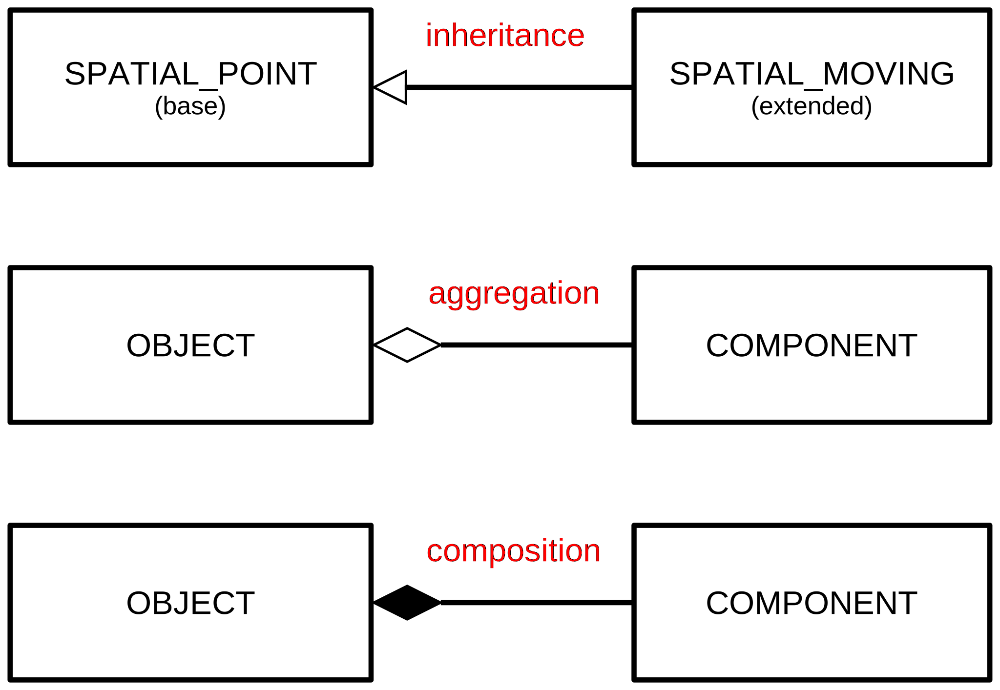
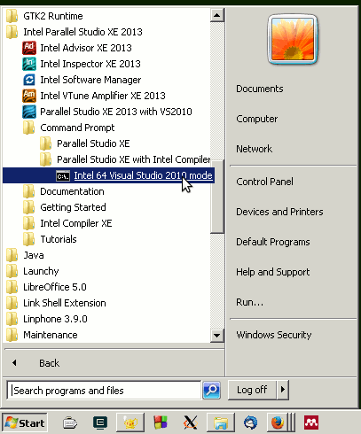
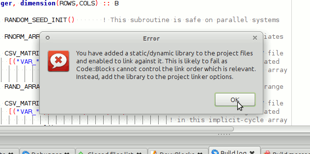
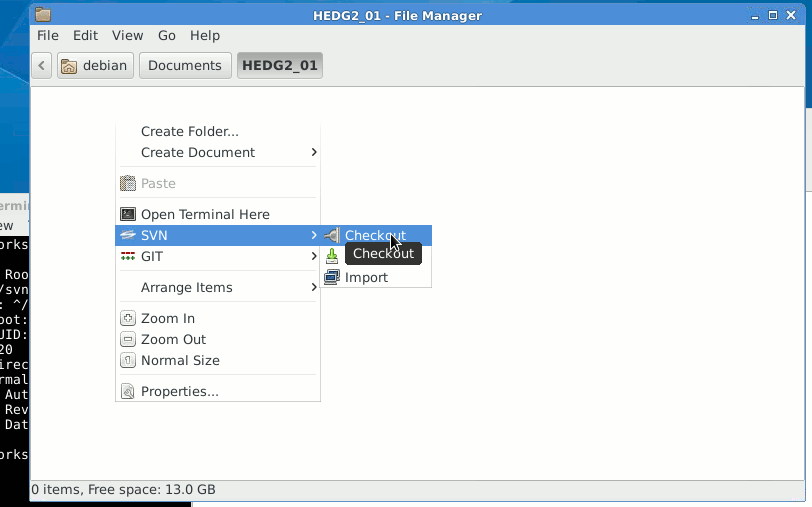
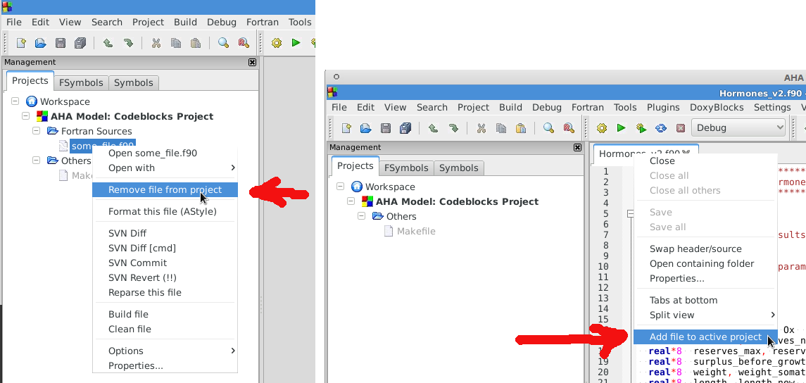

AHA! Modelling Tools Manual
===========================
Sergey Budaev <sergey.budaev@uib.no>
$Id$

////////////////////////////////////////////////////////////////////////////////
Notes:
    * Note: asciidoc document, Generate pdf book with
      a2x -fpdf BASE_UTILS.adoc
    * manual on asciidoc is available at: http://asciidoc.org/userguide.html
      (within the comment block ///// , so won't render in the final document)
    * IMAGES:: set maximum width for images (whole page width) 510
    * PDF svn path is ** updated MANUALLY **
////////////////////////////////////////////////////////////////////////////////

:description: Modelling tools/coding style for the new AHA! environment.

:language: fortran

Abstract
--------

*HEDTOOLS* is a set of modelling utilities and tools (implemented as portable
Fortran modules, not object-oriented) that have general applicability and
are used for data conversion, input/output, random number generation and
execution logging. There are also a few computational tools. Even though
HEDTOOLS modules are primarily designed to be used in the AHA Model, they
are designed such that they can be used in many different simulation projects.

This document describes HEDTOOLS and outlines the software requirements and
general coding style for the AHA model.

Modern Fortran can be considered as an almost ideal language for agent-based
modelling. It is high-level (e.g. it allows to work with whole arrays and
slices) and partly object-oriented. It also contains many similar constructions
with Matab, so the later can be used for rapid prototyping. Nonetheless, it
is compiled and strictly typed which makes coding big and complex projects
safer. Compilers are easily available, including free GNU gfortran. Recent
compilers generate highly efficient and extremely fast machine code. Modern
Fortran includes some built-in parallel calculation instructions, and libraries
and tools for high performance parallel computations are readily available. As
such, Fortran is one of the favourite languages for computation-intensive
works.

_Document date: {docdate}._ The document is generated with the
http://asciidoc.org/[AsciiDoc] markup processor.

Latest PDF version: +
http://ahamodel.uib.no/doc/HEDTOOLS.pdf

////////////////////////////////////////////////////////////////////////////////
SVN: $LastChangedDate$
////////////////////////////////////////////////////////////////////////////////

:numbered:

Software tools and requirements
-------------------------------

Most tools needed for the model are already available on Linux (e.g. gfortran,
make, Subversion, console, midnight commander etc) and are trivial to install
using the standard package manager (e.g. +apt-get install gfortran+ on Ubuntu).
On Windows they can be installed manually from their official web sites. On
Mac use http://brew.sh[homebrew] to install many of the utils. Below are
some details on the Windows software.

The UiB IaaS-based <<UIB_CLOUD_DESKTOP, virtual cloud desktop>> includes all
the essential software components for working with and developing the model.

** *Fortran Compiler* (Mandatory)
[[FORTRAN_GET]]

*Intel Fortran* compiler, a commercial software available
at UiB. Intel Fortran is also installed on the UiB HPC cluster
http://docs.hpc.uib.no/wiki/Available_resources#Linux_cluster_fimm.hpc.uib.no[fimm].
Free *GNU Fortran* distribution along with make
and other tools is available from the Equation solution
http://www.equation.com/servlet/equation.cmd?fa=fortran. There is also *Oracle
Solaris Studio* combining Fortran compiler and an NetBeans-based IDE, freely
available from http://www.oracle.com/technetwork/server-storage/solarisstudio,
Linux and Solaris OSs only (no Windows or Mac). An extensive set of
documentation for GNU gfortran can be found here:
https://gcc.gnu.org/onlinedocs/gfortran
indexterm:[compiler,GNU,gfortran]
indexterm:[compiler,Intel Fortran]
indexterm:[compiler,Oracle Fortran]

** *GNU Make and utils* (Mandatory)
[[MAKE_GET]]

This is an automated program build system that keeps track of changes
in different components of the source code and generates header files
automatically depending on the platform and compiler used. It is possible to
work without it, but in such a case everything should be tweaked manually. GNU
make is trivial to install on Linux. For Windows, it goes bundled with the
Equation solution
http://www.equation.com/servlet/equation.cmd?fa=fortran[GNU Fortran].

If GNU Fortran is not needed, executable *make* can be downloaded separately
from the
http://www.equation.com/servlet/equation.cmd?fa=make[Equation solution web site].
It is also available from the http://www.cygwin.com/[Cygwin system] and other
GNU core utils <<GNUCORE_GET, distros for Windows>>.

IMPORTANT: Two GNU core utilities are *mandatory* to use the GNU make system:
           https://en.wikipedia.org/wiki/Grep[grep],
           https://en.wikipedia.org/wiki/Expr[expr],
           https://en.wikipedia.org/wiki/Cut_(Unix)[cut],
           https://en.wikipedia.org/wiki/Sed[sed] and
           https://en.wikipedia.org/wiki/AWK[awk]
           They can be installed from any of the
           <<GNUCORE_GET, GNU distros for Windows>>.

The official site of GNU make with the code, manuals etc. is here:
https://www.gnu.org/software/make/. An almost complete GNU distribution for
Windows is here: http://www.cygwin.com/.
indexterm:[GNU,Cygwin]

** *Subversion* (Mandatory)
[[SVN_GET]]

<<SVN_INTRO, Subversion>> is a version control system. Windows GUI
(graphical user interface) for Subversion is *TortoiseSVN* (supported by
UiB IT): https://tortoisesvn.net/. It is very helpful to have also console
Subversion client software: TortoiseSVN includes console tools but they
are not installed by default. A good command-line-only Windows tool is
*SilkSVN* https://sliksvn.com/download/. There are many other GUI tools,
e.g.  http://pysvn.tigris.org/project_downloads.html[PySVN-Workbench] and
http://www.twobarleycorns.net/tkcvs.html[TkCVS] that are open source tools
available for Windows, Linux and Mac. *SmartSVN* is a commercial (with free
edition) Java-based multi-platform GUI client (http://www.smartsvn.com). There
is also *SmartGit* multiplatform Java-based GUI client that integrates
Subversion with Git and Mercurial (other types of version control software),
see here: https://www.syntevo.com/smartgit/. Subversion can be integrated with
text editors, IDEs and other tools using various third party
<<SVN_INTEGR, plugins>>.

** *Console terminal* (Highly recommended)
[[CONSOLE_GET]]

indexterm:[ConEmu terminal]

The Windows console (+cmd+) is extremely weak. *Conemu*
https://conemu.github.io/ is a much better alternative, especially
with the *Far manager*, a two-panel console file manager similar to
the ancient Norton commander for DOS (or Midnight commander on Linux):
http://www.farmanager.com/download.php?l=en.

image:doc/img/img_doc_far.png[height=200,align="left"]

It is also very helpful to have (on the Microsoft Windows) the
https://en.wikipedia.org/wiki/GNU_Core_Utilities[GNU core utilities]
(+grep+, +cut+, +sed+, +awk+ etc.). Some of them are used in the GNU make build
system, and the bare minimum set is included with the Equation solutions
gfortran.  However, mandatory +grep+ and +expr+ are not there should be
installed separately.

There are several distributions available, e.g.
http://gnuwin32.sourceforge.net/[GnuWin32],
http://www.cygwin.com/[Cygwin],
http://www.mingw.org/[MinGW],
http://frippery.org/busybox/index.html[busybox-w32],
http://sourceforge.net/projects/ezwinports/[ezwinports],
http://unxutils.sourceforge.net/[UnxUtils],
http://github.com/bmatzelle/gow/wiki[Gow],
http://win-bash.sourceforge.net/[winbash].
Among these available distros, http://www.cygwin.com/[Cygwin] is the most
complete and available for both 32 and 64 bit Windows platforms. It is
recommended for installation.
[[GNUCORE_GET]]
indexterm:[GNU,Cygwin]

** *Doxygen: Automatically generate program
documentation* (Highly Recommended)
[[DOXY_GET]]

This is a tool for writing software reference documentation. The documentation
is written within code using special markup and can include formatting,
formulas, tables, graphics etc. Doxygen can cross reference documentation
and code, so that the user/reader of a document can easily refer to the
actual code. It is trivial to install on Linux, but probably not so on
Windows. Using the full power of the tool is not trivial though. Available
from http://doxygen.org/. On Windows is is also highly desirable to have a
LaTeX distribution, such as MikTeX (http://miktex.org) and Ghostscript
(http://www.ghostscript.com), both are free software. LaTeX and Ghostscript
are required to generate PDF.
indexterm:[LaTeX]
indexterm:[Ghostscript]

** *Asciidoc: Markup text processor* (Recommended)
[[ASCIIDOC_GET]]

Asciidoc is a markup text processor. This manual is written in asciidoc,
but it is not used for anything except compiling a PDF version of this
document. Asciidoc is trivial to install on Linux (check your package
manager), but requires more efforts (due to many dependencies e.g. python,
LaTeX etc.) on Windows. Check out asciidoc web site: http://asciidoc.org/
(or http://www.methods.co.nz/asciidoc/).
indexterm:[asciidoc]

** *Geany* (Recommended)
[[GEANY_GET]]

Lightweight IDE, Editor for code and any text files (including
http://asciidoc.org/[AsciiDoc]). Works on Linux, Windows
and Mac. http://www.geany.org/ Also need plugins: http://plugins.geany.org/
(The Geany SVN plugin for Windows _requires_ command line tools like
https://sliksvn.com/download/[SilkSvn] to work.)

** *Code::Blocks for Fortran* (Recommended)
[[CODEBLOCKS_GET]]

IDE for Fortran. Works with many compilers, including Intel and GNU gfortran.
http://cbfortran.sourceforge.net/. Installation by unpacking into some
directory (i.e. does not require administrative rights). How to use this program
for building for the AHA model is <<CODEBLOCKS_USE, described below>>.
indexterm:[Code::Blocks]

////////////////////////////////////////////////////////////////////////////////
TODO: CSV editors -- do we need them? or just use Office?:
http://recsveditor.sourceforge.net/
https://sourceforge.net/projects/javacsveditor/
////////////////////////////////////////////////////////////////////////////////

** *Follow: A logfile reading program* (Optional)
[[FOLLOW_GET]]

Following a <<TO_LOGGER, logfile>> while executing a program is done trivially
on Linux: +tail -f some_log_file.txt+. There is a Java GUI program for reading
log files that works on all major platforms installs by just placing in some
directory: Follow. Available from http://sourceforge.net/projects/follow/.

////////////////////////////////////////////////////////////////////////////////
FIRST, WE NEED A BRIEF INTRODUCTION TO THE PROGRAMMING / SOFTWARE TOOLS AND
GENERAL INTRO ON PROGRAMMING STYLE, INCLUDING OBJECT-ORIENTED FORTRAN FEATURES.
////////////////////////////////////////////////////////////////////////////////

Coding style: General guidelines and tips
-----------------------------------------

Code formatting rules
~~~~~~~~~~~~~~~~~~~~~

To get an easier and more efficient work with the code, it is good to follow
universal rules in code formatting _consistently_.

IMPORTANT: Here are some links to Fortran programming style:
http://stellar.cleanscape.net/products/fortranlint/fortran-programming_tips.html[Coding tips]
and http://www.fortran.com/Fortran_Style.pdf[Fortran style].
indexterm:[Fortran Best Practices]

////////////////////////////////////////////////////////////////////////////////
Other useful coding rules: do we need to include them?
http://bigdft.org/Wiki/index.php?title=Coding_Rules
////////////////////////////////////////////////////////////////////////////////

** *Line length* should be short, *not exceeding
80 characters*. Use the ampersand symbol +&+ to wrap lines. Too long lines may
not work on some compilers by default and do a lot of mess when you code on
the terminal or have to check +diff+.

[source]
--------------------------------------------------------------------------------
call CSV_MATRIX_WRITE ( reshape(                                        &
                       [proto_parents%individual%body_length,           &
                        proto_parents%individual%body_mass,             &
                        proto_parents%individual%stomach_content_mass,  &
                        proto_parents%individual%thyroid_level,         &
                        proto_parents%individual%smr,                   &
                        proto_parents%individual%energy_current],       &
                       [POPSIZE, 6]),                                   &
                       "out_" // MODEL_NAME // "_" // TAG_MMDD() //     &
                       "_gen_" // TOSTR(realgen, GENERATIONS) // csv,   &
                       ["LEN ","MASS", "STOM", "THYR","SMR ","ENRG"]    &
                      )
........
!> Log generation timing
call LOG_MSG ("Generation " // TOSTR(realgen) // ", took "     //       &
               TOSTR(stopwatch_generation%elapsed(),"(f8.4)")  //       &
               " s since generation start")
--------------------------------------------------------------------------------

** Use +lowercase+ for most of the
coding. Specifically, fortran keywords, intrinsic functions etc. as well as
normal *variables* should be in +lowercase+. Global and local *parameters*
that are not allowed to change, in +UPPERCASE+ (so they become easily
identifiable). For example:

[source]
--------------------------------------------------------------------------------
!> Genotype to phenotype gamma2gene initialisation value for **thyroid**
real, parameter, public :: THYROID_INIT = 0.5
....
call this%hormone_init(this%thyroid_level, THYROID_GENOTYPE_PHENOTYPE, THYROID_INIT)
--------------------------------------------------------------------------------

** *Global variables* that are defined in the upstream module but are not fixed
parameters and so can change their value are in the "Camel Case" or, when very
short, in UPPERCASE.

[source]
--------------------------------------------------------------------------------
!> MMDD tag, year, month and day, used in file names and outputs.
character(LABEL_LENGTH), public :: MMDD

!> The current time step of the model. This is the global non-fixed-parameter
!! variable that is used and updated downstream in the subroutines.
integer, public :: Time_Step_Model_Current
--------------------------------------------------------------------------------

** *External and library procedures* that are not
part of the Fortran intrinsic set and not part of the current model code
should be in +UPPERCASE+. So they are easy to identify. Spherically, modelling
tools functions and subroutines from the <<HEDTOOLS_REF, HEDTOOLS>> bundle
should be in +UPPERCASE+, e.g.

[source]
--------------------------------------------------------------------------------
! LOG_MSG and TOSTR are external procedures
call LOG_MSG ("Generation :" // TOSTR(realgen))
--------------------------------------------------------------------------------

** Global *class names* and all the derived
classes are in +UPPERCASE+, so they are easy to identify within the code, e.g.

[source]
--------------------------------------------------------------------------------
!> This type adds hormonal architecture  extending the genome object
type, public, extends(INDIVIDUAL_GENOME) :: HORMONES
--------------------------------------------------------------------------------

** *Block labels* for particularly long or
important pieces of the code are in +UPPERCASE+, so they are easy to
identify, e.g.

[source]
--------------------------------------------------------------------------------
ENVIRON_RESTRICT: if (present(environment_limits)) then ! Block label UPPERCASE

  do while (.NOT. test_object%is_within(environment_limits))
    call test_object%position( SPATIAL(current_pos%x    + delta_shift(),      &
                                      current_pos%y     + delta_shift(),      &
                                      current_pos%depth + delta_shift()) )
....
--------------------------------------------------------------------------------

** Always explicitly use the *intrinsic type
conversion functions*, whenever conversion between types is necessary -- even
if automatic implicit conversion works correctly. This will avoid many bugs.

[source]
--------------------------------------------------------------------------------
if ( ((real(sex_locus_sum,SRP)/real(sex_locus_num,SRP)) /                 &
           (ALLELERANGE_MAX - ALLELERANGE_MIN)) <= SEX_RATIO ) then
--------------------------------------------------------------------------------

** Always use the *result-style functions* (i.e,
with a result variable). This makes it easier to control the function type
and avoid bugs.

[source]
--------------------------------------------------------------------------------
elemental function alleleconv(raw_value) result (converted)
......
  !> Type 1: no conversion from 0:1 to output allele value
  !! @note   identical to old alleleconv 1
  !!         `converted = raw_value`
  converted = raw_value
end function alleleconv
--------------------------------------------------------------------------------

** Always explicitly set the *intent* of all parameters in any procedure.
There should be no parameter without explicit intent. This helps avoid bugs
and makes it much easier to convert procedures to +pure+ and +elemental+.

** Declare procedures *pure* or *elemental* whenever possible. There is a huge
advantage of using elemental procedures as they transparently work with arrays
and can be automatically parallelized by the compiler too!

[source]
--------------------------------------------------------------------------------
elemental function carea(R) result (area_circ)  ! Declare elemental
  real(SRP), intent(in) :: R                    ! Set intent even in
  real(SRP) :: area_circ                        !  the simplest cases.
  area_circ = PI * R * R
end function carea
--------------------------------------------------------------------------------

Efficient Fortran programming
~~~~~~~~~~~~~~~~~~~~~~~~~~~~~

IMPORTANT: A very helpful collection of advises and tips for efficient
           programming in Fortran can be found here:
           http://www.fortran90.org/src/best-practices.html[Fortran Best
           Practices]
indexterm:[Fortran Best Practices]

** *Avoid using very long lines of code.* They are
difficult to read, especially if you (or your collaborator) use terminal editor
limited by a 80 columns terminal. Working on the HPC cluster is always via
the terminal. Also, compilers often do not like very long lines and may *drop
extra characters* (resulting in compile errors). For example 132 characters
is a standard limitation. But the default rules may be different on different
compilers and platforms. Best try to use code lines limited by *80 characters*
-- many editors have options to show a 80-characters limit line at the right.

indexterm:[line length]

IMPORTANT: In GNU gfortran compiler, +-ffree-line-length-N+ flag controls how
           many characters (+N+) are allowed in a single line of code. The
           default valus is *132*. *+none+* removes any limnt, so the whole
           line is used: +gfortran -ffree-line-length-none code.f90+.

** *Use the ampersand +&+ line continuation symbol
and indents* to format code showing its structure for easy reading.

** *Avoid non-standard and non-portable Fortran
constructions* that work on some compilers but not in others. Intel Fortran
compiler can be especially notorious in implementing such constructs. Refer to
the Fortran standard: Adams, J.C _et al.,_ 2009. _The Fortran 2003 Handbook._
Springer, DOI: 10.1007/978-1-84628-746-6.
indexterm:[portability,compiler limitation]

** *Work at high level, use these tools, use
objects, isolate as much as possible into subroutines* In this way of coding,
it becomes more clear what each part of the program is really doing and it
is also easier to modify components of the program so that they don't affect
other irrelevant components.

[source]
--------------------------------------------------------------------------------
GENERATIONS_LOOP: do while &
                  (realgen <= GENERATIONS .and. &
                   parents(1)%fitness > 0)

  call sort_by_fitness()

  call selection()

  call mate_reproduce()

  call offspring_fitness()

  call generations_swap()

  realgen = realgen +1

end do GENERATIONS_LOOP
--------------------------------------------------------------------------------

** *Modularise*: many small subroutines are easier
to code, test, understand, reuse, and maintain that a single monolithic piece
or very few general subroutines. Modularity can also involve hierarchical
organisation, it is sometimes quite useful, when a limited scope is required,
to define subroutines within subroutines (the keyword +contains+ can be used
within other subroutines and functions!):

[source]
--------------------------------------------------------------------------------
! This is the main module
module THE_GENOME

  use COMMONDATA

  implicit none

  .....
  .....

  contains

  ! It contains this subroutine...
  subroutine chromosome_sort_rank_id(this)
    class(CHROMOSOME) :: this
    .....
    call qsort(this%allele)
    .....

    contains

    ! And the above subroutine contains two further subroutines
    recursive subroutine qsort(A)
    .....
    .....
    end subroutine qsort

    subroutine qs_partition_rank_id(A, marker)
    .....
    .....
    end subroutine qs_partition_rank_id

  end subroutine chromosome_sort_rank_id

end module THE_GENOME
--------------------------------------------------------------------------------

** *Use short procedures* rather than long ones. A single subroutine/function
should _ideally_ occupy not more than a single screen page (with vertical
screen orientation). So the whole bunch of code is easy to overview and work
with. Short procedures are particularly helpful in the object oriented code.

[source]
--------------------------------------------------------------------------------
!> Calculate surface light at specific time step of the model.
!! Light (surlig) is calculated from a sine function. Light intensity
!! just beneath the surface is modeled by assuming a 50 % loss by scattering
!! at the surface: @f$ L_{t} = L_{max} 0.5 sin(\pi dt / \Omega ) @f$.
elemental function surface_light(tstep) result (surlig)

  !> @returns surface light intensity
  real(SRP) :: surlig

  !> @param tstep time step of the model, limited by maximum LIFESPAN
  integer, intent(in) :: tstep

  surlig = DAYLIGHT*0.5_SRP*(1.01_SRP+sin(PI*2._SRP*                          &
              DIELCYCLES*real(tstep,SRP)/(1._SRP*LIFESPAN)))

end function surface_light
--------------------------------------------------------------------------------

** *Use meaningful labels*. *Global variable
names* should have longer names, sometimes even written in full, separate
words with underscore +_+, e.g. +some_global_variable+ so that +Emacs+,
+Vim+ and other advanced programming editors could make use of the words
(i.e. +SomeGlobalVariable+ is much less useful). Global names must therefore
comment themselves, abbreviations should be very limited to the most obvious
cases (e.g. +fry_length+ is much better than +FLEN+). *Local variables* can
have shorter names though, because they are used in limited contexts.

Also, using labels to mark +do.. end do+, +if .. end if+, +forall+ and
other similar constructs may greatly improve the readability of the code and
make it more easy to understand, especially if there are many nested loops
+if..then.. end if+ constructs. No need to label all such things (this will
just increase clutter), but those that are really important or very big must
be. A couple of examples are below:

[source]
--------------------------------------------------------------------------------
GENERATIONS_LOOP: do while &
                  (realgen <= GENERATIONS .and. &
                   parents(1)%fitness > 0)
.....
  realgen = realgen + 1

  ... exit GENERATIONS_LOOP     ! it is now clear which loop to "exit"
  ...
  ... cycle GENERATIONS_LOOP    ! and clear which loop to "cycle"
                                !    if there are several nested loops...
end do GENERATIONS_LOOP
--------------------------------------------------------------------------------

[source]
--------------------------------------------------------------------------------
SELECT_DEVIANT_CLASS: if (dev == 2) then
.....
else if (dev == 3) then SELECT_DEVIANT_CLASS
.....
else if (dev == 4) then SELECT_DEVIANT_CLASS
......
end if SELECT_DEVIANT_CLASS
--------------------------------------------------------------------------------

** *Use whole-array operations* and array slices
instead of loops, prefer built-in loop-free and parallel instructions and
array assignments (+where+, +forall+ etc.): it is faster. Fortran 95,
2003 and 2008 has several looping/array assignment constructions that
have been optimised for speed in multi-processor parallel environments.
Never use loops to initialise arrays, and avoid using them to calculate
array components. Whenever possible, _reverse the order of indices_ in nested
loops, e.g. first looping should be over the columns, and then over the rows.
Nested loops  may have huge speed overhead! Use +FORALL+ and +WHERE+ for
"parallelized" array assignments. Below is a little test conducted on an
average amd64 system using GNU Fortran (+-O3 -funroll-loops -fforce-addr,+
timing is by Linux +time+).
indexterm:[speed, execution speed]
indexterm:[nested loops]
indexterm:[array, nested loops,indices order]
indexterm:[parallel computations]

[source]
--------------------------------------------------------------------------------
! *** Test 1: Multiple nested loops, execution time = 0m12.488s
use BASE_UTILS
use BASE_RANDOM
implicit none
integer, parameter :: n=1000, a=100,b=100,c=100
integer :: nn, i,j,k
real :: random_r
real, dimension(a,b,c) :: M   ! The above header part is the same in all tests

call random_seed_init

MATRLOOP: do nn=1,n
  random_r = rand_r4()
  do i=1,a                                          ! Multiple nested loops
    do j=1,b
      do k=1,c
        M(i,j,k) = random_r
      end do
    end do
  end do
end do MATRLOOP
--------------------------------------------------------------------------------

[source]
--------------------------------------------------------------------------------
! *** Test 2: Direct array assignment, execution time = 0m1.046s
! header the same as above...
call random_seed_init

MATRLOOP: do nn=1,n
  random_r = rand_r4()
  M=random_r                                        ! Direct array assignment
end do MATRLOOP
--------------------------------------------------------------------------------
indexterm:[array, direct assignment]

[source]
--------------------------------------------------------------------------------
! *** Test 3: +forall+ instruction, execution time = 0m1.042s
! header the same as above...
call random_seed_init

MATRLOOP: do nn=1,n
  random_r = rand_r4()
  forall (i=1:a, j=1:b, k=1:c) M(i,j,k) = random_r  ! Parallelised assignment
end do MATRLOOP
--------------------------------------------------------------------------------
indexterm:[FORALL]

[source]
--------------------------------------------------------------------------------
! *** Test 4: Reverse order of nested loops (cols then rows), execution time = 0m1.046s
! header the same as above...
call random_seed_init

MATRLOOP: do nn=1,n
  random_r = RAND_R4()
  do i=1,a
    do j=1,b
      do k=1,c
        M(k,j,i) = random_r                         ! Order of looping is reversed
      end do
    end do
  end do
end do MATRLOOP
--------------------------------------------------------------------------------

Multiple nested loops with the most "natural and intuitive"
indices order (rows then cols) had a _really huge_ execution
speed overhead footnote:[This is because allocation of arrays in
the computer memory goes in an "index-reverse" order in Fortran, see
http://www.fortran90.org/src/best-practices.html#multidimensional-arrays],
more than _ten times_ slower than the other methods (compare 12.5s and
1.0s!). The code is also more concise and easier to read. The same tests
with Oracle Solaris Fortran (+f95+) turning on aggressive optimization
and automatic loop parallelization (+-fast -autopar -depend=yes+) run much
faster, but the speed differences still remained quite impressive (first
test execution time = 0m0.010s, all other = 0m0.006s). So compiler-side
aggressive CPU optimisation does work, although the tricks remain very useful.

Fortran has many built-in functions that work on *whole arrays* and these
would be faster than multiple nested loops coded manually. For example,
many arithmetic functions (+abs+, ... +cos+,... +log+, ... +sin+... ) work
with arrays as well as scalars. These are also useful: +where+, +forall+, as
well as array logical operators with mask: +all+, +any+, +count+, +maxloc+,
+minloc+, +maxval+, +minval+, +merge+, +pack+, +unpack+, +product+, +sum+. The
code below illustrates some loop-free constructions:
indexterm:[array, nested loops]
indexterm:[array, loop-free functions]
indexterm:[array, whole-array functions]
indexterm:[parallel computations]

[source]
--------------------------------------------------------------------------------
!-------------------------------------------------------------------------------
! This program illustrates some loop-free Fortran constructions.
! Note that the order of indices here is: (column, row).
!-------------------------------------------------------------------------------
program LOOP_FREE
  ! Declare arrays and variables we need
  implicit none
  character(len=*), parameter :: fmt_str_r = "(3F8.1)"  ! these are just for
  character(len=*), parameter :: fmt_str_i = "(3I8)"    ! output formatting

  ! Assign 2-D array values from a 1-D vector using 'reshape'
  real, dimension(3,4) :: A  = reshape( [ 1.1 , 2.1 , 3.1 ,&
                                          1.2 , 2.2 , 3.2 ,&
                                          1.3 , 2.3 , 3.3 ,&
                                          1.4 , 2.4 , 3.4 ] , [ 3 , 4 ] )
  integer, dimension(3,4) ::  B = 0
  integer, dimension(3)   ::  S = 0
  logical, dimension(3)   :: AB = F ! logical, can be either .TRUE. of .FALSE.
  !-----------------------------------------------------------------------------
  ! Print original arrays
  print (fmt_str_r), A(:,1)  !     1.1     2.1     3.1
  print (fmt_str_r), A(:,2)  !     1.2     2.2     3.2
  print (fmt_str_r), A(:,3)  !     1.3     2.3     3.3
  print (fmt_str_r), A(:,4)  !     1.4     2.4     3.4

! *** Example 1: Assign values based on logical condition in 'where'
  where( A > 3. )            ! 'where' clearly produces much simpler and
    A=100.                   ! more concise code than two nested loops,
  elsewhere                  ! it is also easier for the compiler to optimise
    B=10                     ! and therefore result in faster machine code.
  end where
  ! Here is the result of this array operation:
  print *, "---------------------------"
  print (fmt_str_r), A(:,1)  !     1.1     2.1   100.0
  print (fmt_str_r), A(:,2)  !     1.2     2.2   100.0
  print (fmt_str_r), A(:,3)  !     1.3     2.3   100.0
  print (fmt_str_r), A(:,4)  !     1.4     2.4   100.0
  print *, "---------------------------"
  print (fmt_str_i), B(:,1)  !      10      10       0
  print (fmt_str_i), B(:,2)  !      10      10       0
  print (fmt_str_i), B(:,3)  !      10      10       0
  print (fmt_str_i), B(:,4)  !      10      10       0

! *** Example 2: Calculate sums of elements for the second (= cols) dimension of A
  S = sum(A, dim=2)
  print *, "---------------------------"
  print (fmt_str_i), S       !       5       9     400

! *** Example 3: Find if the condition holds, for all values over the second (rows)
!                dimension, similar function 'any' evaluates for any of these values.
  AB = all(A > B, dim=2)     ! Here we output values .TRUE. as T or .FALSE. as F
  print *, AB                ! F F T

end program LOOP_FREE
--------------------------------------------------------------------------------

Note that newer versions of Fortran compilers can become smart enough to adjust
the order of looping in the machine code. Nonetheless it is better to write
"optimised" code, preferably *not* requiring hand-optimisation of the looping
order, such as *loop-free array constructions,* that works fast just
everywhere. Many of the Fortran loop-free constructions actually resemble
similar Matlab functions.

** *Use parallel processing constructions.* The latest F2008 standard includes
specific language constructs that enable parallel processing in a standard
and portable way: +do concurrent+ and *coarray* Fortran. This is an example
of a parallel looping construction implementing +do concurrent+:
indexterm:[parallel computations]

[source]
--------------------------------------------------------------------------------
do concurrent (i=1:ADDITIVE_COMPS)
  d1 = ( perception / alleleconv( allelescale(gh(i)) )                    &
        ) ** alleleconv( allelescale(gs(i)) )
  neuronal_response = neuronal_response + d1/(1._SRP+d1)
end do
--------------------------------------------------------------------------------

On systems and compilers that do not yet support automatic parallel processing,
this is equivalent to the standard +do+-loop. Note that parallel processing
capability should be invoked in the compiler. For Intel Fortran it is
+-parallel+ (Linux) or +/Qparallel+ (Windows) compiler options.

Using strings
~~~~~~~~~~~~~

** Always use *assumed length strings* defined
as an asterisk length in subroutine and function dummy input parameters
(+intent(in)+) rather than fixed length parameters.  The latter may result
in a "Character length argument mismatch" compiler error (or warning) if
the function is, for example, called with literal string that does not have
exactly the same length as in the definition.

indexterm:[strings, assumed length]
indexterm:[strings, dummy parameters]

That is, use such definition of the +label+ parameter (assumed length):

[source]
--------------------------------------------------------------------------------
subroutine allele_label_set(this, label)
  class(GENE) :: this
  character(len=*)  :: label                ! assumed length string, use this!

  this%allele_label = label

end subroutine allele_label_set
--------------------------------------------------------------------------------

Rather than this one (length fixed to +LABEL_LENGTH+ characters):

[source]
--------------------------------------------------------------------------------
subroutine allele_label_set(this, label)
  class(GENE) :: this
  character(len=LABEL_LENGTH)  :: label

  this%allele_label = label

end subroutine allele_label_set
--------------------------------------------------------------------------------

In the former case, such code is safe even when +"SEX_DETERMINATION"+ length
(17) is unequal to +LABEL_LENGTH+:

[source]
--------------------------------------------------------------------------------
some_allele%allele_label_set("SEX_DETERMINATION")
--------------------------------------------------------------------------------

Document code as you write it with Doxygen
------------------------------------------

////////////////////////////////////////////////////////////////////////////////
Local documentation for Doxygen on Linux should be here:
file:///usr/share/doc/doxygen/html/index.html
////////////////////////////////////////////////////////////////////////////////

<<DOXY_GET, Doxygen>> is a very useful tool which allows to extract and produce
documentation from the source code in a highly structured manner. Prior to
parsing the code to get the documentation, one has to provide a configuration
file for Doxygen. The +doxywizard+ generates a wizard-like GUI to make this
configuration file easily.  There are many formatting symbols, Markdown
codes are supported. Thus, it is easy to document the code extensively as
it is being written.

Comments that are parsed through Doxygen are inserted into the source code
using special markup language. The basic usage is quite simple. You should
start comment line with *+"!>"+* rather than just *+"!"+*, continuing Doxygen
comments is done with two exclamation marks: *+"!!"+*. Only comments formatted
with this style are processed with Doxygen, you are free to insert "usual"
comments, they are just ignored by the documentation generator.

The documentation description for a particular unit of the program,
e.g. module, subroutine, function or variable definition, should normally
go _before_ this unit. Here is an example:
indexterm:[Doxygen]
indexterm:[documentation, autogeneration, Doxygen]

[source]
--------------------------------------------------------------------------------
!-------------------------------------------------------------------------------
!> @brief   Module **COMMONDATA** is used for definine various global
!!          parameters like model name, tags, population size etc.
!! @details Everything that has global scope and should be passed to many
!!          subroutines/functions, should be defined in `COMMONDATA`.
!!          It is also safe to include public keyword to declarations.
!!          `COMMONDATA` may also include subroutines/functions that have
!!          general scope and used by many other modules of the model.
module COMMONDATA
......
  !> MODNAME always refers to the name of the current module for use by
  !! the LOGGER function LOG_DBG. Note that in the debug mode (if IS_DEBUG=TRUE)
  !! LOGGER should normally produce additional messages that are helpful for
  !! debuging and locating possible sources of errors.
  !! Each procedure should also have a similar private constant PROCNAME.
  character (len=*), parameter, private :: MODNAME = "COMMONDATA"

  !> This is the target string, only for the prototype test
  character(len=*), parameter, public :: GA_TARGET = "This is a test of genetic algorithm."

  !> Model name for tags, file names etc. Must be very short.
  character (len=*), parameter, public :: MODEL_NAME = "HEDG2_01"
--------------------------------------------------------------------------------

There are various options and keywords. A few of them should be particularly
useful in documenting the model(s) codes:

+@param+ describes a function or subroutine parameter, may optionally include
+[in]+ (or out or in,out) specifier. An example is below

[source]
--------------------------------------------------------------------------------
subroutine LOG_DBG(message_string, procname, modname)
    implicit none
    ! Calling parameters:
    !> @param[in] message_string String text for the log message
    character (len=*), intent(in) :: message_string
    !> @param[in] procname Optional procedre name for debug messages
    character (len=*), optional, intent(in) :: procname
--------------------------------------------------------------------------------

+@returns+ describes a function return value. @retval is almost the same but
starts with the function return value.

[source]
--------------------------------------------------------------------------------
function TAG_MMDD() result (MMDD)
    implicit none
    !> @retval MMDD Returns an 8-character string for YYYYMMDD
    character(8) MMDD
--------------------------------------------------------------------------------

+@brief+ starts a paragraph that serves as a brief description. +@details+
starts the detailed description.

[source]
--------------------------------------------------------------------------------
!-----------------------------------------------------------------------------
!> @brief LOG_DBG - debug message to the log
!! @details **PURPOSE:** This subroutine is a wrapper for writing debug
!!          messages by the module `LOGGER`. The debug message message
!!          defined by the `message_string` parameter is issued only
!!          when the model runs in the debug mode, i.e. if `IS_DEBUG=.TRUE.`
subroutine LOG_DBG(message_string, procname, modname)

  implicit none
--------------------------------------------------------------------------------

+@note+ insert a note with special emphasis in the doc text.  +@par+ start a
new paragraph optionally with a title in parentheses. In the example above note
also the use of *Markdown* formatting, such as double asterisks (*) for strong
emphasis (bold) and reverse quote (+`+) for inline code (variable names etc.).
indexterm:[Doxygen, Markdown]

Doxygen parses the source code and produces highly structured documentation
in different formats (e.g. html, rtf, latex, pdf etc.).

There are different options to generate HTML documents. For example, a bundle
of HTML files with images , cross-references, code syntax highlighting and
search functionality can be prepared. Alternatively, a single simpler HTML
file can be done. LaTex output can be converted to PDF with references and
index.

Examples of HTML and PDF outputs are below.

image:doc/img/img_doc_doxygen.png[width=490,align="left"]

Here is an example of LaTeX formula in the autogenerated documentation
file. Note that formulas are delimited with +@f$+ on both sides.
indexterm:[Doxygen, LaTeX]
indexterm:[LaTeX, formulas]

[source]
--------------------------------------------------------------------------------
!> Fitness is just the "distance" between the agent's string and the target
!! string: sum of all absolute differences between the numerical value of
!! the symbol across the whole string: @f$ \sum |a_i - T_i| @f$
this%fitness = sum([(abs(iachar(this%str(i:i)) - iachar(GA_TARGET(i:i))), &
                     i = 1, len(GA_TARGET))])
--------------------------------------------------------------------------------

This is rendered as follows:

To make the formula appear on a separate line, delimit it within +@f[+ and
+@f]+.

[source]
--------------------------------------------------------------------------------
!> ### Implementation details ###
!> The cost of swimming is calculated as:
!! @f[ C_{s} = M^{0.6} \cdot \beta \cdot d / L , @f] where
!! @f$ M @f$ is the body mass, @f$ \beta @f$ is a parameter factor
!! defined as `SWIMMING_SPEED_COST_BURST`, @f$ d / L @f$ is the distance
!! in units of the agent's body length.
cost_swimming = this%body_mass**SWIM_COST_EXP * SWIMMING_SPEED_COST_BURST &
                    * distance / this%body_length
--------------------------------------------------------------------------------

IMPORTANT: +LaTeX+, +dvips+ and +Ghostscript+ should be installed for the
           formula rendering to work correctly. There are web-based LaTeX
           equation editors, e.g. https://www.codecogs.com/latex/eqneditor.php
indexterm:[LaTeX]
indexterm:[Ghostscript]

Documenting a complex model is very important! It is also not really difficult,
but requires some additional discipline. It is much easier to include Doxygen
comments as you write the model code than to look through the whole (huge)
amount of the code a month later just to recall what the code is actually
doing. Thus, the model becomes much more understandable to the level of its
finest details. And Doxygen allows inclusion of various markup commands and
styles, LaTeX formulas and graphics. Doxygen documentation, faq's and howtos
are available here: http://doxygen.org indexterm:[Doxygen]

In the AHA <<MAKE_OVERVIEW, GNU make>> system used to build the executables,
documentation is generated using this simple command:

[source,bash]
--------------------------------------------------------------------------------
make docs
--------------------------------------------------------------------------------

Version control: Subversion (SVN)
--------------------------------

AHA Repository:
https://tegsvn.uib.no/svn/tegsvn/[https://tegsvn.uib.no/svn/tegsvn/]

indexterm:[AHA repository]

AHA Tools stable version (v1.1):
https://tegsvn.uib.no/svn/tegsvn/tags/HEDTOOLS/1.1/[https://tegsvn.uib.no/svn/tegsvn/tags/HEDTOOLS/1.1]

Main terms
~~~~~~~~~~

- *Working copy:* the local file system directory that keeps the files
  synced with the Subversion server: _your local copy_ of the code.
  indexterm:[Subversion, working copy]

- *Checkout:* download the files from the Subversion server _initially,_ this
  sets up all the necessary data and configuration within the chosen
  *working copy*. Checkout is done _only once_.
  indexterm:[Subversion, checkout]

- *Update:* get the files with the latest changes from the Subversion server
  to the local file system directory (_load_). Files that you have changed
  locally and not yet committed to the server are kept intact, so your
  changes are never silently overwritten. To cancel all local changes
  use *revert*.
  indexterm:[Subversion, update]

- *Commit:* _save_ the local changes to the files in your working copy to the
  Subversion server.
  indexterm:[Subversion, commit]

Overview
~~~~~~~~
[[SVN_INTRO]]

<<SVN_GET, Subversion>> (SVN) is a version control system used in the
AHA project. Use version control not only for just managing versions, but
also for organising your coding. Every new code commit should ideally be
a specific task, function or logical workflow unit. And the commit message
should reflect this task.

For example, it would be perfect to commit changes in pieces involving
implementation of a specific function in the model or to correct a specific
bug. Use the log messages to describe briefly what has been done.

The usefulness of the whole version control workflow is limited if the commit
pattern is haphazard and any single commit involves different kinds of code
changes in many different places. It will be, for example, very difficult
to revert from a single change that have previously introduced a bug. Revision
history is a very valuable component of the development process!

If several people are working on the same piece of code, it is important to
make commits frequently. Also frequently integrate others' changes. Otherwise,
there is an increasing change to get version conflicts that have to be solved
manually.

IMPORTANT: Always try to commit some logically integrated piece of code rather
           than do it haphazardly. Write informative commit messages.
           Commit changes frequently.

The examples below assume you use a terminal <<CONSOLE_GET, console>>,
but most SVN commands can also be easily performed from various GUI tools.
indexterm:[Subversion]
indexterm:[svn]
indexterm:[Subversion, log message]

For example, imagine you add a neural response function. Commit the change,
as soon as it is ready then (with log message like _"Added general neural
response function for neural bundles"_). Go to the next logical piece of
the work (e.g. fixing +gamma2gene+) afteer this commit and again commit this
change when more or less ready (i.e. go to the next step only after you have
commited the current changes). Then the versions you have will be organised
into meaningful pieces:

[source,bash]
--------------------------------------------------------------------------------
svn commit model1.f90 -m "Added general neural response function for neural bundles"
.....
svn commit model1.f90 -m "Fixed gamma2gene function, Gaussian perception error"
--------------------------------------------------------------------------------

A typical SVN repository organisation usually includes a *trunk* directory for
the main development line and many *branches* for different purposes created by
different developers. For example, the current AHA repo has this structure:

////////////////////////////////////////////////////////////////////////////////
Command to produce directory tree in ascii, no utf pseudographics
tree --prune --charset ascii -dxL 2
////////////////////////////////////////////////////////////////////////////////

[source,bash]
--------------------------------------------------------------------------------
|-- branches          # Branches are the private workspace for users
|   |-- budaev
|   |-- christian
|   |-- judy
|   `-- ryan
|
|-- old_archived      # Some old code
|
`-- trunk             # Place for the main, "production-ready" model codes
    |-- DOC           # Docs that do not change but handy, e.g. Fortran Handbook
    |-- HEDTOOLS      # Stable version of the modelling tools
    |-- hormonemodel  # One of the models, "production-ready"
    `-- scripts       # Templates of scripts and makefiles for reuse
--------------------------------------------------------------------------------
indexterm:[Subversion,trunk]
indexterm:[Subversion,branch]

The +HEDTOOLS+ folder itself has the following structure

[source,bash]
--------------------------------------------------------------------------------
`-- HEDTOOLS          # Main place for the source files
    |-- doc           # Documentation for HEDTOOLS
    |-- IEEE          # Non-intrinsic IEEE math modules
    `-- template      # Templates for user Makefile's and
                      #   HPC cluster batch scripts
--------------------------------------------------------------------------------

First time setup of the working copy
~~~~~~~~~~~~~~~~~~~~~~~~~~~~~~~~~~~~

IMPORTANT: AHA Tools in (release 1.1) can be found here:
           +https://tegsvn.uib.no/svn/tegsvn/tags/HEDTOOLS/1.1+;
           Development versions are here:
           +https://tegsvn.uib.no/svn/tegsvn/branches/budaev/HEDTOOLS/+.
           So standard checkout (the _stable_ version) is like this: +
           +svn co https://tegsvn.uib.no/svn/tegsvn/tags/HEDTOOLS/1.1 HEDTOOLS+
indexterm:[AHA repository]

Command line tool
^^^^^^^^^^^^^^^^^

First time setup of the working copy of the model (working directory):

* For a new project (run/experiment etc.), get into the working directory where
  the model code will reside (+cd+) (possibly make a new directory +mkdir+),
  and *checkout:* get the model code (one branch, no need to get everything!)
  from the  server with +svn checkout https://path_to_branch+. When a specific
  repository is used _for the first time,_ you should also include the user name
  for this repository (+--username your_user_name+) and then the program asks
  for the password. SVN server name, username and password is then saved, so
  subsequently it is not necessary to state the username/password you connect
  to the same SVN server from the same workstation. For example, first time
  checkout (for user +u01+):

[source,bash]
--------------------------------------------------------------------------------
svn --username u01 checkout https://tegsvn.uib.no/svn/tegsvn/branches/budaev/HED18
--------------------------------------------------------------------------------

image:doc/img/img_doc_svn_first.png[width=400,align="left"]

next, just this should work:

[source,bash]
--------------------------------------------------------------------------------
svn checkout https://tegsvn.uib.no/svn/tegsvn/branches/budaev/HED18
--------------------------------------------------------------------------------

This will get the +HED18+ into the directory +HED18+ within the current working
directory. If we use +HEDTOOLS+, it should also be placed here:

[source,bash]
--------------------------------------------------------------------------------
svn checkout https://tegsvn.uib.no/svn/tegsvn/branches/budaev/HED18
...
svn checkout https://tegsvn.uib.no/svn/tegsvn/branches/budaev/HEDTOOLS
--------------------------------------------------------------------------------

So, we now get +HED18+ and +HEDTOOLS+ in our working directory.
indexterm:[Subversion,checkout]

TortoiseSVN on Windows
^^^^^^^^^^^^^^^^^^^^^^
* Using the <<SVN_GET, TortoiseSVN>> on *Windows*, initial setup is also simple.

[[TORT_INIT]]

First, choose some folder for keeping the working copies of the development
files, open it in the Windows Explorer.

indexterm:[Subversion,GUI tools, TortoiseSVN]
indexterm:[Subversion,TortoiseSVN]
indexterm:[TortoiseSVN]

Then right-click somewhere within this folder, then choose *TortoiseSVN* and click
*Checkout*. This will bring a window to enter the Subversion repository address.
Now paste the address of the folder you are going to clone on the local machine.
It is perhaps good to get the HEDTOOLS modelling tools initially as they
are used anyway.

IMPORTANT: Unlike the command line client, TortoiseSVN by default clones to the
           repository directory into the current folder and *does not* create
           local folder with the same name as the remote one.

It may therefore be necessary to retype the _local directory name_ the same
as the remote one:

Initially the system will also ask for the username and password.

*Repository browser* that is called in the *Checkout* menu *...* button
is a tool to explore the contents of the repository *on the server*. In
*Checkout* menu it can be used to select the folder project to be cloned to
the local machine. Also, using Repository browser you can make a private
project directory on the server under +/branches/your_name+ and then clone
it to the local system using the *Checkout* menu.

Alternatively, you can create project on the local machine first and use the
menu item *Import* to import it to the repository. However, in the later
case make sure you include only the Fortran (Matlab etc) *program code*
into the Subversion and do not include the many accessory files created by
the Microsoft Studio. They make clutter and are not needed in the versioning
sytem. Use the *TortoiseSVN -> Settings -> Ignore* manu item for setting up
ignore file patterns.

Standard workflow
~~~~~~~~~~~~~~~~~

Now you can work within this directory. This is the standard workflow.

[[SVN_WORKFLOW]]

* *update* code from the server: +svn up+
* edit the code using any favoured tools, build, run model etc...
* *diff* (+svn diff+) to check what are the differences between the local
  file(s) or directory and those in the repository, to use specific visual diff
  tool  use +--diff-cmd diff_tool+.
* *commit* when ready (e.g. when a new piece of code has been implememnted):
  +svn commit+
indexterm:[Subversion,update]
indexterm:[Subversion,diff]
indexterm:[Subversion,commit]

+commit+ will ask you to provide a short descriptive log message. It will run
the standard text editor for this by default (can be configured). But you can
provide such a message just on the command line with the +-m+ option:
indexterm:[Subversion,commit]

[source,bash]
--------------------------------------------------------------------------------
svn commit Hed18.f90 -m "New sigmoid function"
--------------------------------------------------------------------------------

Both +update+ and +commit+ can be done for the working directory as well as for
specific file. E.g. to commit only the model code +Hed18.f90+ do:

[source,bash]
--------------------------------------------------------------------------------
svn commit Hed18.f90
--------------------------------------------------------------------------------

Both +update+ and +commit+ can be performed within any subdirectory of the
working copy. In such cases they are limited to this subdirectory only.

Log of changes
~~~~~~~~~~~~~~

The +svn log+ command will issue the list of log messages, by default in
the reverse order (the most recent logs go first), so the development
progress is seen. The log messages can be filtered by date, revision number etc.
Check out +svn help log+.

*Example:* To show only +5+ most recent log messages for the specific file
+Hed18.f90+ use such a command:

[source,bash]
--------------------------------------------------------------------------------
svn log -l 5 Hed18.f90
--------------------------------------------------------------------------------

indexterm:[Subversion, log message]

IMPORTANT: There is a small *caveat* with +svn log+. By default it shows log
           messages from the local _working copy_ (not repository). So, if you
           did many commits lately but did not +svn update+, the latest messages
           will be absent from the log. So, *do +svn update+!*

There is a useful utility *svn2cl* that generates standard
https://www.gnu.org/prep/standards/html_node/Change-Logs.html[GNU-style ChangeLog]
file. This utlity can be found in the standard Debian-based Linux repositories
(subversion-tools). So, installation is trivial on Linux. Download it from the
official site:
https://arthurdejong.org/svn2cl/downloads.html[svn2cl].

indexterm:[ChangeLog]

*Example:* The command below produces a slightly more concise daily log.

[source,bash]
--------------------------------------------------------------------------------
svn2cl --group-by-day
--------------------------------------------------------------------------------

Using branches
~~~~~~~~~~~~~~

A *branch* in Subversion is just a directory on the SVN server. It can be
thought of in the same way as common file system directory/folder. Creating
a new folder is easy:
indexterm:[Subversion,branch]
indexterm:[Subversion,branch,copy branch]
indexterm:[Subversion,branch,move branch]

[source,bash]
--------------------------------------------------------------------------------
# Making a new directory for old code -- use the mkdir command
svn mkdir https://tegsvn.uib.no/svn/tegsvn/old_archived
--------------------------------------------------------------------------------
indexterm:[Subversion,mkdir]

It is also easy to move or copy parts of the repository across the repository:

[source,bash]
--------------------------------------------------------------------------------
# Move a model branch to the archive folder -- use mv (move) command
svn mv https://tegsvn.uib.no/svn/tegsvn/trunk/model_20151013 \
      https://tegsvn.uib.no/svn/tegsvn/old_archived/model_20151013
....
# Copy a file to another branch -- use cp (copy) command
svn cp https://tegsvn.uib.no/svn/tegsvn/trunk/hormones/Hormones.f90 \
  https://tegsvn.uib.no/svn/tegsvn/branches/camilla/hormones/Hormones.f90
--------------------------------------------------------------------------------

Do not forget to update the local working copy after deleting/moving/copying
directories on the SVN server, then local copy will be in sync with the server.

indexterm:[Subversion,mv,move]
indexterm:[Subversion,cp,copy]
indexterm:[Subversion,branch,copy branch]
indexterm:[Subversion,branch,move branch]

Make a branch copying old code
^^^^^^^^^^^^^^^^^^^^^^^^^^^^^^

The +copy+ command is very useful to create a copy of some repository part to
a separate *branch.* Then some new features or functions can be implemented in
the branch and then reintegrated back to the parent project. Or an independent
new model can be initialised in such a way.

Making a branch is easy, use +svn copy source_svn_path destination_svn_path+
to do this. For example, the following command makes a copy of the whole
sub-tree for the model code +HED18+ from user +budaev+ private branch to the
user +natasha+ private branch. Now +natasha+ can work on her own copy of the
code and, when done, merge the changes back to +budaev+'s code. Finally,
+budaev+'s (and +natasha+'s) code can be reintegrated back to the *trunk*
main line.

[source,bash]
--------------------------------------------------------------------------------
svn copy https://tegsvn.uib.no/svn/tegsvn/branches/budaev/HED18 \
    https://tegsvn.uib.no/svn/tegsvn/branches/natasha/HED18 \
    -m "Creating private branch."
--------------------------------------------------------------------------------
indexterm:[Subversion,branch]
indexterm:[Subversion,copy]

Merge changes between branches
^^^^^^^^^^^^^^^^^^^^^^^^^^^^^^

indexterm:[Subversion,merge]
indexterm:[Subversion,branch,merge branch]

If several people are simultaneously working on the project, it make sense to
merge changes from the parent branch back to the current branch (e.g. from
trunk to +budaev+ and +natasha+). Thus does not allow the code to diverge
too far and reduces the chances to get version conflicts. Merging ongoing
changes from the parent project is easy. For example, the following will merge
changes *from trunk back to the current branch* (note that +^+ substitutes the
SVN repository web address):

[source,bash]
--------------------------------------------------------------------------------
svn merge ^/trunk/HEDTOOLS/
--------------------------------------------------------------------------------

That is, with this syntax we have provided the *source* for merging
(+^/trunk/HEDTOOLS/+) *into the current directory*.

indexterm:[Subversion,merge]

Merge can be conducted in both ways (to and from different branches to keep
them in sync). This is the main component in branch maintenance. And it is quite
trivial. Make a branch -- merge changes from trunk or another branch.

To *undo* a merge that has not yet been committed to the server, e.g. if it
was done by mistake in a wrong directory, do this:

[source,bash]
--------------------------------------------------------------------------------
svn revert -R .
--------------------------------------------------------------------------------

indexterm:[Subversion,merge]

Other features
~~~~~~~~~~~~~~

*Keywords.* Subversion has a very useful feature: you can set various
properties (+svn propset+). For example, one can set tags on files or
directories. A very interesting feature is that  +svn:keyword+ properties
can be incorporated into the source files under SVN control. For example,
you can include specific tags into the Fortran (or any other managed) source
code so that they are updated automatically.
indexterm:[Subversion,propset]
indexterm:[Subversion,properties]
indexterm:[Subversion,keywords]
indexterm:[Subversion,tags]

One user case for this is this. Define special +$Id+ tag. This tag includes
the file name, last changed revision number, revision date and time and the
user who did the revision. This is how it will appear in the source code:

[source]
--------------------------------------------------------------------------------
! The comment below incorporates SVN revision ID, it should apparently be
!   inserted into a comment, so does not affect the compiler:
! $Id$
!                                                          other code follows...
......
implicit none
......
! Public constants
integer, public, parameter :: MAX_UNIT=255      ! Maximum unit number (in old
--------------------------------------------------------------------------------

To set up this tag we just have to issue such command:

[source, bash]
--------------------------------------------------------------------------------
svn propset svn:keywords "Id" file_name_to_set_keyword.f90
--------------------------------------------------------------------------------

and include two strings +$Id anything in between initially $+ in this source
text to set where the keywords should be placed. Obviously, we have to *commit*
change to the server after this. From now on, the information will be updated
automatically between the +$id ...+ and +$+ symbols. So the source code itself
will have comments indicating the revision number etc. There are many useful
tags that can be placed in such a way. For example +$Date $Revision $HeadURL
$LastChangedDate+. If several tags should be placed, one can set up several
keywords for a particular file:

[source, bash]
--------------------------------------------------------------------------------
svn propset svn:keywords "Id Date Revision HeadURL LastChangedDate" file_name.f90
--------------------------------------------------------------------------------

Check out full documentation in the SVN manual about +propset+ and
+svn:keyword+.

IMPORTANT: Subversion keywords are case sensitive, so +$ID+ or +$id+ won't work.

*Change Subversion main repository address.* If the main svn repository address
is changed for some reason, +svn relocate+ command is useful:
indexterm:[Subversion,change repository address,relocate]

[source, bash]
--------------------------------------------------------------------------------
 svn relocate --username user_name https://tegsvn.uib.no/svn/tegsvn/
--------------------------------------------------------------------------------

TortoiseSVN client on Windows has a *Relocate* menu item under *TortoiseSVN*.

*WebDAV access.* It is possible to access the Subversion repository using the
standard WebDAV protocol (https://) as a virtual folder without installing
any client software.  WebDAV is supported by most operating systems,
including Windows and Linux. On Windows, use the "Map network drive"" menu
to establish connection to the server. On Linux, just place such an address
in the file manager ("Ctrl L" may be required to go to the address line):
+davs://tegsvn.uib.no/svn/tegsvn/+
indexterm:[Subversion,WebDAV]

GUI Tools
~~~~~~~~~

Using the GUI tools like <<SVN_GET, TortoiseSVN>> is similar to using the
terminal commands. With GUI you should just select the appropriate item from
the menu list.

image:doc/img/img_doc_tortoise.png[height=200,align="left"]

Initial setup for the repository in TortoiseSVN is <<TORT_INIT,simple>>.

Checking changes, diff-ing, setting properties and keywords etc. is also very
easy and visual with the built-in tool. Another useful feature is the revision
graphs showing sequence of versions and pattern of branching. TortoiseSVN
is incorporated into the Windows explorer and uses small overlay icons to
show the status of the files and directories.

Similar GUI tools, although not as mature as TortoiseSVN, exist for Linux. For
example, there is +thunar-vcs-plugin+ (Git and Subversion integration into the
https://en.wikipedia.org/wiki/Thunar[Thunar] file manager).

indexterm:[Subversion,GUI tools, TortoiseSVN]
indexterm:[Subversion,TortoiseSVN]
indexterm:[TortoiseSVN]

[[SVN_INTEGR]]

Subversion also integrates with numerous other tools,
e.g. there is an SVN plugin for the <<GEANY_GET, Geany>> editor
(http://plugins.geany.org/geanyvc.html[GeanyVC]), plugins for the
https://tortoisesvn.net/visualstudio.html[Microsoft Visual Studio IDE] etc.

For example, https://ankhsvn.open.collab.net/[AnkhSVN] is a nice free tool
integrating Subversion into Microsoft Visual Studio.

Do not forget that version control systems are not only for just program code
but any text-based files. So writing papers in LaTeX benefits from a built-in
Subversion support in the http://www.texstudio.org/[TexStudio].

Object-oriented programming and modelling
-----------------------------------------

General principles
~~~~~~~~~~~~~~~~~~

Modern Fortran (F2003 and F2008 standards) allows coding in a truely
object-oriented style. Object oriented style allows to define user's
abstractions that mimic real world objects, isolate extra complexity of the
objects and create extensions of objects.

indexterm:[object-oriented programming]

Object oriented programming is based on the following principles:

** *Abstraction:* defining and abstracting common features of objects and
functions.

** *Modularity and hiding irrelevant information:* An object is written and
treated separately from other objects. Details about internal functioning of
the object are effectively hidden, what is important is the _interface_ of the
object, i.e. how it interacts with the external world. This reduces complexity.

** *Encapsulation:* combining components of the object to create a new object.

** *Inheritance:* components of objects (both data and functions) can be
inherited across objects, e.g. properties the "genome" object inherited by
a more general object "the individual."

** *Polymorphism:* the provision of a single interface to objects of different
types.

Simple basics
~~~~~~~~~~~~~

Stated simply, the object-oriented programming paradigm is based on the
notion of **object.** Here object is an entity that integrates **data**
and **procedures** that are implemented to manipulate these data. In the
simplest case, data can be considered as the "properties"" or "attributes"
that describe the object. Procedures that are linked with the object, on the
other hand, provide other derived attributes of the object or describe what
the object can "do".

Different objects can be arranged in various ways (e.g. form more complex
objects like arrays). For instance a population of agents (another object)
can be simply formed by arranging individual agents (other objects) into an
array. Various agents can also interact with each other.

For example, a single "agent" object is an entity having such attributes as
sex, spatial position, body mass, body length etc. It can also have such
boolean attributes as "is alive" (true or false). For any such object,
one can calculate instantaneous risk of predation and other transient derived
properties. Also, the agent can interact with objects of various other kinds.
For example, an agent can change its spatial position (its position attribute
is changed), approach a food item and "eat" it (basically, absorb the mass
attribute of the item, the item is destroyed thereafter). Agent can also do
many other things, e.g. "die". The functions that are linked to the object
are usually called **methods.**

When an instance of the object is created, it is initialised in a function
(e.g. `init`) that is often called the **constructor**. Another procedure is
sometimes implemented to destroy and deallocate the object, it is the
**destructor**.

Type-bound procedures
~~~~~~~~~~~~~~~~~~~~~

indexterm:[derived type, object]
indexterm:[derived type, type-bound procedures]
indexterm:[derived type,array of derived type]
indexterm:[object-oriented programming]

Object-oriented code in modern Fortran is based on what is called
*type-bound procedures*.

indexterm:[type-bound procedures]

Briefly, a derived type is declared using the `type` keyword; it can contain
several intrinsic and other derived types. Thus, a *data structure* is
implemented.

[source]
--------------------------------------------------------------------------------
type, public :: SPATIAL_POINT
  real(SRP) :: x, y, depth
  character(len=LABEL_LENGTH) :: label
  ....
end type SPATIAL_POINT
--------------------------------------------------------------------------------

A procedure can then be declared that operates specifically on this derived
type.

* The first parameter `this` refers to the object that the procedure operates
  on.

* The base object `this` is declared as `class` in the procedure, which allows
  to accept any **extension** of the `this` object as the first parameter.
  This is called "polymorphic objects."

Note that the other parameters (non `this`) can be declared as `class` or as
`type`. In the former case, the procedure could accept any extensions (the
procedure is then **polymorphic**) of the object, while in the latter, only
this specific `type` (non-polymorphic procedure).

Components of the object are separated from its name with the percent sign
`%`, e.g. the `x` coordinate is `this%x`.

[source]
--------------------------------------------------------------------------------
function spatial_distance_3d (this, other) result (distance_euclidean)
  class(SPATIAL_POINT), intent(in) :: this
  real(SRP) :: distance_euclidean
  class(SPATIAL_POINT), intent(in) :: other
  distance_euclidean = dist( [this%x,  this%y,  this%depth],              &
                             [other%x, other%y, other%depth] )
end function spatial_distance_3d
--------------------------------------------------------------------------------

The procedure is then included into the derived type declaration.

The name of the procedure that is implemented (e.g. `spatial_distance_3d`
in the example above) is not directly called in calculations and can be
declared `private`. Instead, a *public interface* name is declared in the
derived type that defines how the procedure should be called, in the example
below it is `distance`.

Note that the interface name can coincide for several different objects,
however the actual procedure name (`spatial_distance_3d`) must be unique
within the module that defines the derived type and its procedures.

[source]
--------------------------------------------------------------------------------
type, public :: SPATIAL_POINT
  real(SRP) :: x, y, depth
  character(len=LABEL_LENGTH) :: label
  ....
  contains
  procedure, public :: distance => spatial_distance_3d
  ....
end type SPATIAL_POINT
--------------------------------------------------------------------------------

Now, the procedure is called for the specific instance of the object (it comes
to the procedure as the `this` first "self" parameter) using the public
interface name (`distance`) rather than the "actual" procedure name
(`spatial_distance_3d`).

[source]
--------------------------------------------------------------------------------
type(SPATIAL_POINT) :: point_a, point_b
...
distance_between_points = point_a%distance( point_b ) ! use public interface
--------------------------------------------------------------------------------

An **extension** object can be declared, using the +extends+ keyword, that
will use all the properties and type-bound procedures of the base object
and add its own additional ones. All the data attributes (+x+, +y+, +depth+)
of the base class +SPATIAL_POINT+ are now defined (inherited) also for the new
derived type +SPATIAL_MOVING+. Additionally, the new type can define new
properties ans add new type-bound procedures.

This allows creating complex inheritance hierarchies across objects.

[source]
--------------------------------------------------------------------------------
type, public, extends(SPATIAL_POINT) :: SPATIAL_MOVING
  ! The following component adds an array of history of the object
  ! movements:
  type(SPATIAL_POINT), dimension(HISTORY_SIZE_SPATIAL) :: history
  ...
  contains
    ....
    procedure, public :: go_up => spatial_moving_go_up
    procedure, public :: go_down => spatial_moving_go_down
    ....
end type SPATIAL_MOVING
--------------------------------------------------------------------------------

It is also possible to *redefine* the type-bound procedures for the new derived
type. For example, a subroutine +init+ can be defined for the base type
+SPATIAL_POINT+ that sets the default +x+, +y+ and +depth+. A different
type-bound procedure with the same public interface +init+ defined for the
+SPATIAL_MOVING+ extended type can then set the default +x+, +y+ and +depth+
and, in addition, a default move. When such +init+ procedure is called, the
result of the computation is based on the exact nature of the object on which
the procedure is executed. This is called procedure overloading for a
polymorphic object.

indexterm:[type-bound procedures, overloading]

[source]
--------------------------------------------------------------------------------
call instance_object%init()
--------------------------------------------------------------------------------

** If the +instance_object+ is +SPATIAL_POINT+, the +init+ procedure defined
   for +SPATIAL_POINT+ is executed on the object;
** if the +instance_object+ is +SPATIAL_MOVING+, the +init+ procedure defined
   for +SPATIAL_MOVING+ is executed.

Module structure
~~~~~~~~~~~~~~~~

The structure of a module that defines an inheritance hierarchy of objects and
their type-bound functions is like this. The module skeleton below implements
also two +init+ procedures such that +spatial_moving_init+ overloads the
+spatial_init+.

[source]
--------------------------------------------------------------------------------
module SPATIAL_OBJECTS
  ! Declarations of objects:
  type, public :: SPATIAL_POINT
    real(SRP) :: x, y, depth
    character(len=LABEL_LENGTH) :: label
    ....
    contains
    procedure, public :: init => spatial_init
    procedure, public :: distance => spatial_distance_3d
    ....
  end type SPATIAL_POINT
  ....
  type, public, extends(SPATIAL_POINT) :: SPATIAL_MOVING
    ! The following component adds an array of history of the object
    ! movements:
    type(SPATIAL_POINT), dimension(HISTORY_SIZE_SPATIAL) :: history
    ...
    contains
      ....
      procedure, public :: init => spatial_moving_init
      procedure, public :: go_up => spatial_moving_go_up
      procedure, public :: go_down => spatial_moving_go_down
      ....
  end type SPATIAL_MOVING
  .....
  ! other declarations
  .....
  contains
    ! Here go all the procedures declared in this module
    function spatial_distance_3d (this, other) result (distance_euclidean)
      class(SPATIAL_POINT), intent(in) :: this
      real(SRP) :: distance_euclidean
      class(SPATIAL_POINT), intent(in) :: other

      distance_euclidean = dist( [this%x,  this%y,  this%depth],              &
                                 [other%x, other%y, other%depth] )

    end function spatial_distance_3d

    subroutine spatial_init(this)
      class(SPATIAL_POINT), intent(inout) :: this
      ....
    end subroutine spatial_init

    subroutine spatial_moving_init(this)
      class(SPATIAL_MOVING), intent(inout) :: this
      ....
    end subroutine spatial_init

    ! Any other procedures

    ..........

end module SPATIAL_OBJECTS
--------------------------------------------------------------------------------

An object or several related objects (derived types) together with their
type-bound procedures are defined within the same
<<MODULES_INTRO, Fortran module>>.

indexterm:[module]

Class diagram
~~~~~~~~~~~~~

Relationships between different objects (classes) can be represented
graphically in a class diagram. Here, a class (derived type) is represented by
a box with a title that gives its name. The relationships are then depicted by
several types of lines and arrows that connect these boxes.

indexterm:[class diagram]

The simplest and most widespread symbols in a class diagram are presented below.

** *inheritance* shows which class is the base class and which is its
    extension;
** *aggregation* indicates that several objects are "assembled" to create a
    more complex composite object;
** *composition* is a strong form of "aggregation" that points to a
    "part _versus_ whole" relationship."

Arrays of objects
~~~~~~~~~~~~~~~~~

Components of a derived type are referred using the percent
symbol +%+, e.g. +agent%sex+ refers to a component +sex+ of the object
+agent+. Both data components and "methods" are referred in this way, although
methods use parentheses (e.g. +parents%individual%probability_capture()+).

Derived type data objects can be combined into *arrays* as normal intrinsic
type variables. For example, the +sex+ component of the _i_-th element of
the array of derived type +agent+ is referred as +agent(i)%sex+.

If arrays are defined at several levels of the object hierarchy, it can create
quite a complex structure:

indexterm:[arrays of derived types]

[source]
--------------------------------------------------------------------------------
population%individual(i)%chromosome(j,k)%allele(l)%allele_value(m)
--------------------------------------------------------------------------------

Implementation of objects
~~~~~~~~~~~~~~~~~~~~~~~~~

The above declarations just _define_ an object. To use the object,
we must _instantiate_ it, i.e. create its specific instance and give it a
value. This is analogous to having a specific data type, e.g. +integer+. We
cannot use "just an integer," we need (1) to create a specific variable
(variable is also an object though trivial!) of the type _integer_
(e.g. +integer :: Var_A+) and (2) to assign a specific value to it (+Var_A=1+).
indexterm:[object-oriented programming, object instance]
indexterm:[instance]

For example, the following creates two instance arrays of the type
+INDIVIDUAL_FISH+. Both arrays are one-dimensional and have +POPSIZE+
elements. So we now have two fish populations, +generation_one+
and +generation_two+. Each individual value of such an array,
e.g. +generation_one(1)+ is an instance of the object of the type
+INDIVIDUAL_FISH+ that can be quite a complex data structure including many
different data types, even arrays and lower-order derived types. So, instead of
being arrays of simple values these object arrays are in fact arrays of complex
data structures potentially consisting of many different data types and arrays:

[source]
--------------------------------------------------------------------------------
type(INDIVIDUAL_FISH), dimension(POPSIZE) :: generation_one
type(INDIVIDUAL_FISH), dimension(POPSIZE) :: generation_two
--------------------------------------------------------------------------------

We can now assign concrete values to each of the previously defined components
of +generation_one+ array, e.g.

[source]
--------------------------------------------------------------------------------
generation_one(i)%sex = "male"          ! assign values to individual components
generation_one(i)%alive = .true.        ! of the object instance
generation_one(i)%food(j) = "spaghetti"
--------------------------------------------------------------------------------

We can also use the subroutines and type-bound functions that we have defined
within the object definitions to do specific manipulations on the object
and its components:

[source]
--------------------------------------------------------------------------------
subroutine population_init()
....

  do i = 1, POPSIZE
    call generation_one(i)%init()     ! Initialise the i-th fish object in the
  end do                              ! "generation_one" population array
                                      ! using the object-bound subroutine init
end subroutine population_init
--------------------------------------------------------------------------------

A trivial example: Stopwatch object
~~~~~~~~~~~~~~~~~~~~~~~~~~~~~~~~~~~

Here is a trivial example implementing a stopwatch object -- +TIMER_CPU+. The
comments in the code are self-explanatory.

[source]
--------------------------------------------------------------------------------
!> Here we define CPU timer container object for debugging and
!! speed/performance control. Therefore we can instantiate arbitrary timers
!! for different parts of the code (and also global). "Class," so can extend.
!! Using a specific timer (`timer_general`)
!! is like this: `call stopwatch%start()` to start the stopwatch, then the
!! function `stopwatch%elapsed()` returns the elapsed time.
!! @note The near-trivial nature of this object makes it ideal for learning
!!       how to implement objects. TODO: add to doc full implementation.
type, public :: TIMER_CPU
  !> Define start time for the stopwatch.
  !! @note We need to keep only the start time as raw values coming out
  !!       of `cpu_time` are machine-dependent
  !! @note It does not seem good to move `TIMER_CPU` to *HEDTOOLS* as they
  !!       are for portability (require only F90) and do not use OO.
  !!       `TIMER_CPU`  uses full OO extensible class implementation so
  !!       requires *F2003* minimum.
  real(SRP) :: cpu_time_start

  contains
    procedure, public :: start => timer_cpu_start       ! subroutine
    procedure, public :: elapsed => timer_cpu_elapsed   ! function

end type TIMER_CPU
....
....
  !=============================================================================
  ! The two procedures below are for the CPU timer / stopwatch object

  !-----------------------------------------------------------------------------
  !> Start the timer object, stopwatch is now ON.
  !! @note We do not need exact low-level time as it is machine-specific.
  subroutine timer_cpu_start(this)
    class(TIMER_CPU) :: this

    !> this turns on the CPU stopwatch
    call cpu_time(this%cpu_time_start)

  end subroutine timer_cpu_start

  !-----------------------------------------------------------------------------
  !> Calculate the time elapsed since the stopwatch subroutine was called
  !! for this instance of the timer container object. Can be called several
  !! times showing elapsed time since the grand start.
  function timer_cpu_elapsed (this) result (cpu_time_elapsed)
    class(TIMER_CPU) :: this
    !> @returns the time elapsed since `timer_cpu_start` call (object-bound).
    real(SRP) :: cpu_time_elapsed

    ! Local var
    real(SRP) :: cpu_time_finish

    !> We use the intrinsic `cpu_time` to get the finish time point.
    call cpu_time(cpu_time_finish)

    !> Elapsed time is then trivial to get.
    cpu_time_elapsed = cpu_time_finish - this%cpu_time_start

  end function timer_cpu_elapsed
--------------------------------------------------------------------------------

Declarations for the *instantiation* of such an object look like this:

[source]
--------------------------------------------------------------------------------
!> This is the stopwatch objects for global and for timing each generation
type(TIMER_CPU) :: stopwatch_global, stopwatch_generation
--------------------------------------------------------------------------------

The *use* of the stopwatch objects is now rather simple:

[source]
--------------------------------------------------------------------------------
! Start global stopwatch
call stopwatch_global%start()
....
....
! Print elapsed time in the log message;
!    check out the function stopwatch_global%elapsed() that actually gets
!    the elapsed time:
call LOG_DBG("Initialisation of generation one completed, took " //           &
                TOSTR(stopwatch_global%elapsed(), "(f8.4)") //                &
                "s since global procedure start.")
--------------------------------------------------------------------------------

More information
~~~~~~~~~~~~~~~~

Below are some books that should be referred for more information on
object-oriented programming in modern Fortran.

- Adams, J. C., et al., (2009). The Fortran 2003 Handbook. Springer.
- Akin, E. (2003). Object-Oriented Programming via Fortran 90/95. Cambridge
  University Press.
- Brainerd, W. S. (2015). Guide to Fortran 2008 Programming. Springer.
- Chapman, S. J. (2007). Fortran 95/2003 for Scientists and Engineers.
  McGraw-Hill.
- Clerman, N. S., & Spector, W. (2012). Modern Fortran: Style and
  usage. Cambridge University Press.

////////////////////////////////////////////////////////////////////////////////
BELOW START ACTUAL DESCRIPTION OF THE AHA PROGRAMMING FRAMEWORK
////////////////////////////////////////////////////////////////////////////////

Introduction to the AHA Fortran modules
---------------------------------------

Overview of AHA modules
~~~~~~~~~~~~~~~~~~~~~~~

The modelling framework is build on these principles: (1) modularity,
(2) extensibility, (3) portability.

The Modelling framework is composed of two separate components: (1) *HEDTOOLS,*
modelling utilities and tools (implemented as portable Fortran modules,
not object-oriented) that have general applicability and are used for data
conversion, output, random number generation and execution logging. HEDTOOLS
modules are designed such that they can be used in many different simulation
projects, not only the AHA model; (2) *The AHA model,* an object oriented
evolutionary agents simulation framework implementing standard reusable
module components.

*HEDTOOLS:*

[[HEDTOOLS_REF]]

** Module <<TO_BASE_UTILS, BASE_UTILS>> -- utility functions.

** Module <<TO_CSV_IO, CSV_IO>> -- Data output in CSV (comma separated values)
       format.

** Module <<TO_RANDOM, BASE_RANDOM>> -- Utilities for random number generation.

** Module <<TO_LOGGER, LOGGER>> -- Logging facility.

** Module <<TO_STRINGS, BASE_STRINGS>> -- String manipulation utilities.

** Non-intrinsic <<IEEE_NONINTR, IEEE modules>> -- implement IEEE arithmetic
        checks and exceptions tracking.

*The AHA Model*

[[AHA_MOD_REF]]

** Module http://ahamodel.uib.no/doxydoc/classcommondata.html[COMMONDATA] Setting
   common parameters for the model.

** Module http://ahamodel.uib.no/doxydoc/classthe__genome.html[THE_GENOME]
   Implementation of the genome objects, gene, alleles, chromosomes.

** Module http://ahamodel.uib.no/doxydoc/classthe__hormones.html[THE_HORMONES]
   Architecture of the hormones and their functions.

** Module http://ahamodel.uib.no/doxydoc/classthe__neurobio.html[THE_NEUROBIO]
   Implements neurobiological architectures based on sigmoid function,
   decision making and GOS.

** Module http://ahamodel.uib.no/doxydoc/classthe__individual.html[THE_INDIVIDUAL]
   Implements the individual agent in the final form and the individual-based
   model functions.

** Module http://ahamodel.uib.no/doxydoc/classthe__population.html[THE_POPULATION]
   Implements the population(s) of agents.

** Module http://ahamodel.uib.no/doxydoc/classthe__environment.html[THE_ENVIRONMENT]
   Implements the environment and its variation.

** Module http://ahamodel.uib.no/doxydoc/classthe__evolution.html[THE_EVOLUTION]
   Implements the genetic algorithm.

IMPORTANT: Solaris Studio Fortran compiler f95 v. 12.4 does not support all
           object-oriented features (most probably the type-bound functions
           and polymorphic classes) of the Fortran 2003 standard and
           does not compile the AHA model code issuing this error: +f90:
           Internal Error, code=fw-interface-ctyp1-796+. Though, it does
           compile the more portable non-object-oriented +HEDTOOLS+ modules
           without issues. It is believed that the next major release of Oracle
           Studio will include full support of these Fortran features. Recent
           Intel and GNU compilers work as expected with all object-oriented
           code.
indexterm:[compiler,GNU,gfortran]
indexterm:[compiler,Intel Fortran]
indexterm:[compiler,Oracle Fortran]
indexterm:[compiler limitation]
indexterm:[object-oriented programming]

Modules in Fortran
~~~~~~~~~~~~~~~~~~

[[MODULES_INTRO]]

Module is just a piece of <<FORTRAN_GET, Fortran>> program that contains
variable or constant declarations and functions and subroutines. Modules
are defined in such a simple way:
indexterm:[module]

[source]
--------------------------------------------------------------------------------
module SOME_MODULE

character (len=*), private, parameter :: text_string = "its value"
integer :: some_variable
real, dimension(:)

contains                      ! subroutines and functions go after "contains"

  subroutine SOME_SUBROUTINE(parameters)
  ...
  end subroutine SOME_SUBROUTINE

end module SOME_MODULE
--------------------------------------------------------------------------------

To use any variable/constant/subroutine/function from the module, the program
must include the use +MODULE_NAME+ statement:

[source]
--------------------------------------------------------------------------------
use SOME_MODULE
....
--------------------------------------------------------------------------------

////////////////////////////////////////////////////////////////////////////////

NOTE: We don't need to repeat this information...

The AHA modelling tools include several separate modules:

* +BASE_UTILS+
* +CSV_IO+
* +BASE_RANDOM+
* +BASE_STRINGS+
* +LOGGER+
* Error trapping  modules
* IEEE Arithmetics modules

BASE_UTILS contains a few utility functions. CSV_IO is for output of numerical
data into the CSV (comma separated values) format files. CSV is good because
it is human-readable but can still be easily imported into spreadsheets and
stats packages (R reads CSV). It also has little file size overhead which
is good if huge amounts of data are generated by the model.

////////////////////////////////////////////////////////////////////////////////

Invoking the modules requires the +use+ keyword in Fortran. +use+ should
normally be the first statements before +implicit none+:

[source]
--------------------------------------------------------------------------------
program TEST

  use BASE_UTILS  ! Invoke the modules
  use CSV_IO      ! into this program

  implicit none

  character (len=255) :: REC
  integer :: i
  real, dimension(6) :: RARR = [0.1,0.2,0.3,0.4,0.5,0.6]
  character (len=4), dimension(6) :: STARR=["a1","a2","a3","a4","a5","a6"]

..........

end program TEST
--------------------------------------------------------------------------------

Building the program with these modules using the command line is normally a
two-step process:

build the modules, e.g.

[source,bash]
--------------------------------------------------------------------------------
gfortran -g -c ../BASE_CSV_IO.f90 ../BASE_UTILS.f90
--------------------------------------------------------------------------------

This step should only be done if the source code of the modules change, i.e.
quite rarely.

build the program (e.g. TEST.f90) with these modules

[source,bash]
--------------------------------------------------------------------------------
gfortran -g -o TEST.exe TEST.f90 ../BASE_UTILS.f90 ../BASE_CSV_IO.f90
--------------------------------------------------------------------------------

or for a generic F95 compiler:

[source,bash]
--------------------------------------------------------------------------------
f95 -g -c ../BASE_CSV_IO.f90 ../BASE_UTILS.f90
f95 -g -o TEST.exe TEST.f90 ../BASE_UTILS.f90 ../BASE_CSV_IO.f90
--------------------------------------------------------------------------------

indexterm:[compiler,GNU,gfortran]

A static library of the modules could also be built, so the other more
changeable code can be just linked with the library.

// For some reason icons don't appear in output of admonition blocks on herring.
// Workaround: do Important with caption Note.

[IMPORTANT]
.Note
================================================================================
The examples above assume that the module code is located in the
upper-level directory, so ../. The <<MAKE_OVERVIEW, make system>> used to
build the model cares about the HEDTOOLS modules automatically.
================================================================================

////////////////////////////////////////////////////////////////////////////////
*** The file MOD_AHA.adoc contains descriptions of the AHA model modules. They
    are a separate part of the documentation.
*** DISABLED - should be done in the Doxygen documentation within the model
    code. To enable place the include below out of the comment block.
include::MOD_AHA.adoc[]
////////////////////////////////////////////////////////////////////////////////

////////////////////////////////////////////////////////////////////////////////
HEDTOOLS DOCUMENTATION FOLLOWS BELOW
////////////////////////////////////////////////////////////////////////////////

Module: BASE_UTILS
------------------

[[TO_BASE_UTILS]]

indexterm:[BASE_UTILS]

This module contains a few utility functions and subroutines. So far there are
two useful things here: *STDOUT*, *STDERR*, *TOSTR*, *CLEANUP*, and
*RANDOM_SEED_INIT*.

Function: TOSTR
~~~~~~~~~~~~~~~

*TOSTR* converts everything to a string. Accepts any numeric or non-numeric
type, including integer and real (kind 4, 8, 16), logical and strings. Also
accepts arrays of these numeric types. Outputs just the string representation
of the number. Aliases: *STR* (same as *TOSTR*), *NUMTOSTR* (accepts only
numeric input parameter, not logical or string)

indexterm:[TOSTR]
indexterm:[STR]
indexterm:[NUMTOSTR]

Examples:
^^^^^^^^^

Integer:

[source]
--------------------------------------------------------------------------------
STRING = TOSTR(12)
produces  "12"
--------------------------------------------------------------------------------

Single precision real (type 4)footnote:[Note that float point calculations,
especially single precision (real type 4) may introduce a rounding error]

[source]
--------------------------------------------------------------------------------
print *, ">>", TOSTR(3.1415926), "<<"
produces >>3.14159250<<
--------------------------------------------------------------------------------

Double precision real (type 8)

[source]
--------------------------------------------------------------------------------
print *, ">>", TOSTR(3.1415926_8), "<<"
produces >>3.1415926000000001<<
--------------------------------------------------------------------------------

TOSTR also converts logical type to the "TRUE" or "FALSE" strings and can also
accept character string as input. In the latest case it just output the input.

*Optional parameters*

TOSTR can also accept standard Fortran format string as the second optional
*string* parameter, for example:

[source]
--------------------------------------------------------------------------------
print *, ">>", TOSTR(3.1415926,"(f4.2)"), "<<"
produces >>3.14<<
--------------------------------------------------------------------------------

[source]
--------------------------------------------------------------------------------
print *, ">>", TOSTR(12,"(i4)"), "<<"
produces >>  12<<
--------------------------------------------------------------------------------

With integers, TOSTR can also generate leading zeros, which is useful for
auto-generating file names or variable names. In such cases, the number of
leading zeros is determined by the second optional *integer* parameter. This
integer sets the template for the leading zeros, the maximum string. The
exact value is unimportant, only the number of digits is used.

For example,

[source]
--------------------------------------------------------------------------------
print *, ">>", TOSTR(10, 100), "<<"
produces >>010<<
--------------------------------------------------------------------------------

[source]
--------------------------------------------------------------------------------
print *, ">>", TOSTR(10, 999), "<<"
also produces >>010<<
--------------------------------------------------------------------------------

[source]
--------------------------------------------------------------------------------
print *, "File_" // TOSTR(10, 10000) // ".txt"
produces File_00010.txt
--------------------------------------------------------------------------------

*Examples of arrays*

It is possible to convert numeric arrays to their string representation:

[source]
--------------------------------------------------------------------------------
real, dimension(6) :: RARR = [0.1,0.2,0.3,0.4,0.5,0.6]
.....
print *, ">>", TOSTR(RARR), "<<"
produces > 0.100000001 0.200000003 0.300000012 0.400000006 0.500000000 0.600000024<<
--------------------------------------------------------------------------------

Fortran format statement is also accepted for arrays:

[source]
--------------------------------------------------------------------------------
real, dimension(6) :: RARR = [0.1,0.2,0.3,0.4,0.5,0.6]
.....
print *, ">>", TOSTR(RARR,"(f4.2)"), "<<"
produces >> 0.10 0.20 0.30 0.40 0.50 0.60<<
--------------------------------------------------------------------------------

It is possible to use array slices and array constructors with implicit do:

indexterm:[implied do]
indexterm:[implied loop]
indexterm:[array slice]
indexterm:[array constructor]

[source]
--------------------------------------------------------------------------------
print *, ">>", TOSTR(RARR(1:4)), "<<"
print *, ">>", TOSTR( (/(RARR(i), i=1,4)/) ), "<<"
both produce >> 0.100000001 0.200000003 0.300000012 0.400000006<<
--------------------------------------------------------------------------------

or using the newer format with square brackets:

[source]
--------------------------------------------------------------------------------
print *, ">>", TOSTR( [(RARR(i), i=1,4), 200.1, 400.5] ), "<<"
produces >> 0.100000001 0.200000003 0.300000012 0.400000006 200.100006 400.500000<<
--------------------------------------------------------------------------------

the same with format:

[source]
--------------------------------------------------------------------------------
print *, ">>", TOSTR( [(RARR(i), i=1,4), 200.1, 400.5], "(f9.3)" ), "<<"
produces >> 0.100 0.200 0.300 0.400 200.100 400.500<<
--------------------------------------------------------------------------------

The subroutine TOSTR is useful because it allows to change such confusing
old-style Fortran string constructions as this

[source]
--------------------------------------------------------------------------------
!print new gene pool. First make file name      !BSA 18/11/13
if (gen < 10) then
  write(gen1,2902) "gen-0000000",gen
else if (gen < 100) then
  write(gen1,2903) "gen-0000000",gen
else if (gen < 1000) then
  write(gen1,2904) "gen-000000",gen
else if (gen < 10000) then
  write(gen1,2905) "gen-00000",gen
else if (gen < 100000) then
  write(gen1,2906) "gen-0000",gen
else if (gen < 1000000) then
  write(gen1,2907) "gen-000",gen
else if (gen < 10000000) then
  write(gen1,2913) "gen-00",gen
else if (gen < 100000000) then
  write(gen1,2914) "gen-0",gen
else
  write(gen1,2915) "gen-",gen
end if

if (age < 10) then
  write(gen2,2920) "age-0000",age
else if (age < 100) then
  write(gen2,2921) "age-000",age
else if (age < 1000) then
  write(gen2,2922) "age-00",age
else if (age < 10000) then
  write(gen2,2923) "age-0",age
else
  write(gen2,2924) "age-",age
end if

write(gen3,2908)gen1,"-",gen2

if (expmt < 10) then
  write(string104,2901)"HED24-",MMDD,runtag,"-E0",expmt,"-o104-genepool-",gen3,".txt"
else
  write(string104,2910)"HED24-",MMDD,runtag,"-E",expmt,"-o104-genepool-",gen3,".txt"
end if
--------------------------------------------------------------------------------

to a much shorter and clear like this:

[source]
--------------------------------------------------------------------------------
!print new gene pool. First make file name      !BSA 18/11/13
string104 = "HED24-" // trim(MMDD) // trim(runtag) // "-E0" // &
            TOSTR(expmt,10) // "-o104-genepool-" // &
            "gen-" // TOSTR(gen, 10000000) //  "-" // &
            "age-" // TOSTR(age, 10000) // f_exten
--------------------------------------------------------------------------------

Subroutines: STDOUT and STDERR
~~~~~~~~~~~~~~~~~~~~~~~~~~~~~~

These subroutines output arbitrary text to the terminal, either to the standard
output and standard error. While it seems trivial (standard Fortran print *, or
write() can be used), it is still good to have a dedicated standard subroutine
for all outputs as we can then easily modify the code to use Matlab/R API to
work with and run models from within these environments, or use a GUI window
(the least necessary feature now, but may be useful if the environment is used
for teaching in future). In such cases we will then implement a specific
dedicated output function and just globally swap STDOUT with something like
R_MESSAGE_PRINT or X_TXTGUI_PRINT.

indexterm:[STDOUT]
indexterm:[STDERR]

*STDOUT/STDERR* accept an arbitrary number of string parameters, which just
represent messages placed to the output. Each parameter is printed on a new
line. Trivial indeed:)

IMPORTANT: It is useful to have two separate subroutines for stdout and stderr
as they could be easily separated (e.g. redirected to different files).
Redirection could be done under Windows/Linux terminal in such a simple way: +
+model_command.exe 1>output_file_stdout 2>output_file_stderr+ +
Here STDOUT is redirected to output_file_stdout, STDERR, to output_file_stderr.

*Examples*

[source]
--------------------------------------------------------------------------------
call STDOUT("---------------------------------------------------",&
            ch01 // " = " // ch02 // TOSTR(inumber) // " ***", &
            ch10 // "; TEST NR= " // TOSTR(120.345), &
            "Pi equals to = " //  TOSTR(realPi, "(f4.2)"), &
            "---------------------------------------------------")
--------------------------------------------------------------------------------

The above code just prints a message. Note that TOSTR function is used to append
numerical values to the text output (unlike standard write where values are
separated by commas).

Function: CLEANUP
~~~~~~~~~~~~~~~~~

*CLEANUP* Removes all spaces, tabs, and any control characters from the input
string. It is useful to make sure there are no trailing spaces in fixed Fortran
strings and no spaces in file names.

indexterm:[CLEANUP]

Example:

[source]
--------------------------------------------------------------------------------
print *, ">>", CLEANUP("This is along string blablabla"), "<<"
produces >>Thisisalongstringblablabla<<
--------------------------------------------------------------------------------

Determining the runtime platform: PLATFORM_IS_WINDOWS
~~~~~~~~~~~~~~~~~~~~~~~~~~~~~~~~~~~~~~~~~~~~~~~~~~~~~

indexterm:[PLATFORM_IS_WINDOWS]
indexterm:[Runtime platform, Microsoft Windows]
indexterm:[ComSpec]

This function determines if the program is currently running on _Microsoft
Windows_. If this is the case, returns +TRUE+, otherwise +FALSE+.

The detection algorithm is very simple, it just checks if the Windows standard
environment variable +ComSpec+ is set. +ComSpec+ appears to be case sensitive
on recent versions of _Microsoft Windows,_ but this is not guaranteed.

[source]
--------------------------------------------------------------------------------
if ( PLATFORM_IS_WINDOWS() ) print *, "Running on Windows."
--------------------------------------------------------------------------------

Linearly spaced array: LINSPACE
~~~~~~~~~~~~~~~~~~~~~~~~~~~~~~~
indexterm:[LINSPACE]

This function calculates an array of values that are equally spaced in the
linear space. It accepts three parameters: real minimum value, real maximum
value and an integer number indicating how many values should be generated.
The output array is allocatable to the size of the number of values.

[source]
--------------------------------------------------------------------------------
print *, LINSPACE(1.0, 10.0, 10)   ! 1.0 2.0 3.0 4.0 5.0 6.0 7.0 8.0 9.0 10.0
--------------------------------------------------------------------------------

Interpolation: LINTERPOL, DDPINTERPOL, INTERP_LINEAR, INTERP_LAGRANGE
~~~~~~~~~~~~~~~~~~~~~~~~~~~~~~~~~~~~~~~~~~~~~~~~~~~~~~~~~~~~~~~~~~~~~

indexterm:[LINTERPOL]
indexterm:[interpolation, linear]

*LINTERPOL* is a simple linear interpolation _function_. It takes a *sorted*
independent variable (+X+) vector, a conforming (same dimensionality) dependent
variable (+Y+) vector that set the grid data as well as a single +X+ argument
to get the dependent variable +Y+ result of the function. An optional integer
error code (with the intent out) can be provided to check errors.

Possible *error code values* are +0+ no error; +100+ input arrays not
conforming; +-1+ the X argument is below the low limit of the grid array;
+1+ the X argument is above the upper grid limit; +-101+ input arrays not
conforming and X is below low limit; +101+ input arrays are not conforming
and X argument is above the upper grid limit.

The grid vectors and the +X+ argument can be real kind 4 or kind 8 values, all
with same type (i.e. no kind mixing within a single function call).

[source]
--------------------------------------------------------------------------------
print *, LINTERPOL( [1.,2.,3.,6.,12.], [0.1, 0.5, 0.7, 0.95, 0.99], 0.2, IERR )
--------------------------------------------------------------------------------

The *DDPINTERPOL* _function_ works similarly to +LINTERPOL+, but uses the
nonlinear Divided Difference Polynomials Interpolation algorithm.

indexterm:[DDPINTERPOL]
indexterm:[interpolation, polynomial]

*INTERP_LINEAR* is a _subroutine_ that performs linear piecewise interpolation
of a whole array. It takes the following arguments: (1) independent (_X_) grid
data vector, (2) dependent (_Y_) grid data vector, (3) independent data vector
for _interpolation_, (4) the dependent vector of the _resulting_ dependent
data values.

indexterm:[INTERP_LINEAR]
indexterm:[interpolation, linear]

[source]
--------------------------------------------------------------------------------
call INTERP_LINEAR ( XDAT, YDAT, [0.002, 0.1, 0.5, 0.9, 0.95, 0.98], OUT_Y )
--------------------------------------------------------------------------------

The *INTERP_LAGRANGE* _subroutine_ works similarly to +INTERP_LINEAR+ but
performs Lagrange polynomial interpolation.

indexterm:[INTERP_LAGRANGE]
indexterm:[interpolation, polynomial]

Thare are also two interpolation _functions_ that return a vector:
*LIN_INTERPOL_VECTOR* and *LAGR_INTERPOL_VECTOR*. They do, respectively,
linear and Lagrange polynomial interpolation.

indexterm:[LIN_INTERPOL_VECTOR]
indexterm:[LAGR_INTERPOL_VECTOR]
indexterm:[interpolation, linear]
indexterm:[interpolation, polynomial]

[source]
--------------------------------------------------------------------------------
print *, LIN_INTERPOL_VECTOR( [1.,2.,3.,4.,5.],                               &
                              [0.1, 0.5, 0.9, 0.95, 0.98 ],                   &
                              [1.25, 1.1, 4.1, 1.9, 1.95, 1.98]  )

print *, LAGR_INTERPOL_VECTOR( [1.,2.,3.,4.,5.],                              &
                               [0.1, 0.5, 0.9, 0.95, 0.98 ],                  &
                               [1.25, 1.1, 4.1, 1.9, 1.95, 1.98]  )
--------------------------------------------------------------------------------

Subroutines: ARRAY_INDEX and ARRAY_RANK
~~~~~~~~~~~~~~~~~~~~~~~~~~~~~~~~~~~~~~~~
indexterm:[ARRAY_INDEX]
indexterm:[ARRAY_RANK]
indexterm:[vector, sorting index]

*ARRAY_INDEX* calculates an integer sorting index vector for sorting a
real (kind 4 or 8) or an integer input vector footnote:[This routine
is based on the high performance algorithm from Michel Olagnon's
http://www.fortran-2000.com/rank/[ORDERPACK]. It is also analogous to
the +indexx+ subroutine from the _Numerical recipes_ (very restrictive
license disallowing source code distribution).]. The first parameter of the
subroutine defines the vector to be sorted, the second is the calculated
integer indexing vector. The input vector can then be easily sorted by the
integer sorting indices.

The routines can add the *third* scalar integer parameter, the maximum order to
index the array. In such cases, this will result in partial indexing ordering,
which is much faster if we are not interested in the whole array (e.g.
intetested in finding, indexing and ranking the smallest +N+ elements). See
the code example below.

Example:

[source]
--------------------------------------------------------------------------------
! Calculate index array for vector X
call ARRAY_INDEX(X, index_array)

! To get the vector X sorted, just use this index array by vector indexing:
print *, X(index_array)
--------------------------------------------------------------------------------

*ARRAY_RANK* calculates the ranking order scores for the original vector
using the integer sorting index vector that is calculated by +ARRAY_INDEX+.
indexterm:[ARRAY_RANK]

Example:

[source]
--------------------------------------------------------------------------------
! Calculate ranks for the input array X from the previous example.
call ARRAY_RANK(index_array, ranks_for_X)
--------------------------------------------------------------------------------

This shows how to use +ARRAY_INDEX+ and +ARRAY_RANK+ together.

[source]
--------------------------------------------------------------------------------
program TESTRANKS
  use BASE_UTILS
  integer :: i               ! Original vector X to sort and rank:
  real(4), dimension(10) :: X=[ 13.,12.,14.,11.,15.,99.,16.,18.,17.,19.]
  integer, dimension(10) :: Id = 0, Ranks

  call ARRAY_INDEX(X, Id)    ! Calculate index vector for X:
                             !   4   2   1   3   5   7   9   8  10   6
  call ARRAY_RANK(Id, Ranks) ! Calculate rank scores for the original vector X:
                             !   3   2   4   1   5  10   6   8   7   9
end program TESTRANKS
--------------------------------------------------------------------------------

The code below shows partial indexing:

indexterm:[vector, sorting index, partial]

[source]
--------------------------------------------------------------------------------
program TESTRANKS
  use BASE_UTILS
  integer :: i
  real(4), dimension(10) :: X=[ 13.,12.,14.,11.,15.,99.,16.,18.,17.,19.]

  integer, dimension(10) :: Id = 0, Ranks

  integer :: order

  order=7                          ! Set the order, indexing is done up to this.
  if (order>size(X)) order=size(X) ! Order must be smaller than the vector, the
                                   ! indexing procedure does NOT auto-check it.

  Id=-9999; Ranks=-9999            ! Note that we need to initialise the index
                                   ! vector before use to avoid errors, depends
                                   ! on how compiler treats uninitialised arrays.

  call ARRAY_INDEX(X, Id, order)   ! Calculate index vector for X:
                                   !  4  2  1  3  5  7  9  -9999 -9999 -9999
  call ARRAY_RANK(Id, Ranks)       ! Calculate rank scores for the original X:
                                   !  3  2  4  1  5  -9999  6  -9999 7  -9999
  print *, Id
  print *, Ranks

end program TESTRANKS
--------------------------------------------------------------------------------

Subroutine: RANDOM_SEED_INIT_SIMPLE
~~~~~~~~~~~~~~~~~~~~~~~~~~~~~~~~~~~
indexterm:[RANDOM_SEED_INIT_SIMPLE]

*RANDOM_SEED_INIT_SIMPLE* is called without parameters and just initialises
the random seed for the Fortran random number generator. But note that the
module +BASE_RANDOM+ contains a much better subroutine +RANDOM_SEED_INIT+ that
is also suitable for parallel processing systems (+RANDOM_SEED_INIT_SIMPLE+
*cannot* be used in parallel calculations).

*Example*

[source]
--------------------------------------------------------------------------------
call RANDOM_SEED_INIT
--------------------------------------------------------------------------------

Module: CSV_IO
--------------

Overview
~~~~~~~~

[[TO_CSV_IO]]

indexterm:[CSV_IO]

This module contains subroutines and functions for outputting numerical
data to the http://en.wikipedia.org/wiki/Comma-separated_values[CSV (Comma
Separated Values)] format (http://tools.ietf.org/html/rfc4180/[RFC4180],
http://www.creativyst.com/Doc/Articles/CSV/CSV01.htm[CSV format]). There are
many procedures for data output to CSV, and only +CSV_MATRIX_READ+ for input
(we don't input much data).

CSV is especially useful because it is human-readable but can still be easily
imported into spreadsheets and stats packages (e.g. R reads CSV natively). It
also has relatively small file size overhead compared to formatted text or
XML, which is good if huge amounts of data are generated by the model.

CSV *record* is a whole line (*row*) of numbers/strings (as in Excel),
a single file can have quite many records (rows).

image:doc/img/img_doc_record_append.svg[width=320,align="left"]

For example, records (rows) can represent consecutive *generations* during
the evolution or *individuals* for within-generation data.

In a typical workflow, within-column variables (i.e those that belong to the
same row of data file) are appended to the same record. When the record is
full (i.e.  the number of values appended is equal to the number of columns
in the CSV file), the record is written physically to the disk file and we
can go to writing the next record (row) of the data.
indexterm:[CSV record]
indexterm:[record, CSV]

Such a workflow can be like this:
indexterm:[workflow]

////////////////////////////////////////////////////////////////////////////////
** *CSV_OPEN_WRITE* - physically open CSV file for writing;
** *CSV_HEADER_WRITE* - physically write optional descriptive header (header
   is just the first line of the CSV file);
** do -- start loop (1) over records (*rows* of data file) +
   do -- start loop (2) over *column values* within the same record +
    *CSV_RECORD_APPEND* - produce record of data values of different types,
    append single values, arrays or lists, usually in loop(s) +
    end do -- end loop (2) +
    *CSV_RECORD_WRITE* - physically write the current record of data +
    to the output file.
** end do -- end loop (1) -- go to producing the next record;
** *CSV_CLOSE* - physically closes the output CSV file.
////////////////////////////////////////////////////////////////////////////////

Thus, subs ending with *_WRITE* and *_CLOSE* do physical write.

This module is most suited at this moment for CSV file _output_ rather than
input.

//Input CSV is to be done later if necessary.

This module widely uses *optional arguments*. They may or may not be present
in the function/subroutine call. If not all parameters are passed, so called
_named parameters_ are used. That is, the name of the parameter(s) within the
function is explicitly stated when the function/subroutine is called.
indexterm:[optional arguments]
indexterm:[named arguments]

For example, +GET_FREE_FUNIT+ has its both parameters optional (+max_funit+ and
+file_status+), it can be called in the standard way as below:

[source]
intNextunit = GET_FREE_FUNIT(200, logicalFlag)

It can lack any parameter:

[source]
intNextunit = GET_FREE_FUNIT()

If the first optional parameter is absent, +GET_FREE_FUNIT+ is called as here:

[source]
intNextunit = GET_FREE_FUNIT(file_status=logicalFlag)

If both parameters present but swapped in order, it should be

[source]
intNextunit = GET_FREE_FUNIT(file_status=logicalFlag, max_funit=200)

of course, it can also be used this way:

[source]
intNextunit = GET_FREE_FUNIT(max_funit=200, file_status=logicalFlag)

IMPORTANT: The standard way of using subroutine parameters (without explicitly
  setting their names) when calling subroutine works only when their are not
  missing and their order remains the same as in the subroutine declaration.
  When a function / subroutine has many parameters and optional are
  interspersed with mandatory, _it is probably just safer to use named
  parameters anyway_.

Files can be referred either by unit or by name, but unit has  precedence (if
both a provided, unit is used). There is also a derived type *csv_file*
that can be used as a single file handle. If csv_file object is defined,
the file name, unit and the latest operation success status can be accessed
as +%name+, +%unit+, +%status+ (e.g. +some_file%name+, +some_file%unit+).
indexterm:[csv_file]
indexterm:[file handle, file handle object]

The physical file operation error flag, +csv_file_status+ is of logical type.
It is always an optional parameter.
indexterm:[optional arguments]

Here is an example of the data saving workflow:
indexterm:[workflow]

[source]
--------------------------------------------------------------------------------
use CSV_IO  ! invoke this module first
........
........
! 1. Generate file name for CSV output
csv_file_append_data_name="data_genomeNR_" // TOSTR(i) // "_" // TOSTR(j) // &
                          "_" // TOSTR(k) // ".csv"
........
! 2. open CSV file for writing
call CSV_OPEN_WRITE (csv_file_append_data_name, csv_file_append_data_unit, &
                     csv_written_ok)
if (.not. csv_written_ok) goto 1000 ! handle possible CSV error
! 3. Write optional descriptive header for the file
call CSV_HEADER_WRITE(csv_file_name = csv_file_append_data_name, &
                      header = header_is_from_this_string, &
                      csv_file_status = csv_written_ok)
........
........
! 4. Generate a whole record of variable (column) names
record_csv="" ! but first, prepare empty record string
call CSV_RECORD_APPEND(record_csv,["VAR_001", ("VAR_" // TOSTR(i,100),i=2,Cdip)])
! 5. physically write this variable header record to the file
call CSV_RECORD_WRITE (record=record_csv, &
                       csv_file_name=csv_file_append_data_name,&
                       csv_file_status=csv_written_ok)
if (.not. csv_written_ok) goto 1000 ! handle possible CSV error
........
........
! 6. Now we can write records containing actual data values, we do this
!    in two do-loops
CYCLE_OVER_RECORDS: do l=1, Cdip
  ! 7. Prepare an empty string for the current CSV record
  record_csv=""
  CYCLE_WITHIN_RECORD: do m=1, CNRcomp
    ....
    ! do some calculations...
    .....
    .....
    ! 8. append the next value (single number: genomeNR) to the current record
    call CSV_RECORD_APPEND ( record_csv, genomeNR(l,m) )
    .....
  end do CYCLE_WITHIN_RECORD
  ! 9. physically write the current record
  call CSV_RECORD_WRITE ( record=record_csv, &
                          csv_file_name=csv_file_append_data_name,&
                          csv_file_status=csv_written_ok )
  if (.not. csv_written_ok) goto 1000 ! handle possible CSV error
  .......
end do CYCLE_OVER_RECORDS
! 10. close the CSV file when done
call CSV_CLOSE( csv_file_name=csv_file_append_data_name, &
                csv_file_status=csv_written_ok )
if (.not. csv_written_ok) goto 1000 ! handle possible CSV error
--------------------------------------------------------------------------------

indexterm:[csv_file]

Although, there is a wrapper for saving the whole chunk of the data at once.
A whole array or matrix (2-dimensional table) can be exported to CSV
in a single command:

[source]
--------------------------------------------------------------------------------
! save the whole matrix/array d_matrix to some_file.csv
call CSV_MATRIX_WRITE(d_matrix, "some_file.csv", fstat_csv)
if (.not. fstat_csv) goto 1000
--------------------------------------------------------------------------------

An extended example code sthat illustrates how to write diverse data to a
single CSV file is found in the <<TO_CSV_IO_FULLEXAMPLE, Extended example>>
section.

Subroutine: CSV_OPEN_WRITE
~~~~~~~~~~~~~~~~~~~~~~~~~
indexterm:[CSV_OPEN_WRITE]
indexterm:[physical disk write]

Open CSV file for writing. May have two forms:

*(1)* either get three parameters:

[source]
--------------------------------------------------------------------------------
character (len=*) :: csv_file_name  ! file name
integer :: csv_file_unit            ! file unit
logical :: csv_file_status          ! optional status flag, TRUE if operation
                                    !   successful
--------------------------------------------------------------------------------

*(2)* get the (single) file handle object of the derived type +csv_file+

[source]
--------------------------------------------------------------------------------
type(csv_file), intent(inout) :: csv_file_handle  ! file handle object
--------------------------------------------------------------------------------

indexterm:[csv_file]
indexterm:[file handle, file handle object]

*Example*

[source]
--------------------------------------------------------------------------------
type(csv_file) :: file_occ      ! declare file handle object
........
call CSV_OPEN_WRITE(file_occ)   ! use file handle object
........
call CSV_OPEN_WRITE(file_name_data1, file_unit_data1, fstat_csv) ! old style
 if (.not. fstat_csv) goto 1000
--------------------------------------------------------------------------------

Subroutine: CSV_CLOSE
~~~~~~~~~~~~~~~~~~~~
indexterm:[CSV_CLOSE]
indexterm:[physical disk write]

Closes a CSV file for reading or writing. May have two forms:

*(1)* either get three optional parameters:

[source]
--------------------------------------------------------------------------------
character (len=*) :: csv_file_name  ! file name
integer :: csv_file_unit            ! file unit
logical :: csv_file_status          ! optional status flag, TRUE if operation
                                    !   successful
--------------------------------------------------------------------------------

IMPORTANT: At least *file name* or *unit* should be present in the subroutine
           call.

*(2)*  get one file handle object of the derived type +csv_file+

[source]
--------------------------------------------------------------------------------
type(csv_file), intent(inout) :: csv_file_handle  ! file handle object
--------------------------------------------------------------------------------

indexterm:[csv_file]
indexterm:[file handle, file handle object]

*Example*

[source]
--------------------------------------------------------------------------------
type(csv_file) :: file_occ          ! declare file handle object
........
call CSV_CLOSE(file_occ)            ! use file handle object
........
call CSV_CLOSE(csv_file_name=file_name_data1, &   ! old style
               csv_file_status=fstat_csv)
 if (.not. fstat_csv) goto 1000
--------------------------------------------------------------------------------

Subroutine: CSV_HEADER_WRITE
~~~~~~~~~~~~~~~~~~~~~~~~~~~~
indexterm:[CSV_HEADER_WRITE]
indexterm:[physical disk write]

Writes an optional descriptive header to a CSV file. The header should normally
be the first line of the file.

May have two forms:

*(1)* either get four parameters, only the header is mandatory, but the file
      must be identified by name or unit:

[source]
--------------------------------------------------------------------------------
character (len=*) :: csv_file_name  ! file name
integer :: csv_file_unit            ! file unit
character (len=*) :: header         ! header string
logical :: csv_file_status          ! status flag, TRUE if operation successful
--------------------------------------------------------------------------------

IMPORTANT: At least *file name* or *unit* should be present in the subroutine
           call.

*(2)* get two parameters including the header string and the file handle object
      of the type +csv_file+

[source]
--------------------------------------------------------------------------------
character (len=*) :: header         ! mandatory CSV file header
type(csv_file) :: csv_file_handle   ! file handle object
--------------------------------------------------------------------------------

indexterm:[csv_file]
indexterm:[file handle, file handle object]

*Example*

[source]
--------------------------------------------------------------------------------
call CSV_HEADER_WRITE(csv_file_name=FILE_NAME_CSV1, &
      header="Example header. Total " // TOSTR(CSV_RECORD_SIZE(record_csv)) // &
      " columns of data.", csv_file_status=fstat_csv)
if (.not. fstat_csv) goto 1000
--------------------------------------------------------------------------------

Here CSV file header is generated from several components, including the
+CSV_RECORD_SIZE+ function to count the record size.

Function: GET_FILE_UNIT
~~~~~~~~~~~~~~~~~~~~~~~
indexterm:[GET_FILE_UNIT]

Returns file unit associated with an existing open file name, if no file unit
is associated with this name (file is not opened), return unit=-1 and error
status

Input parameters:

[source]
--------------------------------------------------------------------------------
character (len=*) :: csv_file_name    ! mandatory file name
logical :: csv_file_status            ! optional status flag, TRUE if operation
                                      !   successful
--------------------------------------------------------------------------------

Output parameter (function value):

[source]
--------------------------------------------------------------------------------
integer :: csv_file_unit              ! unit associated with open file name
--------------------------------------------------------------------------------

*Example*

[source]
--------------------------------------------------------------------------------
file_unit = GET_FILE_UNIT(file_name)
--------------------------------------------------------------------------------

Function: GET_FREE_FUNIT
~~~~~~~~~~~~~~~~~~~~~~~~
indexterm:[GET_FREE_FUNIT]

Returns the next free/available Fortran file unit number. Can optionally search
until a specific maximum unit number.

Input parameters, optional:

[source]
--------------------------------------------------------------------------------
logical :: file_status                ! operation success status
integer :: max_funit                  ! maximum unit to search
--------------------------------------------------------------------------------

Output parameter (function value):

[source]
--------------------------------------------------------------------------------
integer :: file_unit                  ! the first free/available file unit
--------------------------------------------------------------------------------

IMPORTANT: When optional input parameters are absent, the function uses a
           hardwired maximum unit number, possibly depending on the computer
           platform and compiler used.

*Example*

[source]
--------------------------------------------------------------------------------
restart_file_unit_27 = GET_FREE_FUNIT()
--------------------------------------------------------------------------------

Function: CHECK_UNIT_VALID
~~~~~~~~~~~~~~~~~~~~~~~~~~
indexterm:[CHECK_UNIT_VALID]

Checks if file unit is valid, that is within the allowed range and doesn't
include standard input/output/stderr units. The unit should not necessarily
be linked to any file or be an open file.

Input parameter:

[source]
--------------------------------------------------------------------------------
integer :: file_unit                  ! Fortran file unit to check
--------------------------------------------------------------------------------

Output parameter (function value):
[source]
--------------------------------------------------------------------------------
logical :: file_status                ! gets TRUE if the unit is valid
--------------------------------------------------------------------------------

*Example*

[source]
--------------------------------------------------------------------------------
if (.not. CHECK_UNIT_VALID(csv_file_unit)) then
      csv_file_unit=GET_FREE_FUNIT(csv_file_status, MAX_UNIT)
.........
--------------------------------------------------------------------------------

In this example, we check if the user provided unit is valid, if not, get the
first available one.

Function: CHECK_FILE_OPEN
~~~~~~~~~~~~~~~~~~~~~~~~~

indexterm:[CHECK_FILE_OPEN]

Checks if a file is currently open, can optionally determine the Fortran unit
associated with an open file (returns -1 if it is not open). Input parameters
can be either raw form (file name or unit) or csv_file object. Optional
+csv_file_status+ can determine if the check proceeded without error (=TRUE)
there was an error when trying to access the file (=FALSE). Input parameters
must be either file name or unit.

Standard (verbose) form:

[source]
--------------------------------------------------------------------------------
! Calling parameters
character (len=*), optional, intent(in) :: csv_file_name  ! file name to check
integer, optional, intent(in) :: csv_file_unit            !  or unit to check
logical, optional, intent(out) :: csv_file_status         ! error status
integer, optional, intent(out) :: get_csv_file_unit       ! obtain file unit of
                                                          !  an open file
--------------------------------------------------------------------------------

File object form:

[source]
--------------------------------------------------------------------------------
type(csv_file) :: csv_file_handle
--------------------------------------------------------------------------------

Output of the function is logical type, returns TRUE if the file is currently
opened, FALSE otherwise.

*Examples:*

[source]
--------------------------------------------------------------------------------

if (.not. CHECK_FILE_OPEN("file_out.csv")) call OPEN_OUTPUT
...
if (CHECK_FILE_OPEN(csv_file_unit=12)) goto 100
...
file_is_open = CHECK_FILE_OPEN(csv_file_name="data_out.csv", &
                               get_csv_file_unit=fileunit,   &
                               csv_file_status=error_flag)
--------------------------------------------------------------------------------

[source]
--------------------------------------------------------------------------------
type (csv_file) :: output_handle
...
if (CHECK_FILE_OPEN(output_handle)) then
...
--------------------------------------------------------------------------------

Subroutine: CSV_RECORD_APPEND
~~~~~~~~~~~~~~~~~~~~~~~~~~~~~
indexterm:[CSV_RECORD_APPEND]
indexterm:[record, CSV]

Appends one of the possible data objects to the current CSV record. Data objects
could be either a single value (integer, real with single or double
precision, character string) or a one-dimensional array of the above
types or still an arbitrary length list of the same data types from the above
list.

Overview
^^^^^^^^

The first parameter of the subroutine is always character string record:

[source]
--------------------------------------------------------------------------------
character (len=*) :: record           ! character string record to append data
--------------------------------------------------------------------------------

The other parameters may be of any of thee following types: +integer (kind=4)+,
+real(kind=4)+, +real(kind=8)+, +character+ string.

IMPORTANT: The record keeping variable can be either fixed length string or an
allocatable string. But it should fit the whole record. This might be a little
bit tricky if record  is allocatable as +record_string=""+ allocates it to an
empty string. A good tip is to use the +repeat+ function in Fortran to allocate
the record string to the necessary value, e.g. +record=repeat(" ", MAX_RECORD)+
will produce a string consisting of +MAX_RECORD+ blank characters. +record+
should not necessarily be an empty string initially, it could be just a whole
blank string.
indexterm:[allocatable string]
indexterm:[repeat]

Examples
^^^^^^^^

Append a single string to the current record:

[source]
--------------------------------------------------------------------------------
call CSV_RECORD_APPEND(record_csv, "ROW_NAMES")
--------------------------------------------------------------------------------

Append a single value (any of the supported types) to the current record:

[source]
--------------------------------------------------------------------------------
call CSV_RECORD_APPEND(record_csv, value)     ! some variable of supported type
call CSV_RECORD_APPEND(record_csv, 123.5_8)   ! double precision literal value
--------------------------------------------------------------------------------

Append a list of values (any one of the supported types) to the current record:

[source]
--------------------------------------------------------------------------------
call CSV_RECORD_APPEND(record_csv, fish, age, stat4, fecund)
--------------------------------------------------------------------------------

Append an array slice (any of the supported types) to the current record:

[source]
--------------------------------------------------------------------------------
call CSV_RECORD_APPEND(record_csv, RARR(1:4))
--------------------------------------------------------------------------------

indexterm:[array slice]

Append an array using old-style array constructor with implied do
(any of the supported types) to the current record:

[source]
--------------------------------------------------------------------------------
call CSV_RECORD_APPEND(record_csv,(/(RARR(i), i=1,6)/))
--------------------------------------------------------------------------------

indexterm:[implied do]
indexterm:[implied loop]
indexterm:[array constructor]

Append an array using new-style array constructor (square brackets) with
implied do plus two other values (all values can have any of the supported
types but should have the same type) to the current record:

[source]
--------------------------------------------------------------------------------
call CSV_RECORD_APPEND(record_csv, [(RARR(i), i=1,4), measur1, age(fish)])
--------------------------------------------------------------------------------

Append integers from 1 to 10 to the current record (using implied do):

[source]
--------------------------------------------------------------------------------
call CSV_RECORD_APPEND(record_csv, [(i,i=1,10)])
--------------------------------------------------------------------------------

Append a string, an array of strings with implied do and finally another string
to the record. This example shows how variable (column) names could be
generated:
indexterm:[column names]

[source]
--------------------------------------------------------------------------------
call CSV_RECORD_APPEND(record_csv,["ROW_NAME",("VAR_" // TOSTR(i,1000),i=1,1000),"STATUS"])
--------------------------------------------------------------------------------

IMPORTANT: On some compilers (e.g. Oracle Solaris Studio f95 v.12 but not GNU
gfortran version >5), all strings within the array constructor must explicitly
have the same length, otherwise the compiler issues an error. In gfortran (v>5,
the first occurrence of the string (e.g. the first  iteration of the implied do
loop) defines the default length and all extra characters are just silently
dropped. The behaviour of other compilers and their versions may differ.
indexterm:[array constructor,portability,compiler limitation]
indexterm:[compiler,limitation]
indexterm:[compiler,GNU,gfortran]
indexterm:[compiler,Oracle Fortran]

Function: CSV_GUESS_RECORD_LENGTH
~~~~~~~~~~~~~~~~~~~~~~~~~~~~~~~~~
indexterm:[CSV_GUESS_RECORD_LENGTH]
indexterm:[record, CSV]

Guesses the maximum size for the string variable keeping the record being
appended for +CSV_RECORD_APPEND+.

It gets two parameters: integer record size (the number of separate
numerical values in the record) and the maximum target value (integer,
real, or double precision real (kind=8)) and  returns an integer value for a
guess for the record size. The target value is used to estimate the number
of characters and should have the same type as the values being appended
with +CSV_RECORD_APPEND+.

[source]
--------------------------------------------------------------------------------
! suppose we have a real matrix and like to save it to a CSV file
real, dimension(1000,20) :: MATRX_A
...
! we declare the CSV record as allocatable string
character(len=:), allocatable  :: record_for_csv
...

! As explained in the Important note to CSV_RECORD_APPEND above, we have to
!   allocate the string record such that it fits the complete record;
! This can be achieved as follows. Here 20 is the record size (number of cols,
!   can be determined as ubound(MATRX_A,2)), and the target value is the
!   maximum numeric value of the matrix MATRX_A:
record_for_csv = repeat(" ", CSV_GUESS_RECORD_LENGTH(20, maxval(MATRX_A)))
--------------------------------------------------------------------------------

IMPORTANT: Use this function with caution, especially if long strings are also
added to the CSV file. In such a case, make additional allowance for the added
string(s).

Function: CSV_RECORD_SIZE
~~~~~~~~~~~~~~~~~~~~~~~~~
indexterm:[CSV_RECORD_SIZE]
indexterm:[record, CSV]

Counts the number of values in a CSV record.

Input parameters:

[source]
--------------------------------------------------------------------------------
character (len=*) :: record           ! mandatory CSV record
--------------------------------------------------------------------------------

Function value: an integer

--------------------------------------------------------------------------------
integer :: csv_record_size
--------------------------------------------------------------------------------

*Example*

[source]
--------------------------------------------------------------------------------
print *, "This record is: ", CSV_RECORD_SIZE(record_csv), " columns."
--------------------------------------------------------------------------------

Function: CSV_FILE_LINES_COUNT
~~~~~~~~~~~~~~~~~~~~~~~~~~~~~
indexterm:[CSV_FILE_LINES_COUNT]

Counts the number of lines in an existing CSV file. If file cannot be opened or
file error occurred, then issues the value -1

Input parameters:

[source]
--------------------------------------------------------------------------------
character (len=*) :: csv_file_name  ! The name of the existing file.
logical :: numeric_only             ! Optional flag to include only numeric rows.
logical :: csv_file_status          ! Optional file operation status, TRUE if
                                    !   file operations were successful.
--------------------------------------------------------------------------------

Function value: an integer

--------------------------------------------------------------------------------
integer :: csv_file_lines_count     ! number of lines in file, -1 if file error
--------------------------------------------------------------------------------

Can actually calculate the number of lines in any text file. Does not
distinguish header or variable names lines in the CSV file and does not
recognize CSV format.

*Example*

[source]
--------------------------------------------------------------------------------
print *, "File ", CSV_FILE_LINES_COUNT("test_file.csv", .TRUE., succ_flag), "lines."
--------------------------------------------------------------------------------

Subroutine: CSV_RECORD_WRITE
~~~~~~~~~~~~~~~~~~~~~~~~~~~~
indexterm:[CSV_RECORD_WRITE]
indexterm:[physical disk write]
indexterm:[record, CSV]

Physically writes a complete record of data to a CSV file. A record is a
single row of data in the file.
indexterm:[record, CSV]

This subroutine has two forms:

*(1)* it can either accept three parameters:

[source]
--------------------------------------------------------------------------------
character (len=*) :: csv_file_name        ! file name
integer :: csv_file_unit                  ! file unit
character (len=*)  :: record              ! current CSV record (mandatory)
logical :: csv_file_status                ! optional operation status, TRUE if
                                          !  success
--------------------------------------------------------------------------------

IMPORTANT: The file to write the current record can be referred either by
           name or unit. So one of them must be present in the subroutine call.

*(2)* get the CSV record and the (single) file handle object of the derived
      type +csv_file+

[source]
--------------------------------------------------------------------------------
character (len=*)  :: record              ! current CSV record (mandatory)
type(csv_file) :: csv_file_handle         ! file handle object
--------------------------------------------------------------------------------

indexterm:[csv_file]
indexterm:[file handle, file handle object]

*Example*

[source]
--------------------------------------------------------------------------------
call CSV_RECORD_WRITE(csv_record, file_cop)               ! write current record
call LOG_MSG("Physically wrote record " // TOSTR(a) // &  ! report this in some
             " to the file " // file_cop%name // &        ! logging subroutine.
             ", write status =" // TOSTR(file_cop%status))
--------------------------------------------------------------------------------

Note, that file handle object is used in the above example.

Subroutine: CSV_MATRIX_WRITE
~~~~~~~~~~~~~~~~~~~~~~~~~~~~
indexterm:[CSV_MATRIX_WRITE]
indexterm:[physical disk write]

Writes a matrix of real (kind 4 or  8), integer or string values to a CSV data
file. This is a shortcut allowing to write data in a single code instruction.
This subroutine works either with a two-dimensional matrix or one-dimensional
array (vector). The behaviour is a little different in these cases.

IMPORTANT: CSV matrix subroutines use the "standard" arrangement for the
           matrix: the first index is for *rows*, the second, for *columns*.
           A reverse can be produced using the intrinsic +transpose+ function.

Two-dimensional matrix
^^^^^^^^^^^^^^^^^^^^^^

It gets the following parameters: (1) two-dimensional data matrix (of any
supported type), (2)  mandatory name of the output file; (3) optional vector
of column names. If the column name vector is shorter than the "column"
dimension of the data matrix, the remaining columns get "COL_XXX" names,
where XXX is the consecutive column number (so they are unique). and
(4) optional logical file operation success status.

indexterm:[array,two dimensional]
indexterm:[matrix]
indexterm:[matrix,two dimensional]
indexterm:[column names]
indexterm:[matrix,column names]

[source]
--------------------------------------------------------------------------------
[any supported], dimension(:,:) :: matrix ! data object, array or 2-d matrix
character (len=*) :: csv_file_name        ! file name for output
character, dimension(:) :: colnames       ! optional array of column names
logical :: csv_file_status                ! operation status, TRUE if success
--------------------------------------------------------------------------------

*Example*

[source]
--------------------------------------------------------------------------------
real, dimension(1:100,1:30 ) :: MATRIX
character (len=8), dimension(1:10) :: NAMES = ["MEAS_001","MEAS_002","MEAS_003",&
    "MEAS_004","MEAS_005","MEAS_006","MEAS_007","MEAS_008","MEAS_009","MEAS_010"]
....
! save data with column names, the first ten names are taken from the NAMES
!    string array, the remaining ones are autogenerated
call CSV_MATRIX_WRITE(matrix=MATRIX, colnames=NAMES,
                      csv_file_name="data_file.csv", csv_file_status=fstat_csv)
if (.not. fstat_csv) goto 1000

! save data without column names
call CSV_MATRIX_WRITE(matrix=MATRIX, csv_file_name="data_file.csv",
                      csv_file_status=fstat_csv)
if (.not. fstat_csv) goto 1000
--------------------------------------------------------------------------------

*Column names* can be easily generated inline using array constructor:

indexterm:[array constructor, column names]

[source]
--------------------------------------------------------------------------------
call CSV_MATRIX_WRITE(matrix=Matr, csv_file_name=filename,                    &
                      csv_file_status=errorflag,                              &
                      colnames=[("VAR_" // TOSTR(i,10),i=1,6)] )

! Note: below is a more portable code:
call CSV_MATRIX_WRITE(matrix=Matr, csv_file_name=filename,                    &
                      csv_file_status=errorflag,                              &
                      colnames=["VAR_01", ("VAR_" // TOSTR(i,10),i=2,6)] )
--------------------------------------------------------------------------------

Note that in the second more portable code, the first variable name +"VAR_01"+
is set in full manually whereas the remaining are generated by the array
constructor. This is because some compilers (notably Oracle Fortran f95)
require setting fixed and equal variable length in all string elements
(set by the first string).

*Higher-rank arrays* (with more than two dimensions)footnote:[CSV_IO code
could be modified to save higher-rank arrays if this function is needed]
can be saved into CSV files using array slices, for example:
indexterm:[array slice]
indexterm:[array, multidimensional]
indexterm:[array, high-rank]

[source]
--------------------------------------------------------------------------------
real, dimension(100,300,99) :: M3   ! Declare a 3D matrix M3
....
do i=lbound(M3,3), ubound(M3,3)     ! Cycle over the third index, min - max

  ! Save separate slices of M3 to individual files file_001.csv .. file_999.csv
  !  note that the second parameter to TOSTR, ubound.., is the maximum size
  !  of the first dimension, it is uded here to set the number of leading zeros
  call CSV_MATRIX_WRITE(matrix=M3(:,:,i), &
                      colnames=NAMES,   &
                      csv_file_name="file_" // TOSTR(i,ubound(M3,3)) // ".csv",&
                      csv_file_status=flag)

end do
--------------------------------------------------------------------------------

One-dimensional arrays
^^^^^^^^^^^^^^^^^^^^^^

With one-dimensional array (vector), the subroutine gets (1) the array,
(2) output file name, (3) logical parameter pointing if the array is saved
"vertically" (as a single column, if +TRUE+) or "horizontally" (as a single
row, if +FALSE+). If the +vertical+ parameter is absent, the default +TRUE+
(i.e. "vertical" data output) is used. There is also an alias to this
subroutine, *+CSV_ARRAY_WRITE+*.
indexterm:[CSV_ARRAY_WRITE]

indexterm:[array,one dimensional]
indexterm:[array,one dimensional,write vertical]
indexterm:[array,one dimensional,write horizontal]

[source]
--------------------------------------------------------------------------------
[any supported], dimension(:) :: array    ! data object, array
character (len=*) :: csv_file_name        ! file name for output
logical :: vertical                       ! optional parameter defining how one-
                                          !   dimensional array is saved
logical :: csv_file_status                ! operation status, TRUE if success
--------------------------------------------------------------------------------

*Example*

[source]
--------------------------------------------------------------------------------
! Here the data will be written into a single row of values
call CSV_MATRIX_WRITE (ARRAY, "data_file.csv", .FALSE., fstat_csv)
 if (.not. fstat_csv) goto 1000
--------------------------------------------------------------------------------

*Tip*

In the simplest cases, with only the data object and the file name,
+CSV_MATRIX_WRITE+ can be used with a two-dimensional matrix or one-dimensional
array in the same way (it's convenient during debugging):

[source]
---------------------------------------------------------------------------------
real, dimension(1:100,1:20) :: MatrixX    ! Matrix, two dimensional
real, dimension(1:100) :: Array_Y         ! Array, one-dimensional
.......
.......
call CSV_MATRIX_WRITE(MatrixX, "file_matrixx.csv")      ! write 2-d matrix
call CSV_MATRIX_WRITE(Array_Y, "file_array_y.csv")      ! write 1-d array
---------------------------------------------------------------------------------

Combining multiple arrays with RESHAPE
^^^^^^^^^^^^^^^^^^^^^^^^^^^^^^^^^^^^^^

+RESHAPE+ is a powerful Fortran function that allows combining several arrays
in various ways. This could be very useful for saving multiple vectors (or
arrays) of the same type into a single CSV file using a single line of code.
indexterm:[arrays,reshape]
indexterm:[array constructor, reshape]
indexterm:[arrays,combine,CSV_MATRIX_WRITE]
indexterm:[RESHAPE]

Suppose we have two integer object vectors +generation_one%individual%fitness+
and +generation_one%individual%person_number+ each having +POPSIZE+ elements
(these are just two one-dimensional vector components of a single object).
Each of these vectors can be saved using the standard +CSV_MATRIX_WRITE+ call:

[source]
--------------------------------------------------------------------------------
call CSV_MATRIX_WRITE (generation_one%individual%fitness, "ZZZ1_F.csv")
call CSV_MATRIX_WRITE (generation_one%individual%person_number, "ZZZ1_N.csv")
--------------------------------------------------------------------------------

The code below reshapes these two vectors into a single two-column matrix
(by columns, array constructors are in square brackets +[]+), so in the final
CSV file they represent two separate variables. Note that there is also an
array constructor for two descriptive column names of the same string length.

[source]
--------------------------------------------------------------------------------
! Here we save two huge integer vectors reshaping them into a single matrix
! by columns, see help on Fortran reshape function and array constructors.
! It also creates a vector of two column names for the output file.
call CSV_MATRIX_WRITE ( reshape(                                           &
                         [generation_one%individual%fitness,               &
                          generation_one%individual%person_number],        &
                         [POPSIZE, 2]),                                    &
                         "ZZZ1_all.csv",                                   &
                         ["FITNESS  ","ID_NUMBER"]                         &
                      )
--------------------------------------------------------------------------------

So the resulting data CSV file is like this:

If the arrays to be combined have different types, it is possible to use
whole-array type conversions to get some common type for all of the arrays.
For example, if we combine an integer array +A+ and a real array +B+ (both
having +POPSIZE+ elements as above), it is wise to convert integer to real to
avoid losing data precision:

[source]
--------------------------------------------------------------------------------
! Here integer array A is converted to real so both A and B have the same type.
call CSV_MATRIX_WRITE ( reshape(                                           &
                         [real(A), B],                                     &
                         [POPSIZE, 2]),                                    &
                         "ZZZ1_all.csv",                                   &
                         ["FITNESS  ","ID_NUMBER"]                         &
                      )
--------------------------------------------------------------------------------

We do not combine multiple loops manually, and automatic reshaping of the
arrays is (usually) very fast.

////////////////////////////////////////////////////////////////////////////////
IMPORTANT NOTE: we cannot use TOSTR in such cases because it can convert a
numeric array to a single string, NOT array of strings. Do we need
implementing such a conversion function?
////////////////////////////////////////////////////////////////////////////////

Function: CSV_MATRIX_READ
~~~~~~~~~~~~~~~~~~~~~~~~~
indexterm:[CSV_MATRIX_READ]

This function reads a two-dimensional data matrix from a CSV or tab-separated
data file. It has a single mandatory input parameter: the name of the file.
The other optional parameters are: (1) output file read logical status
(if TRUE then the file was successfully read); (2) input logical flag to
include truncated records (default FALSE); (3) input real type missing code
for substituting data in truncated and empty records.

Input parameters:

[source]
--------------------------------------------------------------------------------
character (len=*) :: csv_file_name              ! File name to read.
logical           :: csv_file_status            ! Logical read success status.
logical           :: include_incomplete_records ! Flag to include truncated
                                                !  rows,  default FALSE.
real              :: missing_code               ! Code that substitutes data in
                                                !  truncated or empty records,
                                                !  if unset = -9999.0
--------------------------------------------------------------------------------

Function value: an allocatable 2-dimensional real array.

--------------------------------------------------------------------------------
real, dimension(:,:), allocatable :: matrix_out
--------------------------------------------------------------------------------

IMPORTANT: CSV matrix subroutines use the "standard" arrangement for the
           matrix: the first index is for *rows*, the second, for *columns*.
           A reverse can be produced using the intrinsic +transpose+ function.

When reading the CSV file, the procedure excludes any lines that contain any
non-numeric characters, therefore header line and text variable names are
automatically excluded, only numeric values are read.

The function automatically allocates the output matrix, if file read
operation was not successful (+csv_file_status+ is +FALSE+), the output matrix
dimensionality is +(0,0)+.  The number of rows (first dimension of the array)
is determined as the total number of lines with all numeric characters,
the number of columns is set from the first numeric line.

Truncated rows
^^^^^^^^^^^^^^

indexterm:[truncated data, CSV_MATRIX_READ]

If the read procedure encounters a row that contains a smaller number of
numeric values than the first numeric row, it can substitute the missing data
with specific missing data code (+missing_code+ parameter, default -9999.0). To
enable missing data substitution, the +include_incomplete_records+ parameter
should be +TRUE+.

[source]
--------------------------------------------------------------------------------
"VAR1", "VAR2", "VAR3"
1.1,  1.2,  1.3
2.1,  2.2,  2.3
3.1,  3.2,  3.3
4.1,  4.2             ! <- truncated row
5.1,  5.2,  5.3
6.1                   ! <- truncated row
--------------------------------------------------------------------------------

Default read mode:

[source]
--------------------------------------------------------------------------------
Matr = CSV_MATRIX_READ(filename, errorflag)
--------------------------------------------------------------------------------

The truncated rows (+4.1, 4.2+ and +6.1+) are ignored in the output data:

[width="30%",cols=">4,>4,>4"]
|====================
| 1.1 |  1.2 |  1.3
| 2.1 |  2.2 |  2.3
| 3.1 |  3.2 |  3.3
| 5.1 |  5.2 |  5.3
|====================

Setting +include_incomplete_records+ flag to TRUE

[source]
--------------------------------------------------------------------------------
Matr = CSV_MATRIX_READ(filename, errorflag, .TRUE.)
--------------------------------------------------------------------------------

makes the function read these truncated rows and append the missing data
values with the missing data code:

[width="30%",cols=">4,>4,>4"]
|==========================
| 1.1 |     1.2 |     1.3
| 2.1 |     2.2 |     2.3
| 3.1 |     3.2 |     3.3
| 4.1 |     4.2 | -9999.0
| 5.1 |     5.2 |     5.3
| 6.1 | -9999.0 | -9999.0
|==========================

A user provided missing data code would then result in such data:

[source]
--------------------------------------------------------------------------------
Matr = CSV_MATRIX_READ(filename, errorflag, .TRUE., 100.0)
--------------------------------------------------------------------------------

[width="30%",cols=">4,>4,>4"]
|======================
| 1.1 |   1.2 |   1.3
| 2.1 |   2.2 |   2.3
| 3.1 |   3.2 |   3.3
| 4.1 |   4.2 | 100.0
| 5.1 |   5.2 |   5.3
| 6.1 | 100.0 | 100.0
|======================

Real kind=8 data
^^^^^^^^^^^^^^^^

It is possible to get a real +kind=8+ data matrix (_double precision_). To do
this, the missing data code parameter should just have +real(kind=8)+ type.
The +include_incomplete_data+ flag can be set to .FALSE., .TRUE. or absent
(defaults to .FALSE.).

[source]
--------------------------------------------------------------------------------
real (kind=8), dimension(:,:), allocatable :: Matr
....
Matr = CSV_MATRIX_READ( filename, errorflag, .FALSE., -9999.0_8 )
....
Matr = CSV_MATRIX_READ( filename, errorflag, -9999.0_8 )
....
Matr = CSV_MATRIX_READ( filename, errorflag, missing_code=100.0_8 )
--------------------------------------------------------------------------------

Derived type: csv_file
~~~~~~~~~~~~~~~~~~~~~~
indexterm:[csv_file]

This type is used as a unitary file handle object. It has the following
structure:
indexterm:[derived type]
indexterm:[file handle, file handle object]

[source]
--------------------------------------------------------------------------------
type, public :: csv_file
  character (len=MAX_FILENAME) :: name  ! The name of the file
  integer :: unit = -1                  ! Fortran unit associated with the file
  logical :: status = .TRUE.            ! success flag for the latest operation
end type csv_file
--------------------------------------------------------------------------------

If +csv_file+ object is defined, the file name, unit and the latest operation
success flag can be accessed as +%name+, +%unit+, +%status+
(e.g. +some_file%name+, +some_file%unit+).

Basic Example
^^^^^^^^^^^^^

[source]
--------------------------------------------------------------------------------
type(csv_file) :: file_occ              ! define the file handle object
....
file_occ%name="some_name.txt"           ! set file name value
....
call CSV_OPEN_WRITE(file_occ)           ! Open file for writing
....
call CSV_CLOSE(file_occ)                ! Close file
--------------------------------------------------------------------------------

Arrays of structures
^^^^^^^^^^^^^^^^^^^^

This derived type can be also used as an array. An example below shows how can
this be done.
indexterm:[derived type,array of derived type]

[source]
--------------------------------------------------------------------------------
type(csv_file), dimension(:), allocatable :: file_ABM ! Define allocatable array
........                                              !   of file handle objects
allocate(file_ABM(modulators))                        ! Allocate this array
........
! now, use the array to handle many files of the same type
do j=1, modulators
  file_ABM(j)%name = "file_no_" // TOSTR(j,10) // ".csv"  ! Set file handle (j)
  call CSV_OPEN_WRITE(file_ABM(j))                        !   and use it
end do
--------------------------------------------------------------------------------

IMPORTANT: The file name is set as a standard *non-allocatable* fixed string
because allocatable strings may not be supported on all compiler types and
versions. Notably, older GNU gfortran (prior to v.5) does not allow allocatable
strings in derived types. Currently, +MAX_FILENAME=255+ (can be changed in the
code). There is one consequence of using fixed strings: you may have to use the
Fortran +trim()+ function to cut off trailing blanks if strings are
concatenated. E.g. do +file_name=trim(String1) // trim(String2)+ instead of
+file_name=String1 // String2+ or
use +file_name=CLEANUP(String1 // String2)+ to remove all blank and control
characters.
indexterm:[allocatable string,portability,compiler limitation]
indexterm:[compiler,GNU,gfortran]
indexterm:[compiler,limitation]

Extended example
~~~~~~~~~~~~~~~~

Below is an extended example subroutine showing how to save diverse data to a
CSV file. The example data variables come from an object oriented code,
although the whole procedure does not use object orientation.

[[TO_CSV_IO_FULLEXAMPLE]]

indexterm:[CSV_IO, example code]

[source]
--------------------------------------------------------------------------------
!> Save data for all agents within the population into a csv file.
subroutine population_save_data_all_agents_csv(this, output_data_file,      &
                                                    save_header, is_logging)
  use CSV_IO
  class(POPULATION), intent(in) :: this
  !> @param[in] output_data_file is the name of the CSV output file.
  character(len=*), intent(in) :: output_data_file
  !> @param[in] save_header turn ON/OFF of the descriptive file header.
  !!            Header is saved into the first row of the CSV output file
  !!            If not present, default is FALSE.
  logical, optional, intent(in) :: save_header
  !> @param[in] is_logging turn ON/OFF writing the file name and data into
  !!            the logger. If not present, default is TRUE.
  logical, optional, intent(in) :: is_logging

  ! Local copies of optionals.
  logical :: logging_enabled

  ! Counter
  integer :: ind

  !> ### Implementation notes ###
  !> #### Local variables for CSV backend ####
  !> - `N_COLUMNS` is the total number of columns in the spreadsheet data
  !!   file: it is equal to the number of variables that are saved for each
  !!   agent.
  integer, parameter :: N_COLUMNS = 21 ! equal to the number of columns
  !> - `handle_csv` is the CSV file handle object defining the file name,
  !!   Fortran unit and error descriptor, see HEDTOOLS manual for details.
  type(CSV_FILE) :: handle_csv
  !> - `csv_record_tmp` is the temporary character string that keeps the
  !!   whole record of the file, i.e. the whole row of the spreadsheet table.
  character(len=:), allocatable :: csv_record_tmp
  !> - `COLUMNS` is a parameter array that keeps all column headers; its
  !!   size is equal to the total number of variables (columns) in the data
  !!   spreadsheet file, which ic defined by the `N_COLUMNS` parameter here.
  !! .
  character(len=LABEL_LENGTH), dimension(N_COLUMNS),                        &
    parameter :: COLUMNS =  [ "ID_NUM   ", "PERS_NAME", "ALIVE    ",        &
                              "SEX_MALE ", "BODY_LEN ", "CTRL_RND ",        &
                              "BODY_MASS", "ENERGY   ", "STOMACH  ",        &
                              "MAXSTOMCP", "SMR      ", "HORM_GROW",        &
                              "HORM_THYR", "HORM_ADRE", "HORM_CORT",        &
                              "HORM_TEST", "HORM_ESTR", "N_REPROD ",        &
                              "N_OFFSPNG", "AGE      ", "FITNESS  "   ]

  ! PROCNAME is the procedure name for logging and debugging
  character(len=*), parameter ::                                            &
                          PROCNAME = "(population_save_data_all_agents_csv)"

  if (present(is_logging)) then
    logging_enabled = is_logging
  else
    logging_enabled = .TRUE.
  end if

  if (logging_enabled)                                                      &
    call LOG_MSG (LTAG_INFO // "Saving all individuals in population # " // &
            TOSTR(this%pop_number) // "(name '" // trim(this%pop_name) //   &
            "'), " //                                                       &
            "generation # " // TOSTR(Global_Generation_Number_Current) //   &
            ", time step " // TOSTR(Global_Time_Step_Model_Current) //      &
            " to file :" // output_data_file )

  !> #### Save data in CSV file ####
  !> - Define the file name \%name component of the CSV file handle. This
  !!   file handle object is now used as the sole file identifier.
  handle_csv%name = output_data_file
  !> - Open the output file defined by the `handle_csv` handle object for
  !!   writing.
  call CSV_OPEN_WRITE( handle_csv )

  !> - Possible error status of the latest file operation is obtained by the
  !!   \%status component of the file handle. Check if there were any errors
  !!   opening the file and report in the logger with the error tag.
  if ( .not. handle_csv%status ) then
      call LOG_MSG( LTAG_ERROR // "Opening output CSV file FAILED: " //     &
                    output_data_file // ", in " // PROCNAME )
      call LOG_MSG( LTAG_ERROR // "Data file " // output_data_file //       &
                    " is not written in " // PROCNAME )
      return
  end if

  !> - If the `save_header` flag is set to TRUE, save the CSV file header.
  if (present(save_header)) then
    if (save_header) call                                                   &
              CSV_HEADER_WRITE( "Population: " // this%pop_name, handle_csv )
  end if

  !> - Prepare the character string variable `csv_record_tmp` that keeps the
  !!   whole record (row) of data in the output CSV data file. The length of
  !!   this string should be enough to fit all the record data, otherwise
  !!   the record is truncated.
  csv_record_tmp = repeat(" ", N_COLUMNS * len(COLUMNS(1)) )

  !> - Produce the first record containing the column headers (variable
  !!   names). Note that `CSV_RECORD_APPEND()` accepts both arrays and scalar
  !!   values for appending. Also, write the first record physically to
  !!   the file.
  call CSV_RECORD_APPEND( csv_record_tmp, COLUMNS )
  call CSV_RECORD_WRITE ( csv_record_tmp, handle_csv )

  !> - The actual data are written to the CSV file in a loop over all the
  !!   individual members of the population. One record (row) of the data
  !!   file then represents a single individual.
  do ind = 1, size(this%individual)
    !>   - the `csv_record_tmp` character string variable is produced such
    !!     that it can fit the whole record;
    csv_record_tmp = repeat(" ",                                            &
                      max( CSV_GUESS_RECORD_LENGTH(N_COLUMNS+1,0.0_SRP),    &
                           len(this%individual(ind)%genome_label) ) )

    !>   - the actual data for the individual is appended to the current
    !!     record one by one. Note that logical values are converted to
    !!     integers using commondata::conv_l2r() function.
    associate ( AGENT => this%individual(ind) )
      call CSV_RECORD_APPEND(csv_record_tmp,AGENT%person_number        ) ! 1
      call CSV_RECORD_APPEND(csv_record_tmp,AGENT%genome_label         ) ! 2
      call CSV_RECORD_APPEND(csv_record_tmp,conv_l2r(AGENT%alive)      ) ! 3*
      call CSV_RECORD_APPEND(csv_record_tmp,conv_l2r(AGENT%sex_is_male)) ! 4*
      call CSV_RECORD_APPEND(csv_record_tmp,AGENT%body_length          ) ! 5
      call CSV_RECORD_APPEND(csv_record_tmp,AGENT%control_unselected   ) ! 6
      call CSV_RECORD_APPEND(csv_record_tmp,AGENT%body_mass            ) ! 7
      call CSV_RECORD_APPEND(csv_record_tmp,AGENT%energy_current       ) ! 8
      call CSV_RECORD_APPEND(csv_record_tmp,AGENT%stomach_content_mass ) ! 9
      call CSV_RECORD_APPEND(csv_record_tmp,AGENT%maxstomcap           ) ! 10
      call CSV_RECORD_APPEND(csv_record_tmp,AGENT%smr                  ) ! 11
      call CSV_RECORD_APPEND(csv_record_tmp,AGENT%growhorm_level       ) ! 12
      call CSV_RECORD_APPEND(csv_record_tmp,AGENT%thyroid_level        ) ! 13
      call CSV_RECORD_APPEND(csv_record_tmp,AGENT%adrenaline_level     ) ! 14
      call CSV_RECORD_APPEND(csv_record_tmp,AGENT%cortisol_level       ) ! 15
      call CSV_RECORD_APPEND(csv_record_tmp,AGENT%testosterone_level   ) ! 16
      call CSV_RECORD_APPEND(csv_record_tmp,AGENT%estrogen_level       ) ! 17
      call CSV_RECORD_APPEND(csv_record_tmp,AGENT%n_reproductions      ) ! 18
      call CSV_RECORD_APPEND(csv_record_tmp,AGENT%n_offspring          ) ! 19
      call CSV_RECORD_APPEND(csv_record_tmp,AGENT%age                  ) ! 20
      call CSV_RECORD_APPEND(csv_record_tmp,AGENT%fitness              ) ! 21
    end associate

    !>   - after all data are appended to the record, this record is
    !!     physically written to the disk using `CSV_RECORD_WRITE()`.
    !!   .
    call CSV_RECORD_WRITE( csv_record_tmp, handle_csv )

  end do

  !> - When all the records are saved, the CSV file is closed
  !!   with `CSV_CLOSE()`.
  call CSV_CLOSE( handle_csv )

  !> - This is finally sent to the logger (if `logging_enabled` is TRUE).
  !! .
  if (logging_enabled)                                                      &
    call LOG_MSG (LTAG_INFO // "Individual data saved, population size " // &
            TOSTR(this%population_size) //                                  &
            ", number of columns " // TOSTR(N_COLUMNS) )

end subroutine population_save_data_all_agents_csv
--------------------------------------------------------------------------------

Procedures to manipulate the filesystem
~~~~~~~~~~~~~~~~~~~~~~~~~~~~~~~~~~~~~~~

There are several procedures for simple manipulations of the filesystem that
are implemented as Fortran bindings to the standard POSIX C functions via
Fortran interfaces.

The procedures have an optional parameter +iostat+ for reporting the status
of the operation. It retrns 0 in case of success and -1 if there was an error.

IMPORTANT: These subroutines might not work on all systems. However, tested
           and work on gfortran and ifort on both Linux and Windows and f95
           (Oracle) on Linux.

Subroutine: FS_MKDIR
^^^^^^^^^^^^^^^^^^^^
indexterm:[FS_MKDIR, Make directory]

Make a directory indicated by the first character string parameter
(+dirname+). The second optional integer parameter +iostat+ returns the
error status of the operation, 0 in case of success, -1 if there was an
error creating the directory.

Note that +iostat+ error -1 is returned also if there is already a directory
with the same name, so it might not be very informative practically.

The third, logical, optional parameter +is_writeable+ can be used to check if
the directory that has to be created is actually writeable. This parameter is
useful, for example, in case when one needs to create a directory, but the
directory happened to exist already (so +iostat+ returns -1), although this
is not a problem because the directory is still writeable (+is_writeable+
returns *TRUE*).

[source]
--------------------------------------------------------------------------------
dirname = "./model_output"
...
call FS_MKDIR(dirname, ierr) ! This checks the status if the mkdir itself.
....
call FS_MKDIR(dirname, is_writeable=success_write) ! This checks if the
                                                   ! directory is writeable.
--------------------------------------------------------------------------------

Subroutine FS_RENAME
^^^^^^^^^^^^^^^^^^^^
indexterm:[FS_RENAME, rename file]

Rename a file.

[source]
--------------------------------------------------------------------------------
call FS_RENAME("old_name", "new_name", i)
--------------------------------------------------------------------------------

Subroutine FS_UNLINK
^^^^^^^^^^^^^^^^^^^^
indexterm:[FS_UNLINK, delete file]

Deletes a file from the filesystem. Note that this subroutine does not delete
directories for safety. Use FS_REMOVE subroutine for this.

[source]
--------------------------------------------------------------------------------
call FS_UNLINK("obsolete_file", i)
--------------------------------------------------------------------------------

Subroutine FS_REMOVE
^^^^^^^^^^^^^^^^^^^^
indexterm:[FS_REMOVE, delete file or directory]

Deletes a file or a directory from the filesystem.

[source]
--------------------------------------------------------------------------------
call FS_REMOVE("delete_me", i)
--------------------------------------------------------------------------------

Module: BASE_RANDOM
------------------

[[TO_RANDOM]]

This module contains subroutines for generating random numbers (pseudo-random
number generator, PRNG). However, the code of this module depends on the
platform and compiler used. The build system (make) generates the appropriate
header file automatically.
indexterm:[compiler,limitation]
indexterm:[BASE_RANDOM]
indexterm:[PRNG]
indexterm:[random number]

Subroutine: RANDOM_SEED_INIT
~~~~~~~~~~~~~~~~~~~~~~~~~~~~
Initialise the random seed for random number generation. This module uses an
improved random seed generation algorithm that uses the system entropy pool
on Unix systems and XOR of the current time and PID on Windows. Therefore, it
is *safe* for use on *parallel processing systems*. Normally has no parameters.
indexterm:[RANDOM_SEED_INIT]
indexterm:[parallel computations]

[source]
--------------------------------------------------------------------------------
call RANDOM_SEED_INIT()
--------------------------------------------------------------------------------

+RANDOM_SEED_INIT+ can optionally return the current (calculated) seed as two
parameters: integer dimension of the seed array +n_here+ and the array itself
+seed_here+. This, however, is useful only for debugging.

[source]
--------------------------------------------------------------------------------
integer :: dbg_seed_size                      ! depends on compiler/platform
integer, dimension (12) :: dbg_seed_array     ! ... can be 12 or 2 on x86
...
call RANDOM_SEED_INIT(dbg_seed_size, dbg_seed_array)
print *, "Seed: ", dbg_seed_size, ", array: ", dbg_seed_array(:dbg_seed_size)
--------------------------------------------------------------------------------

The seed array size can be different: on GNU gfortran x86 it is *12*, on
Intel and Oracle Fortran (both x86) it is *2*.

Function: RAND_I
~~~~~~~~~~~~~~~~

Generates a random integer (uniform distribution) within the range A to B
(the two parameters of the function).

[source]
--------------------------------------------------------------------------------
ipos = RAND_I(1, len(ga_target))
--------------------------------------------------------------------------------
indexterm:[RAND_I]

Functions: RAND_R4 (RAND) and RAND_R8
~~~~~~~~~~~~~~~~~~~~~~~~~~~~~~~~~~~~~

Generates a random real (kind 4 or 8) number with the _uniform_
distribution. If the function has no parameters, it calculates a uniform
random number ranging from *0* to *1*. May have two real or integer parameters
defining the desired range (_minimum_, _maximum_) of the random numbers. +RAND+
is an alias for +RAND_R4+.

[source]
--------------------------------------------------------------------------------
if ( RAND() < ga_mutationrate ) then
  call mutate(fish(i))
end if
.....
rate = RAND_R4(10,100) ! this generates a random number within 10..100
--------------------------------------------------------------------------------
indexterm:[RAND_R4]
indexterm:[RAND_R8]
indexterm:[RAND]

IMPORTANT: These functions are just wrappers to the standard Fortran subroutine
           +random_number+. Note that such intrinsic Fortran functions as +RAN+
           are provided for backwards compatibility with the old _Fortran 77_
           standard. They are usually implemented as a simple modulo generator
           (as in +f77+). The new standard +random_number+ implements a
           superior algorithm and should be used for all new codes.

Functions: RNORM_R4, RNORM_R8, RNORM
~~~~~~~~~~~~~~~~~~~~~~~~~~~~~~~~~~~~

In absence of any parameters, +RNORM+ generates a normally distributed +real+
(kind 4) random number with _zero mean_ and _standard deviation = 1.0._
May also have two real parameters defining the desired _mean_ and _variance_.
+RNORM_R4+ forces 32 bit real (kind 4) while +RNORM_R8+ does 64 bit (kind 8).

Based on algorithm 712, _Transactions on Mathematical Software,_ 18, 4, 434-435
(1992); (Kinderman & Monahan, augmented with quadratic bounding curves).

[source]
--------------------------------------------------------------------------------
ga_mut  = RNORM()             ! generate Gaussian variate with mean 0 and variance 1
ga_len  = RNORM(100.,10.)     ! generate Gaussian variate with mean 100 and variance 10
ga_len8 = RNORM(100._8,10._8) ! same as previous but kind 8 (double precision)
--------------------------------------------------------------------------------
indexterm:[RNORM_R4]
indexterm:[RNORM_R8]
indexterm:[RNORM]

Function: RAND_STRING
~~~~~~~~~~~~~~~~~~~~~

indexterm:[RAND_STRING]

Generates a string composed of random characters. It has a single mandatory
integer parameter, the string length. There are also two optional integer
parameters defining the range of the ASCII character codes for this string.

Some useful ranges: numbers 48:122, Latin alphanumeric characters 65:122,
uppercase Latin letters 65:90, lowercase Latin letters: 97:122.

[source]
--------------------------------------------------------------------------------
LABEL = RAND_STRING(24,97,122) ! Set a random label of 24 lowercase letters
--------------------------------------------------------------------------------

Arrays of random numbers: RAND_ARRAY and RNORM_ARRAY
~~~~~~~~~~~~~~~~~~~~~~~~~~~~~~~~~~~~~~~~~~~~~~~~~~~~

The subroutines +RAND_ARRAY+ and +RNORM_ARRAY+ generate arrays
(up to 6-dimensions) of _uniform_ and _normal (Gaussian)_ random numbers,
respectively. +RAND_ARRAY+ can generate real (kind=4 or 8) and integer
arrays. In absence of additional parameters, +RAND_ARRAY+ produces values
ranging within 0.0 and 1.0, +RNORM_ARRAY+, normal (Gaussian) values with
zero mean and unity standard deviation.

*Additional parameters for arbitrary random numbers.* As with the above
single-value functions, additional parameters enable the generation of random
numbers with arbitrary parameters. For example, two additional parameters of
+RAND_ARRAY+ define the range (_minimum_, _maximum_) of uniformly distributed
numbers whereas two additional parameters of +RNORM_ARRAY+ determines the
_mean_ and _variance_ of the Gaussian random numbers generated.

The subroutine +RAND_ARRAY+ can be also used with an integer array as a
parameter. In this case, the subroutine requires two additional mandatory
integer parameters that set the range of the integers generated.

There are aliases +RAND_MATRIX+ and +RNORM_MATRIX+ for two- to six-dimensional
matrices.

Here are a few examples:

[source]
--------------------------------------------------------------------------------
real, dimension(200,500)  :: ARRAY_X, ARRAY_Y, ARRAY_Z
integer, dimension(20,20) :: ARRAY_I
....
call RAND_ARRAY(ARRAY_X)         ! produce 2D array of uniform random numbers
...
call RAND_ARRAY(ARRAY_X,10.,20.) ! produce 2D array of uniform random numbers
                                 !   ranging from 10.0 to 20.0
...
call RNORM_ARRAY(ARRAY_Y)        ! produce 2D array of random normal variates
                                 !   (mean=0, std.dev.=1)
...
call RNORM_MATRIX(ARRAY_Z,1.,.2) ! produce 2D array of Gaussian numbers with
                                 !   mean=1.0 and variance=0.2
...
call RAND_ARRAY(ARRAY_I,1,10)    ! produce 2D array of integers ranging 1 to 10
--------------------------------------------------------------------------------

Random permutation: PERMUTE_RANDOM function
~~~~~~~~~~~~~~~~~~~~~~~~~~~~~~~~~~~~~~~~~~~

indexterm:[PERMUTE_RANDOM]
indexterm:[random permutation]
indexterm:[permutation]

+PERMUTE_RANDOM+ produces a random permutation index array, i.e. an array of
integers from 1 to N in a randomised order. It takes a single integer argument,
the size of the random permutation index array (N).

[source]
--------------------------------------------------------------------------------
print *, PERMUTE_RANDOM(10)         ! Produces:  7, 4, 5, 10, 3, 9, 2, 1, 8, 6
print *, X(PERMUTE_RANDOM(size(X))) ! Elements of the array X in random order
--------------------------------------------------------------------------------

Usage Notes
~~~~~~~~~~~

If the parameter type is ambiguous while calling the PRNG function, "single
precision" (kind 4) is used by default. For example, the following involves
type conversion from kind 4 to kind 8:

[source]
--------------------------------------------------------------------------------
real(8) :: ga_mut   ! kind 8 type real
...
ga_mut  = RNORM()   ! RNORM returns a kind 4 value, assigned to kind 8 variable
--------------------------------------------------------------------------------

Be careful when using literal constants as parameters. They should normally
have the same type as the main argument. For example, numerical parameters
in the example below should be explicitly kind 8, otherwise this error will
be issued: "There is no specific subroutine for the generic rnorm_array."

[source]
--------------------------------------------------------------------------------
real(8), dimension(ROWS)      :: C  ! declarations use kid 8
real(8), dimension(ROWS,COLS) :: D
....
call RAND_ARRAY(C, 10._8,25._8)     ! correct call as all arguments are kind 8
call RNORM_ARRAY(D, 10._8, 25._8)
....
call RAND_ARRAY(C, 10, 25)          ! compiler error, type mismatch, not kind 8
call RNORM_ARRAY(D, 10., 25.)
--------------------------------------------------------------------------------

(This limitation might change in future if mixed type functions are
implemented.)

Build details
~~~~~~~~~~~~~

When *not using* the automatic build system based on GNU make, the module
subroutine +RANDOM_SEED_INIT+ should be tweaked according to the compiler
and platform as follows:
indexterm:[make,not using]
indexterm:[build,manual build]
indexterm:[compiler,limitation]
[[BLD_MAN_RAND]]

*GNU fortran:*

indexterm:[compiler,GNU,gfortran]

[source]
--------------------------------------------------------------------------------
!*****************************************************************************
! *** NON-PORTABLE CODE BEGIN ***

use ISO_FORTRAN_ENV, only: int64   ! GNU and Intel

implicit none

integer, allocatable :: seed(:)
integer :: i, n, un, istat, dt(8), pid
integer(int64) :: t

! *** NON-PORTABLE CODE END ***
!*****************************************************************************
--------------------------------------------------------------------------------

*Intel Fortran*

indexterm:[compiler,Intel Fortran]

[source]
--------------------------------------------------------------------------------
!*****************************************************************************
! *** NON-PORTABLE CODE BEGIN ***

use ISO_FORTRAN_ENV, only: int64  ! GNU and Intel

use IFPORT, only : getpid         ! getpid is an extension defined in IFPORT

implicit none

integer, allocatable :: seed(:)
integer :: i, n, un, istat, dt(8), pid
integer(int64) :: t

! *** NON-PORTABLE CODE END ***
!*****************************************************************************
--------------------------------------------------------------------------------

*Oracle Fortran*

indexterm:[compiler,Oracle Fortran]

[source]
--------------------------------------------------------------------------------
!*****************************************************************************
! *** NON-PORTABLE CODE BEGIN ***

! External Modules not used on Oracle f95, but an include header must be placed

implicit none

integer, allocatable :: seed(:)
integer :: i, n, un, istat, dt(8), pid
integer, parameter :: int64 = selected_int_kind(18) ! define int64
integer(int64) :: t

include "system.inc"  ! Include non-intrinsic library headers for the Oracle f95

! *** NON-PORTABLE CODE END ***
!*****************************************************************************
--------------------------------------------------------------------------------

The build system based on GNU make does this automatically.

Module: LOGGER
--------------

Overview
~~~~~~~~

[[TO_LOGGER]]

This module controls logging arbitrary messages during the execution of the
program. The format and destination of the messages is configurable during
the run time. Thus, a trace of the execution can be read by the user during
and after the execution. The module includes subroutines to connect a file
to the logger, configure the logging process, for example enable or disable
the terminal (stdout) messages, issue actual log messages. There are four
log levels (*volume*, *chapter*, *section* and *subsection*) that can differ
a little in the visual representation, it can be useful for marking specific
parts of the log. Logging is especially useful for simulation models that
run for quite a long time like AHA. The user can then check the log from time
to time to make sure everything is in order and get an idea about where it
is running now.
indexterm:[LOGGER module]

Here is an example of a log file with timestamps (date and time printed on the
left of the log strings) being displayed using the <<FOLLOW_GET, Follow>>
program.
indexterm:[log timestamps]

Subroutine: LOG_STARTUP
~~~~~~~~~~~~~~~~~~~~~~~

The logger must be started up with the subroutine +LOG_STARTUP+
that has the log file name as a parameter, for example +call
LOG_STARTUP("logfile-01.log")+. The second optional argument defines if the
existing log file with the same name should be appended (+.TRUE.+, default)
or overwritten (+.FALSE.+). The code below shows how to start logging and
build the log file from parts:
indexterm:[LOG_STARTUP]

[source]
--------------------------------------------------------------------------------
!> Set log file name from string parts and start logging, *overwrite* old log
call LOG_STARTUP("output_" // MODEL_NAME // "_" // TAG_MMDD() // &
                 "_MAIN.log", .FALSE.)
--------------------------------------------------------------------------------

Subroutine: LOG_CONFIGURE
~~~~~~~~~~~~~~~~~~~~~~~~~

There are also several configuration options for the +LOGGER+ which are
called using the +LOG_CONFIGURE+ subroutine.

+LOG_CONFIGURE+ accepts two parameters:

* character string parameter name
* parameter value (character string, integer or logical type)

These are the possible configuration options and their explanations:
indexterm:[LOG_CONFIGURE]
indexterm:[log stdout]

[width="100%",cols="<6,<4,<10",options="header"]
|===============================================================================
| Option                    | Value              | Explanation
| +timestamp+               | logical TRUE/FALSE | if timestamp is issued in the log
| +writeonstdout+           | logical TRUE/FALSE | if the log should also go to terminal (stdout)
| +writeonlogfile+          | logical TRUE/FALSE | if the log should also go to the disk file
| +stoponerror+             | logical TRUE/FALSE | defines if execution should stop on error
| +logfileunit+             | integer value      | Set specific unit for log (use with caution!)
| +level_string_volume+     | string delimiter   | Set the string for *volume*
| +level_string_chapter+    | string delimiter   | Set the string for *chapter*
| +level_string_section+    | string delimiter   | Set the string for *section*
| +level_string_subsection+ | string delimiter   | Set the string for *subsection*
|===============================================================================

The following code shows an example of +LOGGER+ configuration. Here it turns
*on* printing timestamps in the log and chooses whether log messages should
also go to the screen terminal (stdout).

[source]
--------------------------------------------------------------------------------
call LOG_CONFIGURE("timestamp", .TRUE.)         ! do timestamps in the log

if (IS_DEBUG) then
  call LOG_CONFIGURE("writeonstdout" , .TRUE.)  ! output also to screen if DEBUG
else
  call LOG_CONFIGURE("writeonstdout" , .FALSE.) ! NO screen log output normally
end if
--------------------------------------------------------------------------------

Function: LOG_ISINITIALIZED
~~~~~~~~~~~~~~~~~~~~~~~~~~~

The logical function +LOG_ISINITIALIZED+ returns TRUE if the logger is
already initialised.
indexterm:[LOG_ISINITIALIZED]

[source]
--------------------------------------------------------------------------------
if (LOG_ISINITIALIZED) then
--------------------------------------------------------------------------------

Subroutine: LOG_CGET
~~~~~~~~~~~~~~~~~~~~

The subroutine +LOG_CGET+ is used to query a +LOGGER+ configuration option
value. It has two parameters, character string +option+ and logical, integer
or character string +value+. Its use is similar to +LOG_CONFIGURE+.
indexterm:[LOG_CGET]

[source]
--------------------------------------------------------------------------------
call LOG_CGET("writeonstdout", is_stdout)   ! check if log is going to screen
--------------------------------------------------------------------------------

Subroutine: LOG_DELIMITER
~~~~~~~~~~~~~~~~~~~~~~~~~

+LOG_DELIMITER+ issues a string delimiter to the log, it has an optional
integer argument setting the kind of the delimiter, default is "volume"
(1). This is useful to mark the log with visually different parts. The
maximum string length of the delimiter is *80* characters (set as a public
integer parameter +LOG_LEVEL_DELIMITER_LENGTH+).

The four levels of logging *volume*, *chapter*, *section* and *subsection*
are defined in the module +LOGGER+ as constants, so these constant can be used
instead of the integer number. There are also the default delimiter strings.
indexterm:[LOG_DELIMITER]

[source]
--------------------------------------------------------------------------------
integer , parameter , public :: LOG_LEVEL_VOLUME = 1      ! "==============="
integer , parameter , public :: LOG_LEVEL_CHAPTER = 2     ! "---------------"
integer , parameter , public :: LOG_LEVEL_SECTION = 3     ! "***************"
integer , parameter , public :: LOG_LEVEL_SUBSECTION = 4  ! "+++++++++++++++"
--------------------------------------------------------------------------------

Below is a code example of issuing log delimiters:

[source]
--------------------------------------------------------------------------------
call LOG_DELIMITER(1)                     ! issues volume     "---------------"
.....
call LOG_DELIMITER(LOG_LEVEL_SUBSECTION)  ! issues subsection "+++++++++++++++"
--------------------------------------------------------------------------------

Using a user-defined delimiter string is illustrated below.

[source]
--------------------------------------------------------------------------------
! Set delimiter as a 60-characters long line of "======..." for volume delimiter
call LOG_CONFIGURE("level_string_volume", repeat("=",60))
.......
call LOG_DELIMITER(LOG_LEVEL_VOLUME)      ! issues this long delimiter line
--------------------------------------------------------------------------------

Subroutine: LOG_SHUTDOWN
~~~~~~~~~~~~~~~~~~~~~~~~

+LOG_SHUTDOWN:+ The last thing to do is to shut down logging with the
+LOG_SHUTDOWN+ subroutine:
indexterm:[LOG_SHUTDOWN]

[source]
--------------------------------------------------------------------------------
call LOG_SHUTDOWN ()  ! close logger
--------------------------------------------------------------------------------

////////////////////////////////////////////////////////////////////////////////
Error trapping modules, not described so far...

Error trapping modules: ERRORS, ASSERT, EXCEPTIONS
--------------------------------------------------

These modules can be used for error trapping and handling. To be done
////////////////////////////////////////////////////////////////////////////////

Module: BASE_STRINGS
--------------------

////////////////////////////////////////////////////////////////////////////////
Repeat the doc file included with the module
////////////////////////////////////////////////////////////////////////////////

[[TO_STRINGS]]

_This module containing some useful string manipulation functions is borrowed
from http://www.gbenthien.net/strings/index.html. The description below is
just repeating the official doc file included with the module. Note that there
are a couple of utils (+GETFLINE+, +WRITEQ+) in this module that work with
files. These use the standard Fortran unit to refer for the file and unlike
the other modules here are not adjusted (yet) to use the file handle object
(+csv_file+)._
indexterm:[BASE_STRINGS]
indexterm:[strings]
indexterm:[string manipulation]

IMPORTANT:  These utilities are currently provided "as is," not well tested,
            contain unsafe code and probably some bugs.

One issue is that they do *not* work with strings declared as *parameters*
footnote:[They do not explicitly use +intent+.] For example, this code does
work as expected:

[source]
--------------------------------------------------------------------------------
character(len=40) :: st_inp = "AAA BBB CCC*DDD"           ! normal string
character(len=6), dimension(6) :: st_out
call parse(st_inp, " *", st_out, i)
--------------------------------------------------------------------------------

Whereas this (st_inp is a +parameter+) results in _invalid memory reference_:

[source]
--------------------------------------------------------------------------------
character(len=*), parameter :: st_inp = "AAA BBB CCC*DDD" ! fixed parameter
character(len=6), dimension(6) :: st_out
call parse(st_inp, " *", st_out, i)
--------------------------------------------------------------------------------

*SB:* _I shall recode and fix them if and when I have time, but the priority is
low_.

*Fortran Character String Utilities.* A collection of string manipulation
routines is contained in the module strings found in the file
stringmod.f90. To obtain this module as well as some other string utilities,
go to the website http://www.gbenthien.net/strings/index.html. To use the
routines in the module strings the user needs to add the statement +use
strings+ to the top of the program. These routines were developed primarily
to aid in the reading and manipulation of input data from an ASCII text
file. The routines are described below.

Subroutine: PARSE
~~~~~~~~~~~~~~~~~

+SUBROUTINE PARSE(str, delims, args, nargs)+
indexterm:[PARSE]

This routine was originally designed to separate the arguments in a command
line where the arguments are separated by certain delimiters (commas,
spaces, etc.).  However, this routine can be used to separate other types
of strings into their component parts. The first input is a string +str+
(e.g., a command line). The second argument is a string +delims+ containing
the allowed delimiters. For example, +delims+ might be the string +" ,"+
consisting of a comma and a space. The third argument is a character array
+args+ that contains on output the substrings (arguments) separated by the
delimiters. Initial spaces in the substrings (arguments) are deleted. The
final argument is an integer +nargs+ that gives the number of separated parts
(arguments).  To treat a delimiter in +str+ as an ordinary character precede
it by a backslash (\). If a backslash character is desired in +str+, precede
it by another backslash (\\). In addition, spaces that immediately precede
or follow another delimiter are not considered delimiters. Multiple spaces
or tabs are considered as a single space, i.e., +"a     b"+ is treated the
same as +"a b"+. Backslashes can be removed from an argument by calling the
routine +REMOVEBKSL+, i.e.,

+call REMOVEBKSL(<string>)+

This routine converts double backslashes (\\) to single backslashes (\).

*Example:* If the delimiters are a comma and a space (+delims = " ,"+),
then the subroutine +PARSE+ applied to the string +"cmd arg1 arg\ 2 arg3"+
produces the output:

[source]
--------------------------------------------------------------------------------
args(1) = cmd
args(2) = arg1
args(3) = arg 2
args(4) = arg3
nargs = 4
--------------------------------------------------------------------------------

Subroutine: COMPACT
~~~~~~~~~~~~~~~~~~~

+SUBROUTINE COMPACT(str)+
indexterm:[COMPACT]

This routine converts multiple spaces and tabs to single spaces and deletes
control characters.

Subroutine: REMOVESP
~~~~~~~~~~~~~~~~~~~~

+SUBROUTINE REMOVESP(str)+
indexterm:[REMOVESP]

This routine removes spaces, tabs, and control characters in string +str+.

Subroutine: VALUE
~~~~~~~~~~~~~~~~~

+SUBROUTINE VALUE(str, number, ios)+
indexterm:[VALUE]

This subroutine converts a number string to a number. The argument +str+ is
a string representing a number. The argument number is the resulting real
number or integer (single or double precision). The argument +ios+ is an error
flag. If +ios+ is nonzero, then there was an error in the conversion.

Subroutine: SHIFTSTR
~~~~~~~~~~~~~~~~~~~~

+SUBROUTINE SHIFTSTR(str, n)+
indexterm:[SHIFTSTR]

This routine shifts characters in the string +str+ by +n+ positions
(positive values denote a right shift and negative values denote a left
shift). Characters that are shifted off the end are lost. Positions opened
up by the shift are replaced by spaces.

Subroutine: INSERTSTR
~~~~~~~~~~~~~~~~~~~~~

+SUBROUTINE INSERTSTR(str, strins, loc)+
indexterm:[INSERTSTR]

This routine inserts the string strins into the string +str+ at position
+loc+. Characters in +str+ starting at position +loc+ are shifted right to make
room for the inserted string.

Subroutine: DELSUBSTR
~~~~~~~~~~~~~~~~~~~~~

+SUBROUTINE DELSUBSTR(str, substr)+
indexterm:[DELSUBSTR]

This subroutine deletes the first occurrence of substring +substr+ from string
+str+ and shifts characters left to fill hole.

Subroutine: DELALL
~~~~~~~~~~~~~~~~~~

+SUBROUTINE DELALL(str, substr)+
indexterm:[DELALL]

This routine deletes all occurrences of substring +substr+ from string +str+
and shifts characters left to fill holes.

Function: UPPERCASE
~~~~~~~~~~~~~~~~~~~

+FUNCTION UPPERCASE(str)+
indexterm:[UPPERCASE]

This function returns a string that is like the string +str+ with all characters
that are not between a pair of quotes (+" "+ or +' '+) converted to uppercase.

Function: LOWERCASE
~~~~~~~~~~~~~~~~~~~~~

+FUNCTION LOWERCASE(str)+
indexterm:[LOWERCASE]

This function returns a string that is like the string +str+ with all
characters that are not between a pair of quotes (+" "+ or +' '+) converted
to lowercase.

Subroutine: GETFLINE
~~~~~~~~~~~~~~~~~~~~

+SUBROUTINE GETFLINE(nunitr, line, ios)+
indexterm:[GETFLINE]

This routine reads a line from unit +nunitr+, ignoring blank lines and deleting
comments beginning with an exclamation point(!). The line is placed in the
string +line+. The argument +ios+ is an error flag. If +ios+ is not equal to
zero, then there has been an error in the read operation. A negative value
for +ios+ denotes an end of file.

IMPORTANT: There is a more powerful function +READLINE+ in
           <<TO_CSV_IO, CSV_IO>>.

Subroutine: MATCH
~~~~~~~~~~~~~~~~~

+SUBROUTINE MATCH(str, ipos, imatch)+
indexterm:[MATCH]

This routine finds the delimiter in string +str+ that matches the delimiter
in position +ipos+ of +str+. The argument +imatch+ contains the position of the
matching delimiter.  Allowable delimiters are (), [], {}, <>.

Subroutine: WRITENUM
~~~~~~~~~~~~~~~~~~~~

+SUBROUTINE WRITENUM(number, string, fmt)+
indexterm:[WRITENUM]

This routine writes a number to a string. The argument number is a real number
or an integer (single or double precision). The number number is written to
the character string string with format +fmt+ (e.g., +"e15.6"+ or +"i5"+).

Subroutine: TRIMZERO
~~~~~~~~~~~~~~~~~~~~

+SUBROUTINE TRIMZERO(str)+
indexterm:[TRIMZERO]

This subroutine deletes nonsignificant trailing zeroes in a number string
+str+. A single zero following a decimal point is allowed. For example,
+"1.50000"+ is converted to +"1.5"+ and +"5."+ is converted to +"5.0"+.

Subroutine: WRITEQ
~~~~~~~~~~~~~~~~~~

+SUBROUTINE WRITEQ(unit, name, value, fmt)+
indexterm:[WRITEQ]

This routine writes a string of the form +"name=value"+ to the unit
+unit+. Here +name+ is the input string name and value is the input number
value converted to a string with the format +fmt+. The number value can be a
real number or an integer (single or double precision).

Function: IS_LETTER
~~~~~~~~~~~~~~~~~~~

+FUNCTION IS_LETTER(ch)+
indexterm:[IS_LETTER]

This function returns the logical value +.TRUE.+ if the input character +ch+ is
a letter (az or AZ). It returns the value +.FALSE.+ otherwise.

Subroutine: IS_DIGIT
~~~~~~~~~~~~~~~~~~~~

+FUNCTION IS_DIGIT(ch)+
indexterm:[IS_DIGIT]

This function returns the logical value +.TRUE.+ if the input character +ch+ is
a digit (09). It returns the value +.FALSE.+ otherwise.

Subroutine: SPLIT
~~~~~~~~~~~~~~~~~

+SUBROUTINE SPLIT(str, delims, before, sep)+
indexterm:[SPLIT]

This routine uses the first occurrence of a character from the string +delims+
in the string +str+ to split the string into two parts. The portion of
+str+ before the found delimiter is output in before; the portion of +str+
after the found delimiter is output in +str+ (+str+ is left justified). The
output character +sep+ (optional) contains the found delimiter. To treat
a delimiter in +str+ as an ordinary character precede it by a backslash
(+\+). If a backslash is desired in +str+, precede it by another backslash
(+\\+).  Repeated applications of +SPLIT+ can be used to parse a string into
its component parts. Backslashes can be removed by calling the routine
+REMOVEBKSL+, i.e., +call REMOVEBKSL(string)+

IEEE Arithmetics
----------------

Overview
~~~~~~~~

[[IEEE_OVERVIEW]]

The model can now use the IEEE arithmetic  modules. They allow exact control
of the CPU math features and exceptions caused by invalid calculations, such as
dividion by zero, overflow, underflow etc. A potential issue is that they have
an optional status in the Fortran standard, so compilers do not have to
implement them, although many do.
indexterm:[IEEE arithmetic]
indexterm:[compiler,limitation]

IMPORTANT: IEEE arithmetic and exceptions are fully described in chapter 14 of this
book: Adams, et al., 2009 _The Fortran 2003 Handbook_. Springer.

For example, Intel Fortran implements intrinsic IEEE arithmetics
modules. GNU Fortran does not implement them untile version 5.footnote:[It was
because GNU compiler collection is made for portability and supports many
different processor architectures in addition to the most common x86 and
implementation of IEEE modules is highly dependent on the CPU type and
features.] However, there are external (non-intrinsic) IEEE modules for gfortran
on the x86 (support both 32 and 64 bit) that are included into the *HEDTOOLS*
bundle.

[[IEEE_NONINTR]]

indexterm:[compiler,limitation]
indexterm:[compiler,GNU,gfortran]
indexterm:[compiler,Intel Fortran]
indexterm:[Intel Fortran]

IMPORTANT: the
http://docs.hpc.uib.no/wiki/Available_resources#Linux_cluster_fimm.hpc.uib.no[*fimm* HPC cluster],
where calculations are normally performed, has GNU Fortran 4.8.1 and will
require non-intrinsic IEEE modules. It also has the Intel Fortran which has
built-in (intrinsic) IEEE modules though.
indexterm:[fimm]

IEEE Exceptions
~~~~~~~~~~~~~~~

There are several exception conditions:

* +IEEE_DIVIDE_BY_ZERO+
* +IEEE_INEXACT+
* +IEEE_INVALID+
* +IEEE_OVERFLOW+
* +IEEE_UNDERFLOW+
* +IEEE_USUAL+ (An array of three exceptions +IEEE_OVERFLOW+,
  +IEEE_DIVIDE_BY_ZERO+, +IEEE_INVALID+)
* +IEEE_ALL+ (An array of five exceptions +IEEE_OVERFLOW+,+IEEE_DIVIDE_BY_ZERO+,
  +IEEE_INVALID+, +IEEE_UNDERFLOW+,  +IEEE_INEXACT+)
indexterm:[IEEE arithmetic, exceptions]

Normally, if the program encounters invalid arithmetic calculations, then it
should crash or at least report the problem. Otherwise, correctness of
calculations is not guaranteed. By default, many compilers just *ignore* invalid
calculations (even many cases of division by zero, NaNfootnote:["Not a Number,"
a wrong arithmetic value that is not equal to itself, can result from many math
errors] generation etc.).

In most cases NaNs and other invalid arithmetics strongly point to a bug. If
a NaN value is just left ignored during the calculations, it will likely
propagate further into some other calculations making them invalid. It is
therefore wise to turn halting ON by default in _model_ calculations (unlike
normal utility software that should never crash).

Turning arithmetic exception halting ON during the compile time requires
specific compiler options.

[width="100%",cols="<3,<4,<10",options="header"]
|===============================================================================
| Compiler       | option        | example
| GNU GCC        | +-ffpe-trap+  | +-ffpe-trap=zero,invalid,overflow,underflow+
| Intel Fortran  | +-fpe (/fpe)+ | +-fpe0+ (+/fpe:0+ on Windows)
| Solaris Studio | +--ftrap+     | +--ftrap=invalid,overflow,division+
|===============================================================================
indexterm:[IEEE arithmetic]
indexterm:[IEEE arithmetic,exceptions]
indexterm:[compiler,exception trapping]

The IEEE module +IEEE_EXCEPTIONS+ allows to control halting during the run time.
For example, it is cool to switch halting ON in specific troublesome parts of
the code that can normally result in invalid calculations (division by zero,
invalid, inexact etc.) and control each such occurrence specifically (e.g.
provide a subroutine handling and fixing the calculations).
indexterm:[IEEE_EXCEPTIONS,module]

Halting the program that encounters specific condition is controlled via
+IEEE_GET_HALTING_MODE+ subroutine (returns logical parameter +IEEE_DEF_MODE+).
For example, for +IEEE_INVALID+ it is:

[source]
--------------------------------------------------------------------------------
call IEEE_GET_HALTING_MODE(IEEE_INVALID, IEEE_DEF_MODE)
--------------------------------------------------------------------------------

It is also possible to set specific halting mode for specific condition. For
example, to set halting ON (execution termination) on invalid arithmetic do
this:

[source]
--------------------------------------------------------------------------------
call IEEE_SET_HALTING_MODE(IEEE_INVALID, .TRUE.)  ! Will halt on IEEE_INVALID
--------------------------------------------------------------------------------

Here is an example:

[source]
--------------------------------------------------------------------------------
...
! Invoke IEEE Arithmetics:
! use, non_intrinsic :: IEEE_EXCEPTIONS ! if gfortran v<5

! We normally use included auto-generated wrapper for the module
include "IEEE_wrap.inc"

IMPLICIT NONE

REAL    r,c,C0,Ap,Vc,Ke,Eb
REAL    FR1,FR2,F1,FDER

....

logical :: IEEE_MATH_FLAG, IEEE_DEF_MODE  ! values for IEEE math modules

call IEEE_GET_HALTING_MODE(IEEE_INVALID, IEEE_DEF_MODE) ! Get default halting
call IEEE_SET_HALTING_MODE(IEEE_INVALID, .FALSE.)       ! NO halting from here!

...

FR2=LOG(ABS(C0)*Ap*Vc)
FR1=LOG(((Ke+Eb)/Eb)*r*r*EXP(c*r))
F1 = FR1-FR2
FDER = c + 2./r

call IEEE_GET_FLAG(IEEE_INVALID, IEEE_MATH_FLAG) ! Get the error flag
if(IEEE_MATH_FLAG) then
  ! if IEEE exception is signalled, we cannot relay on the calculations
  ! Report the error: remember there is no halting now, the program won't stop
  write(10,*) "IEEE exception in DERIV ", r,F1,FDER,c,C0,Ap,Vc,Ke,Eb
  ! We also have to fix the calculations, e.g. equate some values to zero
  r=0.; F1=0.; FDER=0.
  call IEEE_SET_FLAG(IEEE_INVALID, .FALSE.) ! Set the error flag back to FALSE
end if

...

call IEEE_SET_HALTING_MODE(IEEE_INVALID, IEEE_DEF_MODE) ! Set default halting

END SUBROUTINE DERIV
--------------------------------------------------------------------------------

Implementation details
~~~~~~~~~~~~~~~~~~~~~~
We use an automatic build system (see below) which normally keeps track of the
compiler and its version and IEEE modules support, there is no need to include
+use, intrinsic (or non_intrinsic) :: IEEE_EXCEPTIONS+ and tweak it manually
depending on the compiler support. The build system automatically generates
the correct include file +IEEE_wrap.inc+ which should be inserted into the
code in place of +use ...+ statement:

[source]
--------------------------------------------------------------------------------
SUBROUTINE DERIV(r,F1,FDER,c,C0,Ap,Vc,Ke,Eb)
!Derivation of equation for visual range of a predator

! Invoke IEEE Arithmetics:
! use, non_intrinsic :: IEEE_EXCEPTIONS ! if gfortran v<5

! We normally use included auto-generated wrapper for the module
include "IEEE_wrap.inc"

REAL    r,c,C0,Ap,Vc,Ke,Eb
....
--------------------------------------------------------------------------------
indexterm:[IEEE arithmetic]
indexterm:[IEEE arithmetic,exceptions, implementation]
indexterm:[compiler, exception trapping, implementation]
indexterm:[include]
indexterm:[IEEE_wrap.inc, include]
[[BLD_MAN_IEEE]]

Without the GNU make-based build system, the rule is simple. Use
*non-intrinsic* modules with GNU gfortran version <5.0 footnote:[e.g. gfortran
on the fimm cluster] and build the modules beforehand:
indexterm:[make,not using]
indexterm:[build,manual build]
indexterm:[compiler,GNU,gfortran]

[source]
--------------------------------------------------------------------------------
!*****************************************************************************
! *** NON-PORTABLE CODE BEGIN ***
use, non_intrinsic :: IEEE_FEATURES
use, non_intrinsic :: IEEE_ARITHMETIC
use, non_intrinsic :: IEEE_EXCEPTIONS
! *** NON-PORTABLE CODE END ***
!*****************************************************************************
--------------------------------------------------------------------------------

and *intrinsic* modules on GNU gfortran v>5, Intel Fortran or Oracle Fortran:
indexterm:[compiler,GNU,gfortran]
indexterm:[compiler,Intel Fortran]
indexterm:[compiler,Oracle Fortran]

[source]
--------------------------------------------------------------------------------
!*****************************************************************************
! *** NON-PORTABLE CODE BEGIN ***
use, intrinsic :: IEEE_FEATURES
use, intrinsic :: IEEE_ARITHMETIC
use, intrinsic :: IEEE_EXCEPTIONS
! *** NON-PORTABLE CODE END ***
!*****************************************************************************
--------------------------------------------------------------------------------

Build system: GNU make
----------------------

Overview
~~~~~~~~
[[MAKE_OVERVIEW]]

The model currently uses a build system based on
<<MAKE_GET, GNU make>> (Makefile). https://www.gnu.org/software/make/[GNU make]
is an automated system for building source code (in fact, any digital project
that requires keeping track of dependencies between multiple components.)
indexterm:[Makefile]

[quote, Mecklenburg R., Managing Projects with GNU Make, 2005]
The make program is intended to automate the mundane aspects of transforming
source code into an executable. The advantages of make over scripts is that
you can specify the relationships between the elements of your program to make,
and it knows through these relationships and timestamps exactly what steps
need to be redone to produce the desired program each time. Using this
information, make can also optimize the build process avoiding unnecessary steps.

All the build rules for building the model executable are collected in the
Makefile. If the model requires external components (e.g. non-intrinsic IEEE
math modules), they will be automatically inserted.

GNU make is good because it works on diverse combinations of platforms and OSs
(e.g. Linux and Windows). Some proprietary Unix platforms could supply the
vendor's +make+ utility that may not be compatible with the GNU +make+ (e.g.
Oracle Solaris includes its own +make+ clone). There might be an option turning
on GNU compatibility. But it is better to use the GNU +make+ (+gmake+ on
Solaris) anyway.

IMPORTANT: A good manual on the GNU Make is this book:
      http://www.oreilly.com/openbook/make3/book/index.csp[Mecklenburg, R, 2005,
      _Managing Projects with GNU Make,_ Third edition. OReilly]. There is also
      the official https://www.gnu.org/software/make/manual/[GNU Make Manual].

Using make
~~~~~~~~~~

Most basic things with the standard +Makefile+ are simple. The commands are
issued on the terminal <<CONSOLE_GET, console>>.

IMPORTANT: There is a separate +Makefile+ in the HEDTOOLS bundle. It is used
           for building the modelling tools as a <<BUILD_HEDTOOLS_STATLIB,
           static library>>.  Separate building of HEDTOOLS is normally not
           necessary. Just tweak and run the +Makefile+ that is supplied
           in the current model directory. It will build HEDTOOLS and,
           if necessary, IEEE modules automatically.

indexterm:[GNU make, make, gmake]
indexterm:[Makefile, make]
indexterm:[make]

The make system keeps track of all the code components. For example, if only
one has been changed, it will recompile only this. It also keeps track of whether
IEEE math modules are really necessary and if the intrinsic or non-intrinsic
modules are used.

For example, you may have built the model executable (make) and then edited
the code of a module a little. Then just issue command to run batch (make run)
on fimm. The make system will then automatically determine that the model
executable is now out of date and recompile the changed module and build an
updated executable, and only after this will start the batch job.

Another example: you just checked-out or updated (e.g. +svn up+) the model
source that is tested and known to be bug-free on the fimm cluster. Now you
should compile components of the program, (e.g. tweak IEEE math modules),
build the executable, and finally start the executable in the cluster's batch
job system. All this is done using a single command: +make run+.

[source,bash]
--------------------------------------------------------------------------------
$ svn update
$ ... some output...
$ make run
--------------------------------------------------------------------------------

The system should work the same way on Windows, Mac and Linux including the
fimm HPC cluster. By editing the +Makefile+ provided, one can easily tweak
the behaviour of the build process, e.g. add other modules, change names,
compilation options and details etc.

Microsoft Studio, Oracle Solaris Studio and other similar IDEs actually
provide their own make systems (e.g. +nmake+, +make+ or +dmake+) that work
behind the scenes even if the IDE GUI is used.

IMPORTANT: The HEDTOOLS bundle has a subdirectory called +template+ that
           contains a template +Makefile+ for new modelling projects. In many
           cases only the source code file name(s) have to be
           <<MAKEFILE_TWEAK, tweaked>> there.

Building and running the model
^^^^^^^^^^^^^^^^^^^^^^^^^^^^^^

* Get a short help on the options: +make help+
* Autogenerate model documentation with Doxygen: +make docs+
* Build the model executable using default compiler: +make+
* Force rebuild the model executable with Intel compiler: +make intel+
* Force rebuild the model executable with GNU compiler: +make gnu+
* Run the current model: +make run+ (on the fimm HPC cluster, this will
  automatically start a new batch job)

IMPORTANT: On some systems, running the AHA Model compiled with the Intel
           Fortran compiler crashes with "stack overflow"" or "segmentation
           fault". This is because of the model can have large number
           of concurrent threads working with large data arrays. To fix
           it on Linux, issue this command: +ulimit -s unlimited+ on the
           terminal. The same error on Windows is corrected by increasing
           stack size with the +/F100000000+ ifort compiler option (this is
           normally already fixed in the Makefile). Increasing stack size
           on Mac OS X is described
           https://developer.apple.com/library/content/qa/qa1419/_index.html[here].

indexterm:[compiler,Intel Fortran, stack size]

Cleanup
^^^^^^^

There are also a few options for deteting the files and data generated by the
build process.

* Remove all the data generated by the model +make cleandata+
* Remove all the data files generated by the model run as well as the model executable: +make clean+
* Remove everything generated by the build system and all the data, retain the default state: +make distclean+

IMPORTANT: If there are *weird build errors,* like +cannot find logger.mod+
           while the module is in fact there, use +make distclean+ for a
           complete cleanup first and then issue normal +make+ again.

Debugging
^^^^^^^^^

[[DEBUG_OPS]]

The environment variable +DEBUG+ controls whether the build system produces the
debug symbols (-g) or, if NOT defined, speed-optimised machine code (-O3,
automatic loop parallelization etc.). To build with debug support just define
DEBUG in the manner standard for the platform/OS. For example, on Linux use:
indexterm:[DEBUG]

[source,bash]
--------------------------------------------------------------------------------
$ DEBUG=1 make
--------------------------------------------------------------------------------

or (+DEBUG+ is now persistent)

[source,bash]
--------------------------------------------------------------------------------
$ export DEBUG=1
$ make
--------------------------------------------------------------------------------

on Windows:

[source,bash]
--------------------------------------------------------------------------------
O:\WORK\MODEL\HED18>set DEBUG=1
O:\WORK\MODEL\HED18>make
--------------------------------------------------------------------------------

or use +DEBUG+ as a parameter to make, this works on all platforms:

[source,bash]
--------------------------------------------------------------------------------
$ make intel DEBUG=1
--------------------------------------------------------------------------------

Profiling
^^^^^^^^^

Building the model code for profiling using the GNU toolset is similar to
debugging. Here the variable +PROFILE+ is used the same way.

[source,bash]
--------------------------------------------------------------------------------
$ PROFILE=1 make
--------------------------------------------------------------------------------

Running the program that has been built with profiling enabled will generate
a profiling report: +gmon.out+ that contains various execution timing
statistics. This report can be read and analysed with the +gprof+ utility,
for example:

[source,bash]
--------------------------------------------------------------------------------
$ gprof MODEL.exe
--------------------------------------------------------------------------------

IMPORTANT: Profiling currently works only with the GNU toolset (GNU gfortran
           and GNU profiler).

Compiling documentation
^^^^^^^^^^^^^^^^^^^^^^^

<<DOXY_GET, Doxygen>> documentation for the model (extracted from the source
code comments) is produced using this command:

[source,bash]
--------------------------------------------------------------------------------
make docs
--------------------------------------------------------------------------------

Additionally, *this document* can be compiled in the +HEDTOOLS+ directory with:

[source,bash]
--------------------------------------------------------------------------------
make doc
--------------------------------------------------------------------------------

IMPORTANT: Note *doc* not docs as in the model Doxygen documentation.

The default output format for this manual is _PDF_. Any other format supported
by asciidoc can be produced by setting the +DOCFMT+ variable. For example,
_Epub_ is compiled using:
indexterm:[asciidoc]

[source,bash]
--------------------------------------------------------------------------------
make doc DOCFMT=epub
--------------------------------------------------------------------------------

IMPORTANT: Compiling *this* document in PDF and other supported output formats
           requires the <<ASCIIDOC_GET, asciidoc>> markup processor.
           Asciidoc is not required for anything else.

Using Intel Parallel Studio on Windows (command line)
^^^^^^^^^^^^^^^^^^^^^^^^^^^^^^^^^^^^^^^^^^^^^^^^^^^^^

[[VISUAL_STUDIO_CMDBLD]]

Using +Makefile+ with the *Intel Parallel Studio XE 2013* Fortran compiler
(+ifort.exe+) (and probably other versions of Intel Fortran on Windows)
*requires* setting up the Microsoft Studio environment. This is normally done
by calling the *Command Prompt* from the menu:

indexterm:[Intel Fortran on Windows]
indexterm:[Intel Parallel Studio]
indexterm:[Makefile, Intel Fortran on Windows]
indexterm:[Intel Fortran, command line]

Or if you right click on the shortcut, copy the commend line set in the menu
and run it in the terminal. Such a command may look like this:

////////////////////////////////////////////////////////////////////////////////
CAUTION: very long line below, and one more further down:
////////////////////////////////////////////////////////////////////////////////

[source,bash]
--------------------------------------------------------------------------------
C:\Windows\SysWOW64\cmd.exe /E:ON /V:ON /K ""C:\Program Files (x86)\Intel\Composer XE 2013\bin\ipsxe-comp-vars.bat" intel64 vs2010"
--------------------------------------------------------------------------------

Then running this command will result in this:

Once the Intel command prompt environment is set, we can use the +make+ command
as normal with the Intel Fortran compiler, e.g. build using the Intel +ifort+
on Windows:

[source,bash]
--------------------------------------------------------------------------------
make intel
--------------------------------------------------------------------------------

IMPORTANT: It is crucial to set up the Intel Fortran command prompt build
           environment on the Windows platform, otherwise make would not find
           all the necessary Intel Parallel Studio and Microsoft Studio
           compiler and linker components. This is not necessary on the Linux
           Intel Fortran compiler.

If you use the <<CONSOLE_GET, ConEmu>> terminal, the command to set up the
Intel Parallel Studio environment can be inserted in the ConEmu startup command
line or script.

indexterm:[ConEmu terminal]

In the simplest case, the *Startup* command line or startup script might
contain something like this (note that it is a single line with commands
separated by ampersands +&+):

[source, bash]
--------------------------------------------------------------------------------
cmd.exe /C call "C:\Program Files (x86)\Intel\Composer XE 2013\bin\ipsxe-comp-vars.bat" intel64 vs2010 & "C:\Program Files\Far Manager\far.exe"
--------------------------------------------------------------------------------

The exact path to the +ipsxe-comp-vars.bat+ should be taken from the menu
shortcut. In the above case, <<CONSOLE_GET, ConEmu>> will call the command
prompt setup batch script +ipsxe-comp-vars.bat+ (with full path and platform
parameters +intel64 vs2010+) and then run the Far Manager (also full path
is here).

If you like to use different *tasks* in <<CONSOLE_GET, ConEmu>>, such
initialisation command, tweaked for particular task can be also inserted the
*Startup -> Tasks -> Commands* menu; here is an almost identical example
calling Far Manager:

Then, all the Intel build environment commands will be run automatically
every time the <<CONSOLE_GET, ConEmu>> terminal is started (or the task is
started), so you would not need to runt it manually.

indexterm:[Intel Fortran, command line]

More information on the command line interface with the Intel Fortran Compiler
see http://ahamodel.uib.no/intel/hh_goto.htm#GUID-24AAD29E-A809-4F6E-B553-C9D591FEC2A0.html[Using the Command Line].

Tweaking Makefile
~~~~~~~~~~~~~~~~~

IMPORTANT: In most cases only the model source code file(s) may need tweaking.
           This is <<DEF_SRC_MAKE, defined>> in the variable +SRC+ of the
           +Makefile+. Also, path to the Modelling tools, +HEDTOOLSDIR+, may
           need an update. Everything else should work out of the box.

[[MAKEFILE_TWEAK]]

Concepts
^^^^^^^^

The two most important concepts for writing +Makefile+ are *variables*,
*macros*, *rules* and *targets*. In essence, +Makefile+ just defines _rules_
that build _targets_ from their _prerequisites_ using _variables_ and _macros_.

Everything that starts from +#+ is considered a comment.

*Variables* are defined as in shell scripts, for example:
indexterm:[Makefile, variables]

[source,bash]
--------------------------------------------------------------------------------
# This variable defines the compiler command
GF_FC = gfortran
--------------------------------------------------------------------------------

Variable can be _expanded_. The simplest kind of it is just assignment of a
value from another variable:

[source,bash]
--------------------------------------------------------------------------------
# FC now gets value from GF_FC
FC = $(GF_FC)
--------------------------------------------------------------------------------

A variable can get value from the output of the a shell script, then it should
start from +shell+ keyword, e.g.

[source,bash]
--------------------------------------------------------------------------------
# Check GCC version, it just calls: gfortran -dumpversion
#  gfortran is obtained from the variable GF_FC
GFORTVERSION = $(shell $(GF_FC) -dumpversion)
--------------------------------------------------------------------------------

There are also automatic variables, such as:

+$@+ The filename representing the target, +$<+ The filename of the first
prerequisite, +$?+ The names of all prerequisites that are newer than the
target, separated by spaces, +$^+ The filenames of all the prerequisites,
separated by spaces, +$*+ The filename of the target without suffix.

*Macros* are like multi-row variables that define a sequence of actions, a
kind of "subroutine." For example, the following macro has the name
+AUTOGEN_COMMENT+, it uses the standard +echo+ shell command and file
redirection +>+ to write (autogenerate) a piece of source code, the file name
is defined by +$(AUTOGEN_HEADER)+:
indexterm:[Makefile, macros]

[source,bash]
--------------------------------------------------------------------------------
# Autogenerated include file.
define AUTOGEN_COMMENT
  $(shell echo "!> @file $(AUTOGEN_HEADER)"                 > $(AUTOGEN_HEADER))
  $(shell echo "!! Autogenerated header for module RANDOM"  >> $(AUTOGEN_HEADER))
  $(shell echo "!! Sets compiler-specific code for PRNG"    >> $(AUTOGEN_HEADER))
  $(shell echo "!+---------------------------------------+" >> $(AUTOGEN_HEADER))
  $(shell echo "!| WARNING: auto-generated, do NOT edit  |" >> $(AUTOGEN_HEADER))
  $(shell echo "!+---------------------------------------+" >> $(AUTOGEN_HEADER))
endef
--------------------------------------------------------------------------------

This sequence of actions can be called just like a variable:

[source,bash]
--------------------------------------------------------------------------------
  $(AUTOGEN_COMMENT)
--------------------------------------------------------------------------------

*Targets* define the file (e.g. executable program name) or other thing (e.g.
some other target) that we are going to build. The line may also include
prerequisites we need for compiling/building and finally the command(s) that
actually do the build. In the simplest form a target with the name +target_0+
can be written like this:
indexterm:[Makefile, targets]

[source,bash]
--------------------------------------------------------------------------------
target_0: prerequisite_1 prerequisite_2
    commands
--------------------------------------------------------------------------------

Then the make system checks that +prerequisite_1+ and +prerequisite_2+ do
exist and are newer than the target (by the file modification time), and
then rebuilds the +target_0+ using +commands+. The system may go to other
targets that are difened by the prerequisites to update them.

IMPORTANT: The commands that are defined to build a target in the +Makefile+
          (i.e. below the colon +:+ part) must start from the +TAB+ symbol.

For example, the part below has the target +BASE_UTILS.o+ (compiled object
file), the prerequisite for compiling this file is Fortran source code
+BASE_UTILS.f90,+ The system builds the target +BASE_UTILS.o+ using the
compiler defined with +$(FC)+ with compiler flags +$(FFLAGS) -c+, also here +$<+
is the first prerequisite, in this case the source code file (+BASE_UTILS.f90+).
indexterm:[Makefile, rules]

[source,bash]
--------------------------------------------------------------------------------
BASE_UTILS.o: BASE_UTILS.f90
    $(FC) $(FFLAGS) -c $<
--------------------------------------------------------------------------------

If the system does not find the target file, it is compiled using the provided
rule commands. Furthermore, if it finds out that we have already got the target
file +BASE_UTILS.o+ but it is older than the source code +BASE_UTILS.f90+
(the prerequisite), then this means that the target is "outdated" and should
be re-compiled from the source.

A target may also be defined by a variable, e.g.

[source,bash]
--------------------------------------------------------------------------------
# Produce tweaked include file for PRNG
$(AUTOGEN_HEADER): $(BASE_RANDOM.f90) $(THIS_FILE)
    $(AUTOGEN_COMMENT)
    $(AUTOGEN_CODE)
--------------------------------------------------------------------------------

The above code defines the rule to write the source include header file
with the name defined by +$(AUTOGEN_HEADER)+ with the prerequisites
+$(BASE_RANDOM.f90)+ and +$(THIS_FILE)+ using the actions defined by the
two macros (or variables): +$(AUTOGEN_COMMENT)+ and +$(AUTOGEN_CODE)+.

Basic parameters
^^^^^^^^^^^^^^^^

There are only few parameters in the +Makefile+ that may need manual
tweaking. The two variables that always need tweaking are, understandably,
the file name(s) for the model code: +SRC+ and the name of the executable +OUT+
(although the latter may always be +MODEL.exe+).

The variable +SRC+ defines *the main source code* file(s) for the model
(HEDTOOLS are separate).

[[DEF_SRC_MAKE]]

indexterm:[Makefile, SRC]
indexterm:[Makefile, OUT]

[source,bash]
--------------------------------------------------------------------------------
# These names should be set for particular project,
# Most probably they should be edited manually for each specific project
# SRC is the name of the main source code (can be several files). Note that
#   Intel fortran doesn't like f95 file extension, use f90
# OUT is the executable file

SRC = HEDG2_03.f90

OUT = MODEL_00.exe
--------------------------------------------------------------------------------

Several files of the model source code can be defined, e.g.

[source,bash]
--------------------------------------------------------------------------------
SRC = HEDG2_03.f90 HEDG2_03U1.f90 HEDG2_03U2.f90 HEDG2_03U3.f90
--------------------------------------------------------------------------------

or wildcards for files in the current directory (or several wildcards) can be
used:

[source,bash]
--------------------------------------------------------------------------------
SRC = HEDG2*.f90
--------------------------------------------------------------------------------

The variable +HEDTOOLSDIR+ defines the location of the source code for the
*modelling tools/modules*. In most cases the file hierarchy is simple, model
code and the HEDTOOLS code are in separate subdirectories.

[source,bash]
--------------------------------------------------------------------------------
Workdir
 |
 |-- Model1   # Directory for Model 1
 |-- Model2   # Directory for Model 2
 |
 `-- HEDTOOLS # Directory for modelling tools
      `--IEEE
--------------------------------------------------------------------------------

In such a case, +HEDTOOLSDIR+ is defined in the +Makefile+ as follows:

[source,bash]
--------------------------------------------------------------------------------
# Path to HEDTOOLS and IEEE non-intrinsic libs
HEDTOOLSDIR = ../HEDTOOLS
IEEEPATH = $(HEDTOOLSDIR)/IEEE
--------------------------------------------------------------------------------
indexterm:[Makefile, HEDTOOLSDIR]
indexterm:[Makefile, IEEEPATH]

Here are some of the variables that might need re-definition:

* +FC+ is the default compiler,

* +SRC+ is the source file name(s) for the model (almost always needed!),

* +OUT+ is the executable name to be built,

* +HOST_HPC_ROOT+ host name of the HPC cluster where the model is run by
  submitting the cluster job (normally +fimm+),

* +HEDTOOLSDIR+ path to the modelling tools (HEDTOOLS),

* +IEEEPATH+ path to the non-intrinsic IEEE modules (normally
  +$(HEDTOOLSDIR)/IEEE+),

* +GF_STATIC+ GNU compiler options for static build,

* +GF_TRAPS+ GNU compiler options for IEEE arithmetic traps,

* +GF_RCHECKS+ GNU compiler options defining runtime code checks,

* +GF_FFLAGS+ GNU compiler flags, optimisations etc.,

* +IF_+ - Intel compiler options with the same purposes as the above
  +GF_+-flags.

The definition of the supported compilers and the *the default compiler* (that
is used if +make+ is called without parameters) is like this:

[source,bash]
--------------------------------------------------------------------------------
# Supported Fortran compiler types
GF_FC = gfortran
IF_FC = ifort
SF_FC = f95

# Choose the default compiler type
FC = $(GF_FC)
--------------------------------------------------------------------------------

So, to tweak the +Makefile+ to use the Intel compiler as default, just change
this:

[source,bash]
--------------------------------------------------------------------------------
FC = $(IF_FC)
--------------------------------------------------------------------------------

indexterm:[Makefile, FC]
indexterm:[Makefile, compiler]

IMPORTANT: The +Makefile+ code is documented, just read the comments and
           explanations for the different variables and macros.

Using Microsoft Visual Studio
-----------------------------

Working with the source code of the Modelling Tools
~~~~~~~~~~~~~~~~~~~~~~~~~~~~~~~~~~~~~~~~~~~~~~~~~~~

*This is a _difficult_ but flexible method.*

Developing and debugging the code that uses the source code of the HEDTOOLS
modelling tools with Microsoft Visual Studio on the Windows platform should
follow such a workflow.

1. Create the model project in Microsoft Visual Studio as usual.

2. Include the source +.f90+ files from HEDTOOLS that are used in the project
   into the current Microsoft Studio project. Source files can be just copied
   into the model source code directory for convenience.

3. Manually *tweak* the source code for these non-portable modules, that make
   use of auto-generated include files in the make system. Currently, there
   are two such modules: <<BLD_MAN_RAND, BASE_RANDOM>> and <<BLD_MAN_IEEE,
   IEEE Modules>>

4. Compile/Build/Debug and work with the model code(s) as normal from within
   the Misrosoft Studio

5. The model code can be (re)built using the command line tools and the
   +make+-based system. Just do not forget to point to the location of the
   *original unedited* HEADTOOLS code within the +Makefile+. The Modelling
   tools code tweaked manually as a part of the Visual Studio Project cannot
   be used by the make system.

Building the Modelling Tools as a static library
~~~~~~~~~~~~~~~~~~~~~~~~~~~~~~~~~~~~~~~~~~~~~~~~

*This is the _easiest_ method not requiring any manual tweaks.*

indexterm:[Microsoft Visual Studio]
indexterm:[static library]
indexterm:[Intel Fortran on Windows]
indexterm:[Intel Parallel Studio]

[[BUILD_HEDTOOLS_STATLIB]]

An easier and more convenient way to include the +HEDTOOLS+ modelling tools
to a Microsoft Visual Studio / Intel Parallel Studio Project is to build
the tools as a <<VISUAL_STUDIO_CMDBLD, static library>> that is then included
into the current model coding project. This method does not require manual
tweaking of the modelling tools source code and takes full advantage of the
automatic make system footnote:[Although, if <<BLD_MAN_IEEE, IEEE Modules>> are
used in the code, the code should be tweaked manually]. Also, the same library
file can be included into many different Visual Studio projects. However,
the tools library must be built using exactly the same platform and compiler.

IMPORTANT: Never mix static library produced with GNU fortran into Intel
           Parallel Studio projects or vice versa, or even different versions
           of Intel Parallel Studio Fortran--the library and the project
           code must be built using the same compiler.

First, build the HEDTOOLS modelling tools as a static library using the make
system with +FC=ifort+, this is the default +make+ target. Do not forget to
make sure the Intel Parallel Studio *Command Prompt Environment* has been
correctly <<VISUAL_STUDIO_CMDBLD, prepared>> prior to the build process.

[source,bash]
--------------------------------------------------------------------------------
make FC=ifort
--------------------------------------------------------------------------------

On the Windows platform with Intel Fortran compiler, this will produce a
static library file with this name: *lib_hedutils.lib* as well as many *.mod*
header files. For convenience, the make system also produces a *zip* archive
containing all the re-distributable tool files.

IMPORTANT: The +Makefile+ producing the library requires two command line GNU
           utilities: +uname+ and +zip+. Windows versions are available from
           http://gnuwin32.sourceforge.net/[GnuWin32] and
           <<CONSOLE_GET, other distributions>>. If these utilities are not
           available, the static library is still produced although the handy
           *zip* file distribution is not generated.

IMPORTANT: Binary pre-built HEDTOOLS library ready to be
           included into other projects is available at the
           http://ahamodel.uib.no/pages/tools.html[DOWNLOADS] section. This
           distribution is built with the Intel Fortran ifort version used
           currently at http://bio.uib.no/te/[TEG]. The compiler version
           used to build the HEDTOOLS library *should agree* with the version
           used for the project. To check the version call +ifort+ program
           without parameters in the Windows terminal (command prompt window).

Include HEDTOOLS into Microsoft Visual Studio project
^^^^^^^^^^^^^^^^^^^^^^^^^^^^^^^^^^^^^^^^^^^^^^^^^^^^

Once the HEDTOOLS library distribution is available, either custom built as
above or downloaded from the http://ahamodel.uib.no/pages/tools.html[pre-built]
distribution site, it can be included into a Microsoft Studio project.

IMPORTANT: Make sure the project is built for the 64 bit platform
           (**x64**) if the HEDTOOLS library is built as **x64**. They
           should always be the same!  Set the correct target platform
           in the project **Properties**.  The pre-built distributions at
           http://ahamodel.uib.no/pages/tools.html[DOWNLOADS] are 64 bit.
           Note that the error message issued by the compiler if the target
           platform does not match is not intuitive ("modules built for a
           different compiler version").

First, copy +.mod+ files to the current Visual Studio Project folder
containing the source code +.f90+ files. The library itself should be
also placed there. It is convenient to just unzip the whole content of the
redistributable *zip* file created by the make system.

Then, insert the *lib_hedutils.lib* static library file into the project,
use the menu *Add -> Existing Item* menu.

It is also possible to add the library into the project directly from the
HEDTOOLS directory, in such case, also add all the +.mod+ from HEDTOOLS to
the project. Then, the library and +.mod+ files are accessed directly from the
Modelling Tools folder and should not be copied to the current project
folder and can be included from their own directory to several Visual
Studio projects.

////////////////////////////////////////////////////////////////////////////////
set maximum width for images (whole page width) 510
////////////////////////////////////////////////////////////////////////////////

Now the code should build successfully (calling the modelling tools code from
the library) as normal (e.g. *Build -> Build Solution*).

Link error: LNK2005
^^^^^^^^^^^^^^^^^^^

There may be a **LNK2005** problem with the *LIBCMTD.lib* library in the
*Debug* solution (I have not encountered the same issue in the *Release*
solution though):

indexterm:[Intel Parallel Studio, LIBCMTD.lib]
indexterm:[Microsoft Visual Studio, LIBCMTD.lib]
indexterm:[Microsoft Visual Studio, Error, LNK2005]

If there is such a problem, go to *Properties -> Linker -> Input* and insert
the problem library +libcmtd.lib+ to the *Ignore Specific Library* field:

indexterm:[Intel Parallel Studio, LIBIFCOREMDD.dll]
indexterm:[Microsoft Visual Studio, LIBIFCOREMDD.dll]
indexterm:[Microsoft Visual Studio, Error, LNK2005]

It is also possible that the Microsoft linker issues another **LNK2005**
error, related to double definition of symbols in libifcoremdd.dll.

In such a case, go to *Properties -> Fortran -> Libraries* and select non-DLL
*Runtime Library,* e.g. *Debug Multithreaded* instead of
*Debug Multithreaded DLL*:

and *Multithreaded* instead of *Multithreaded DLL*:

If this does not help, try placing *libifcoremdd.lib* into the ignore list as
above: *Properties -> Linker -> Input* then *Ignore Specific Library*.

image:doc/img/img_doc_ms_studio_ignore2.png[width=510,align="left"]

The **LNK2005** problems could potential occur with the following libraries
(both single- and multi-threaded versions are included):

* +libifcore.lib+
* +libifcoremt.lib+
* +libifcoremt.lib+
* +libifcorertd.lib (libifcorertd.dll)+
* +libifcoremd.lib (libifcoremd.dll)+
* +libcmtd.lib+
* +libcmt.lib+
* +libcmtd.lib+
* +msvcrt.lib (msvcrt.dll)+
* +msvcrt.lib (msvcrt.dll)+
* +msvcrt.lib (msvcrt.dll)+

The solution, in either case, is to include the respective *.lib* file into
the ignore list as above.

From now, it should (hopefully) build without further issues. The modelling
tools are now automatically inserted by the compiler into the executable
code from the static library provided as if the subroutines and functions
were intrinsic.

Using the static library tools for command line building
^^^^^^^^^^^^^^^^^^^^^^^^^^^^^^^^^^^^^^^^^^^^^^^^^^^^^^^^

Finally, if you like to build code with the static library from the command
prompt rather than Visual Studio IDE, it is also easy:

indexterm:[static library]

[source,bash]
--------------------------------------------------------------------------------
ifort file.f90 lib_hedutils.lib
--------------------------------------------------------------------------------

This command compiles and links the code in +file.f90+ with the library.

The static library can be built on any of the supported platforms (Windows,
Linux, Mac) and compilers (e.g. GNU gfortra and Intel Fortran). But note
that on Unix systems and GNU gfortran on Windows the library has an +.a+
rather than +.lib+ file extension. The redistributable *zip* file that is
produced when building the library contains a small +Readme.txt+ file.

Using Code::Blocks IDE
----------------------

Building the Modelling Tools as a static library
~~~~~~~~~~~~~~~~~~~~~~~~~~~~~~~~~~~~~~~~~~~~~~~~

Working with the <<CODEBLOCKS_GET, Code::Blocks IDE>> is similar to
that with Microsoft Studio. The simplest way to get it running is to (1)
build HEDTOOLS as a static library using the make system, (2) copy the
library file +lib_hedutils.a+ (or +lib_hedutils.lib+) and all the +.mod+
files produced by the make build system into the working project directory,
add the library file to the project file using the *Project -> Add Files*
menu. After this it should build within the IDE.
[[CODEBLOCKS_USE]]

indexterm:[Code::Blocks]
indexterm:[static library]

When building, a link order issue may appear, but this does not affect anything,
so in most cases just ignore it.

Alternatively, the library can be inserted using the *Project -> Build
Options -> Linker settings*. Using this method, you might get an issue
with the compiler not being able to find the library (as it is not in the
LIBPATH). Not keeping relative path to the library will solve the problem.

Using the custom Makefile
~~~~~~~~~~~~~~~~~~~~~~~~~

Another method to use the HEDTOOLS bundle in Code::Blocks IDE is to set
up the program build directly from the custom +Makefile+:
*Project -> Properties*

and setting target paths as in the +Makefile+, i.e. in the *+"."+* directory
(rather than the default +\bin+). Also, the +Makefile+ commands for *Debug*
(*Project -> Build options*) should include the +DEBUG=1+ flag (see the GNU
Makefile <<DEBUG_OPS, command line options>> for debugging).

This is the most universal and flexible method that uses the same +Makefile+
for building both on the command line and from the IDE.

IMPORTANT: A Code::Blocks project template for the AHA Model is available
    in the +^/trunk/scripts+ folder on the Subversion repository:
    https://tegsvn.uib.no/svn/tegsvn/trunk/scripts/Project.cbp[Project.cbp].
    This file should be copied to the project folder. the svn command for
    this is: +
    +svn export https://tegsvn.uib.no/svn/tegsvn/trunk/scripts/Project.cbp+

Manual builds of HEDTOOLS
-------------------------

Editing source codes
~~~~~~~~~~~~~~~~~~~~

If the model is built _without_ using the automatic <<MAKE_OVERVIEW, GNU
make>> utility and the supplied +Makefile+, you should take care about the
dependencies and header files yourself. These are the modules that require
manual source tweaking in such cases:
indexterm:[build,manual build]
indexterm:[make,not using]

////////////////////////////////////////////////////////////////////////////////
Note: The following tagged links might make problem compiling this document.
      Check out anchors: BLD_MAN_RAND and BLD_MAN_IEEE
      don't remove blank lines between list items below.
////////////////////////////////////////////////////////////////////////////////

* <<BLD_MAN_RAND, BASE_RANDOM>>

* <<BLD_MAN_IEEE, IEEE Modules>>

These pieces of code should be edited manually depending on the compiler
and its version used. Please check your documentation. Make sure all source
code files for the model as well as for the HEDTOOLS are included in the
project. Many IDEs allow generating (importing) project from a supplied
+Makefile+ and recognize GNU make format. This could make work a little easier.

Using static library
~~~~~~~~~~~~~~~~~~~~

Another option is (1) to build the *modelling tools* as a static
<<BUILD_HEDTOOLS_STATLIB, library>> using the +make+ system. (2) Compile
the model and link the tools in from the library. Then, no manual edits may
be required. Refer to the +Readme.txt+ file that is produced with the static
library. When using the Intel Fortran compiler on Windows, make sure the command
prompt environment is <<VISUAL_STUDIO_CMDBLD, correstly set up>>.

indexterm:[static library]

[source,bash]
--------------------------------------------------------------------------------
# (1) in the modelling tools directory
HEDTOOLS]$ make             # make the static library of the Modelling Tools
...
# (2) in the model code directory (make sure .mod and library files are placed there)
#     compile model code link with the library producing the executable
test_library]$ gfortran test_lib.f90 lib_hedutils.a
--------------------------------------------------------------------------------

*This is a small test program code* producing two random matrices and saving
them to CSV:

indexterm:[column names]

[source]
--------------------------------------------------------------------------------
! test_lib.f90 :: Small test of the HEDTOOLS
program test_library

  use CSV_IO        ! we use these modules
  use BASE_UTILS    !   from HEDTOOLS
  use BASE_RANDOM

  implicit none
  integer, parameter :: ROWS=1000,  COLS=20
  integer :: i
  real, dimension(ROWS,COLS)    :: A
  integer, dimension(ROWS,COLS) :: B

  call RANDOM_SEED_INIT()        ! This subroutine is safe on parallel systems

  call RNORM_ARRAY(A)            ! Generate a matrix of random normal variates

  call CSV_MATRIX_WRITE(A, "file_matrix_a.csv",& ! Save the matrix to CSV file
        [("VAR_" // TOSTR(i,COLS),i=1,COLS)])    ! Column names are generated
                                                 ! in this implicit-loop array

  call RAND_ARRAY(B,10,100)      ! Generate a random integer matrix with range

  call CSV_MATRIX_WRITE(B, "file_matrix_b.csv",& ! Save the matrix to CSV file
        [("VAR_" // TOSTR(i,COLS),i=1,COLS)])    ! Column names are generated
                                                 ! in this implicit-loop array
end program test_library
--------------------------------------------------------------------------------

Plotting tools
--------------

indexterm:[plotting, PGPLOT]
indexterm:[plotting, GrWin]

There are a few plotting tools in the +HEDTOOLS/tools+ directory. They are
non-essential and implemented separately from the main HEDTOOLS code, although
do use HEDTOOLS code procedures. This is done to keep the dependencies to the
absolute minimum.

Currently they make use the http://www.astro.caltech.edu/~tjp/pgplot/[PGPLOT]
Fortran plotting library, but the plotting part is quite small and simple, so
they can be easily recoded to use a different toolbox for plotting (e.g. PlPlot
or distlin). PGPLOT is chosen because it is very small, simple to use and
can be built for Linux (and various Unix clones) and Windows.  PGPLOT in
included in the standard Ubuntu Linux repositories. For Windows, PGPLOT is
a part of the http://spdg1.sci.shizuoka.ac.jp/grwinlib/english/[GrWin library].

Plotting tools should be built separately from HEDTOOLS and the model code
and then placed to some directory in the +PATH+ so the system is able to find
the executables. They should be called from the main model code using the
standard intrinsic Fortran procedures to run the system (shell) commands:
+execute_command_line+ or (older +system+).

To build the plotting tools using the default parameters issue this command in
the main +HEDTOOLS+ directory:

[source, bash]
--------------------------------------------------------------------------------
make tools
--------------------------------------------------------------------------------

On the Microsoft Windows platform, depending on the directory location of the
GrWin library (it is different on 32 and 64 bit versions of Windows), one may
need to change the +GRWIN_ROOT+ value in the tools own +Makefile+ that is
located in +HEDTOOLS/tools+:

[source, bash]
--------------------------------------------------------------------------------
# Root directory of the GrWin installation on Windows.
# NOTE: can differ in 32 and 64 bit distributions!
GRWIN_ROOT = C:/GrWin/MinGW_gfortra
--------------------------------------------------------------------------------

Here is an example of calling the scatterplot utility using a wrapper
(+call_external+) to the intrinsic +execute_command_line+ subroutine.

[source]
--------------------------------------------------------------------------------
!> The name of the **scatterplot** program (htscatter.f90 from HEDTOOLS)
!! executable.
character(len=*), parameter, public :: EXEC_SCATTERPLOT = "htscatter.exe"
...
...
!> Call external command to plot the data scatterplot.
call call_external(                                                       &
      command = EXEC_SCATTERPLOT // " " // csv_file_here // " " //        &
                                           csv_file_here // PS,           &
      suppress_output = .TRUE., suppress_error = .TRUE.,                  &
      is_background_task = do_background )
--------------------------------------------------------------------------------

List of utilities
~~~~~~~~~~~~~~~~~

* +hthist.f90+ -- histogram of data saved in a CSV file, any column can be
  plotted.

[source, bash]
--------------------------------------------------------------------------------
hthist 2 data_file_csv plot_file.png
--------------------------------------------------------------------------------

* +htintrpl.f90+ -- linear and non-linear interpolation of data provided on
  the command line.
  Example:

[source, bash]
--------------------------------------------------------------------------------
htintrpl.exe [1 2 3 4] [10., 45., 14., 10.] [2.5 1.9] [linear] [file.ps]
--------------------------------------------------------------------------------

* +htscatter.f90+ -- scatterplot of data saved in a CSV file.
  Example:

[source, bash]
--------------------------------------------------------------------------------
htscatter data_file_csv plot_file.png
--------------------------------------------------------------------------------

Notes on PGPLOT Windows (GrWin)
~~~~~~~~~~~~~~~~~~~~~~~~~~~~~~~

It is possible to build the Microsoft Windows executables of the plotting
utilities on a machine with the GrWin library installed and run on another
machine without these libraries. However, the GrWin graphics server will
be unavailable on the later machine and the _interactive graphics display_
window could not be opened. Therefore, only _saving_ the plot to a PostScript
output file will work footnote:[This is what is needed as we do not (normally)
display plots on the screen.].

There is an additional possible caveat: (a) there should be the PGPLOT main
font file +grfont.dat+ installed somewhere on the system footnote:[If the
font file is not found the system will issue this error: +PGPLOT, Unable to
read font file: grfont.dat+] and (b) the +PGPLOT_FONT+ environment variable
footnote:[It can be set in the Windows _Control Panel_.] must indicate the
path where it is located. A quick and dirty method to make the graphics
working is just to to copy the font file into the current directory.

Using IaaS workstation: AHA_Workshop
------------------------------------

Linux-based Workstation
~~~~~~~~~~~~~~~~~~~~~~~

[[UIB_CLOUD_DESKTOP]]

The University of Bergen provides a cloud-based Infrastructure as a Service
(http://docs.uh-iaas.no/en/latest/[IaaS]) system based on
https://en.wikipedia.org/wiki/OpenStack[OpenStack]. There is a virtual
workstation for developing the AHA Model based on this cloud infrastructure.
The "virtual developer 's computer" has the
https://en.wikipedia.org/wiki/Debian[Debian Linux] OS and has
all the essential software pre-installed and ready for use out of the box.

IMPORTANT: The current system is based on GNU gfortran and
           <<CODEBLOCKS_USE, Code::Blocks IDE>>. This is open source software
           under the GNU license. Intel Fortran and any other proprietary
           software  can be installed individually provided there is valid
           license.

indexterm:[IaaS]
indexterm:[AHA Workshop, cloud-based workstation]

Connecting the cloud workstation
^^^^^^^^^^^^^^^^^^^^^^^^^^^^^^^^

To connect the cloud-based AHA Workshop you need the
https://en.wikipedia.org/wiki/X2Go[X2Go] client software installed on the
local physical computer that is used to access the cloud workstation. Once
connected, it works just like a physical Linux computer preloaded with all
the <<FORTRAN_GET, required software>>:

There is even less difference from the look and feel of a physical system if
the remote access X2Go client is working in the full screen mode.

*X2Go Client* can be downloaded for Windows from the official website:
http://wiki.x2go.org/doku.php/start .

On the Ubuntu Linux installation is trivial from the command line:

[source,bash]
--------------------------------------------------------------------------------
sudo apt-get install x2goclient
--------------------------------------------------------------------------------

The access is based on ssh *key file*. You can supply your own ssh public key
or get a private secret ssh key (+xxx.pem+) from the administrator.

indexterm:[ssh key, key]

IMPORTANT: If you have got an *ssh key file* (.pem), *it should be kept secret
           in a secure place not accessible for anyone else.*  This key file
           is the only method to get access to the cloud AHA Workshop
           workstation (there is no password). The graphical connection session
           is tunnelled via ssh and is secure.

The *user name* at the AHA Workshop workstation is *debian*. To connect,
you will also be given an unique *ip address*. The session type for the
Linux machine is always XFCE. Xfce is a simple and lightweight desktop
environment. Check out its official web site: https://www.xfce.org/ and the
http://docs.xfce.org/xfce/getting-started[Getting Started] guide.

A typical configuration of the AHA Workshop connection is like this:

You may also like to set up the screen resolution in the *Settings* tab. There
is also a useful tab for setting the *Shared folders*: you can automatically
mount your local folder into the remote system. It is then easy to transfer
data to and from the local to the cloud machine. Do not forget to tick
"automatically mount" here. The mounted remote folders are under
+/home/debian/media/disk/+:

If the local system has a high resolution display, the AHA Workshop virtual
PC may have *huge fonts* (that looks as if everything just in zoom-in). In such
a case one has to adjust the screen DPI: Go to *Settings* tab and set
*Set display DPI* to *100* or a higher value if your display is in HD mode
(default DPI is 96).

It also makes sense to disable the remote sound support in the Settings tab as
it could reduce CPU load on the local machine and avoid any sound errors.
There is no sound on the AHA Workshop cloud PC anyway.

In addition to the full graphical connection mode, it is also possible to
connect the remote system via plain ssh (using the Terminal):

[source,bash]
--------------------------------------------------------------------------------
ssh debian@ip_address
--------------------------------------------------------------------------------

It is then recommended to use the
https://www.gnu.org/software/screen/manual/screen.html[screen] (pre-installed)
or https://tmux.github.io/[tmux] utilities for terminal session management.

Initial setup: Subversion and IDE Project
^^^^^^^^^^^^^^^^^^^^^^^^^^^^^^^^^^^^^^^^^

*Subversion* command line client is installed here. To get your <<SVN_INTRO,
Subversion>> files in the _Documents_ folder double-click _Home_ to open
the file manager, then _Documents_, right click and select *Open Terminal
here*. When the Terminal window opens issue this command:

indexterm:[svn, Subversion, AHA Workshop]

[source,bash]
--------------------------------------------------------------------------------
svn --username user_name checkout https://tegsvn.uib.no/svn/tegsvn/_your_svn_path
--------------------------------------------------------------------------------

It will also ask your *svn password* on the first run, use option to save it.
Good to save to avoid retyping the password on any svn operation.

This can also be done using the SVN client <<SVN_INTEGR, integrated>> into
the default _Thunar_ file manager: go to _Documents_, right-click and select
*Create Folder,* enter the *name* of this new folder footnote:[Caveat: the
built-in svn client does *checkout* into an *existing* folder.], it will then
contain the code. Second, go into the new folder, right-click, select *SVN*
then *Checkout*:

and finally put the SVN branch URL into the opening window.

*Code:Blocks.* It is also easy to get an initial <<CODEBLOCKS_USE, Code::Blocks
IDE>> *Project file template* linked with the +Makefile+. Go to the working
copy containing the code, open Terminal and issue:

[source,bash]
--------------------------------------------------------------------------------
svn export https://tegsvn.uib.no/svn/tegsvn/trunk/scripts/Project.cbp
--------------------------------------------------------------------------------

IMPORTANT: Configuring the project template file is only necessary if the
           +Makefile+ is used for building the project. The +Project.cbp+
           file is configured to use the existing +Makefile+ in the current
           directory. If the existing +Makefile+ is not used, Code:Blocks
           project should be configured from scratch, as needed.

The same using the file manager: go to the working directory
containing the model code, right-click and select *SVN* then
*Export*, and then put the Code:Blocks *Project* file path
(https://tegsvn.uib.no/svn/tegsvn/trunk/scripts/Project.cbp).

Then you can open this project file from the Code:Blocks IDE. The first thing
to do here is (1) delete the fake Fortran file +some_file.f90+ from the
Workspace pane and (2) Open valid Fortran source code files (can be easily
done by drag and drop), right click the file tab and select *Add to active
project*:

To complete the Code:Blocks project configuration, set the correct *executable*
name that is generated into the build options. The executable name *should
coincide* with that in the +Makefile+: variable +$(OUT)+ footnote:[It is
defined as +OUT=executable_name.exe+ in the +Makefile+.]. Go to the menu
*Project*, then *Project options* and switch to the *Build targets* tab:

Notes on the tools
^^^^^^^^^^^^^^^^^^

The <<CODEBLOCKS_USE, Code::Blocks>> installation on the AHA Workshop machines
has a simple Subversion menu integrated into the tools menu. This allows to run
basic <<SVN_WORKFLOW, elementary commands>> like `update`, `diff`, `commit`
and `revert`.

For example, **commit** calls an entry field for the commit message:

The Xfce Thunar file manager has a useful feature allowing to configure
custom commands and actions on files and folders. For this click *Edit*, then
*Configure custom actions*. For example, it is easy to make a right-click menu
entry to check the differences between the working file and the SVN server
version (i.e. do svn diff using a graphical program, e.g. *meld*).

indexterm:[Xfce, AHA Workshop]

Then right clicking on a file will also bring a menu entry to check the
difference between the local and SVN versions:

Similarly, one can configure menu items for performing other actions, for
example the +make+ and +make distclean+:

Note that a better command for pasting into the Make is this long:

[source,bash]
--------------------------------------------------------------------------------
xfce4-terminal -x bash -c "time make ; echo BUILD DONE, ENTER to CLOSE ; read"
--------------------------------------------------------------------------------

It does not close the terminal upon completion and also shows how long it took
to do the build (the +time+ command is used for this).

System maintenance
^^^^^^^^^^^^^^^^^^

The cloud PC should be kept in secure condition by regular software
updates. This is done easily from the terminal using this command:

[source,bash]
--------------------------------------------------------------------------------
sudo apt-get update && sudo apt-get upgrade
--------------------------------------------------------------------------------

The Linux package system might sometimes keep downloaded updates and dependency
components that no longer required. To clean these dependencies issue this
command in the terminal:

[source,bash]
--------------------------------------------------------------------------------
sudo apt-get clean && sudo apt-get autoremove
--------------------------------------------------------------------------------

Installing additional software can be done using the synaptic GUI system:

[source,bash]
--------------------------------------------------------------------------------
sudo synaptic
--------------------------------------------------------------------------------

Or on the command line from the terminal. For example, to install the R base
package issue this:

[source,bash]
--------------------------------------------------------------------------------
sudo apt-get install r-base
--------------------------------------------------------------------------------

For more details check the Debian Linux documentation site:
https://www.debian.org/doc/user-manuals

////////////////////////////////////////////////////////////////////////////////
// End of main text
////////////////////////////////////////////////////////////////////////////////
