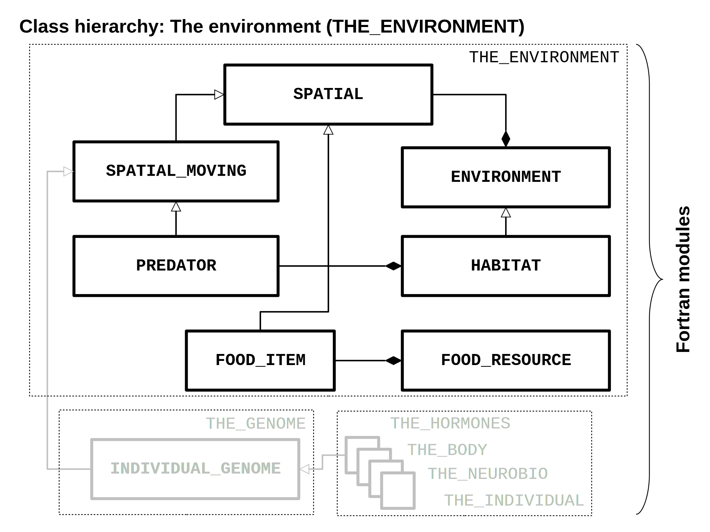
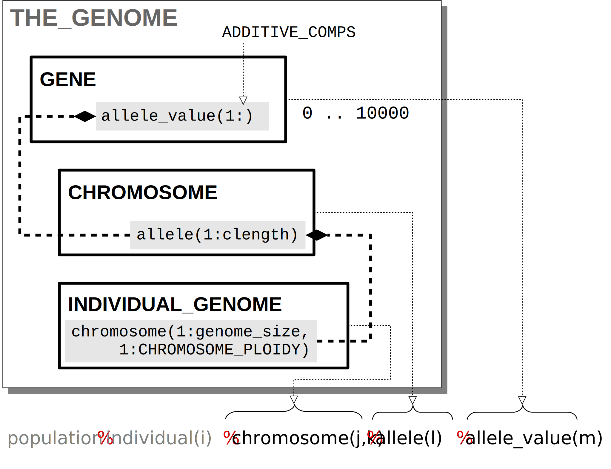
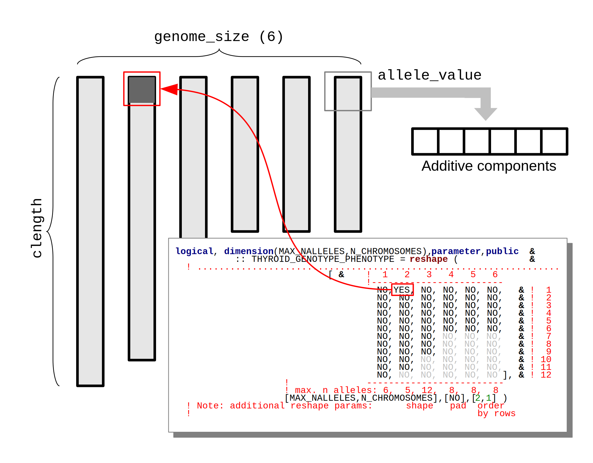
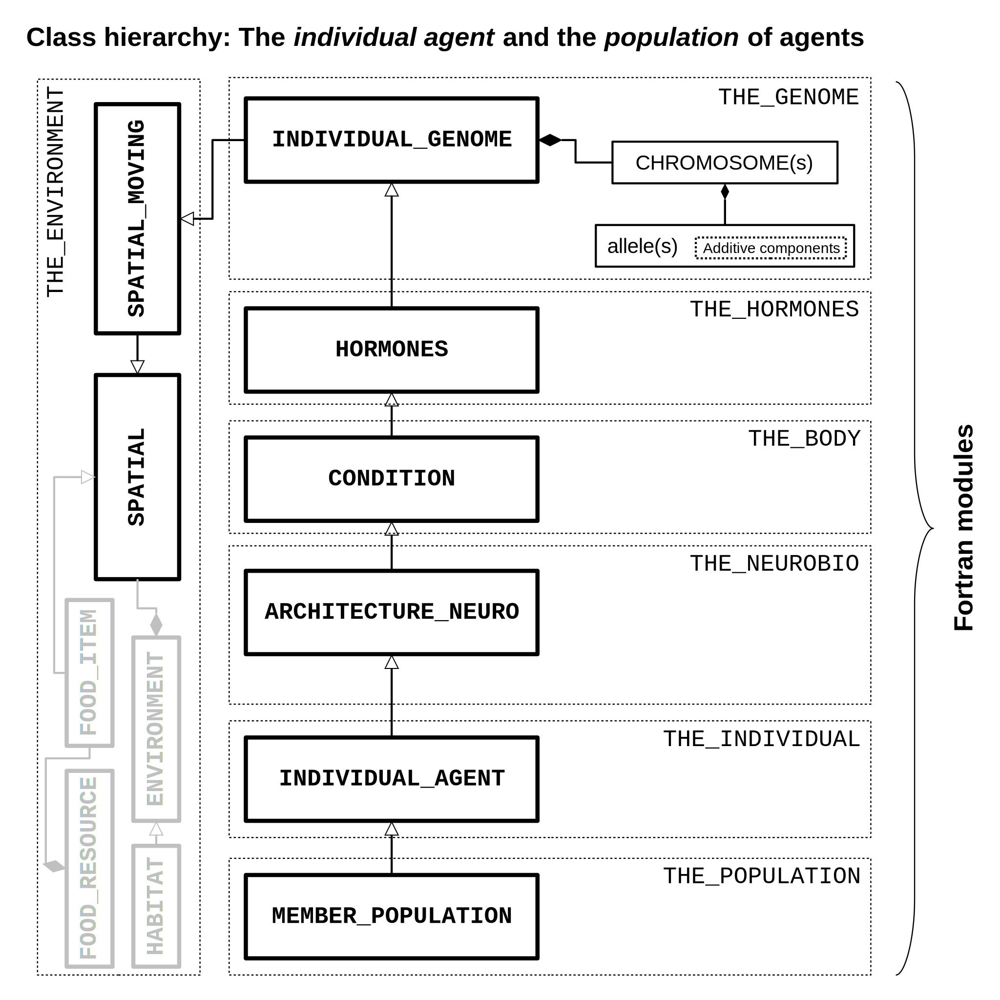
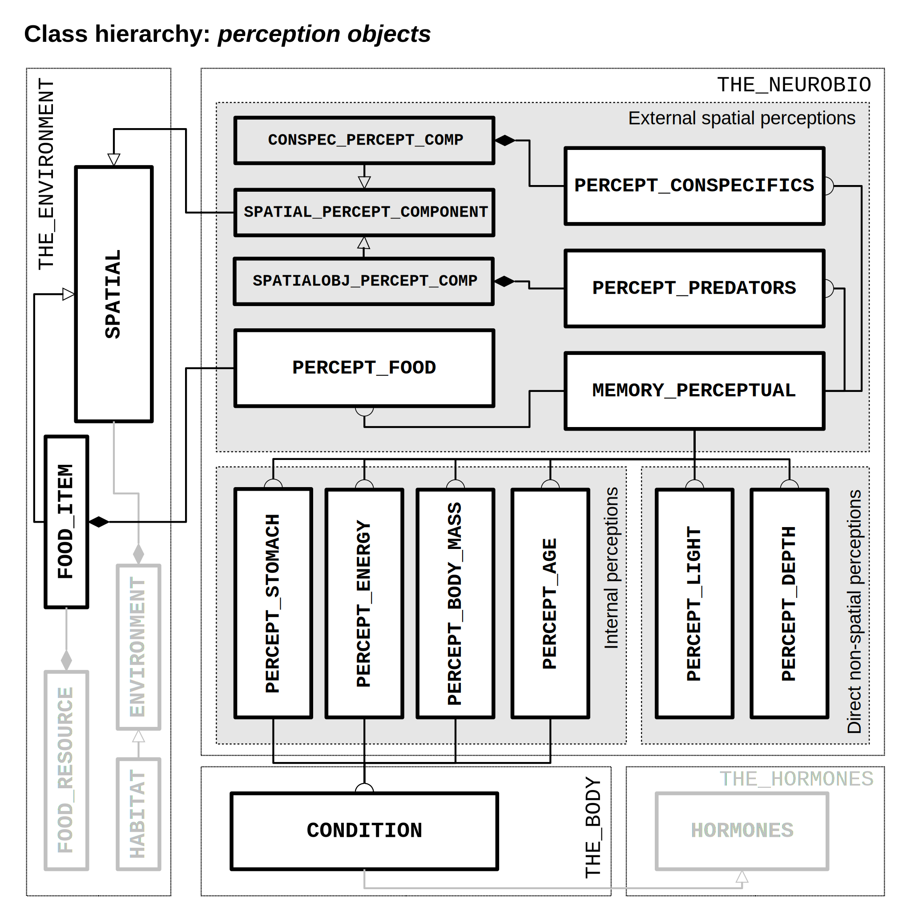
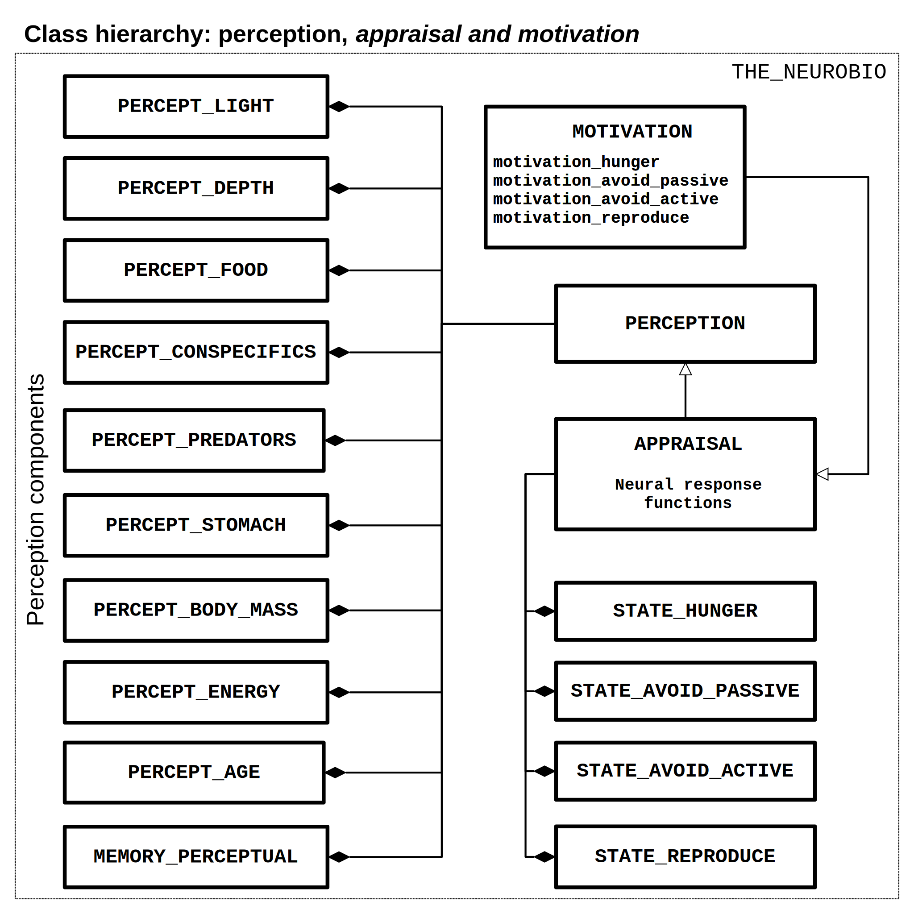
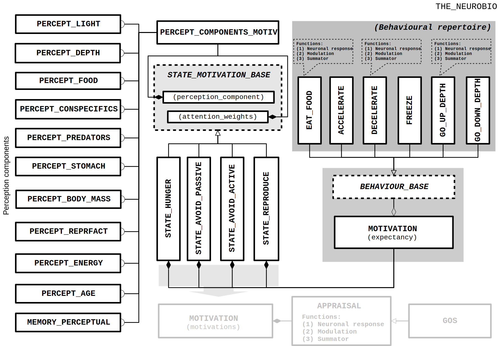

////////////////////////////////////////////////////////////////////////////////
*** CLASS DIAGRAMS AND THE BEAST FRAMEWORK TOOLS FOLLOW BELOW
////////////////////////////////////////////////////////////////////////////////

Building blocks of the AHA Model
--------------------------------

////////////////////////////////////////////////////////////////////////////////
Note -- shading in svg files produced by LO lead to massive memory leak in
        asciidos, use colour.
////////////////////////////////////////////////////////////////////////////////

The environment
~~~~~~~~~~~~~~~

Outline of THE_ENVIRONMENT module.

The genome structure
~~~~~~~~~~~~~~~~~~~~

Outline of the AHA Model code. So far very little.

Implementation of the genome.

Genome object types

Implementation of the chromosome structure. Arbitrary number of chromosomes,
arbitrary size (alleles), arbitrary number of additive components. Arbitrary
ploidity (diploid, polyploid).

Correspondence between the genotype and the phenotype (hormones,
neurobiological modules etc.) are represented by the boolean Gene x Phenotype
matrices. Any arbitrary structure can be implemented, many traits controlled
by a single gene, many genes controlling a specific single trait.

Genetic trait architecture

The individual agent
~~~~~~~~~~~~~~~~~~~~

Class diagram for the structure of the individual agents, from
individual person to the population membership (incomplete yet):

Individual, class hierarchy

Mostly to be written yet.

The perception mechanism
~~~~~~~~~~~~~~~~~~~~~~~~

Class diagram of the perception structure. Perception objects of three types,
(1) external spatial perception objects (perception depends on visual range),
(2) internal perception objects, depend on the body. (3) Light perception is
separate in that it gets this environmental factor directly.

External spatial perception components are truly "localist" and proximate, they
get individual environmental objects (e.g. food items, individual conspecifics
or predators). This allows to produce very complex environmental structures
(e.g. patchy foods with Gaussian scatter). Also, every individual environmental
object is perceived only if it is within the specific visual range. This means
that, as food items are stochastic (have random Gaussian size), perception of
each food item depends on its individually-adjusted visual range. The same is
for conspecifics, predators, etc.

Selection of the nearest environmental objects that are within the current
visual range is based on partial indexing (segmentation) of potentially huge
arrays of different objects (e.g. thousands of individual stochastic food
items, each with specific visual range). This allows very fast processing of
only the objects that are in proximity of the agent.

Behaviour units and expectancies
~~~~~~~~~~~~~~~~~~~~~~~~~~~~~~~~

